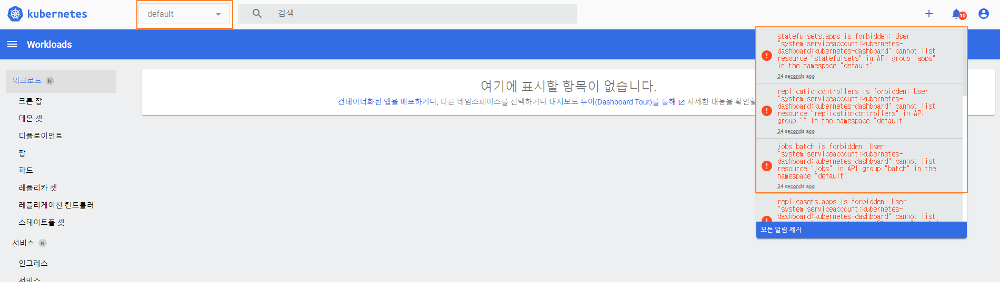

안녕하세요 Mambo 입니다. [쿠버네티스 클러스터 제어하기](/control-kubernetes-cluster)에서 쿠버네티스 클러스터 접근 구성파일을 통해 큐브컨트롤을 사용하여 쿠버네티스 클러스터를 제어해보는 것을 학습했습니다. 오늘은 쿠버네티스 대시보드 애드온을 쿠버네티스 클러스터에 설치하고 사용자 토큰을 사용하여 외부 환경에서 쿠버네티스 대시보드에 접근하여 쿠버네티스 클러스터를 제어하는 것을 학습하고자 합니다.

## 쿠버네티스 대시보드
[쿠버네티스 대시보드](https://github.com/kubernetes/dashboard)는 쿠버네티스 클러스터를 제어하거나 모니터링을 지원하는 웹 UI 애드온입니다. 나무 기술의 **칵테일 클라우드**와 같은 관리형 쿠버네티스 클러스터 플랫폼 서비스는 웹 UI 기반으로 클러스터를 구성하여 관리하고 모니터링 기능을 제공하지만 kubeadm과 같은 쿠버네티스 배포 도구로 직접 쿠버네티스 클러스터를 구성하는 경우 쿠버네티스 대시보드를 추가하여야 웹 UI 기반으로 쿠버네티스 클러스터 제어 및 모니터링이 가능합니다.

### 쿠버네티스 대시보드 애드온 추가하기
쿠버네티스 대시보드 애드온을 추가하기 위하여 큐브컨트롤을 사용하여 다음의 명령어를 실행합니다.

```sh Terminal
kubectl create -f https://raw.githubusercontent.com/kubernetes/dashboard/v2.3.1/aio/deploy/recommended.yaml
---
namespace/kubernetes-dashboard created
serviceaccount/kubernetes-dashboard created
service/kubernetes-dashboard created
secret/kubernetes-dashboard-certs created
secret/kubernetes-dashboard-csrf created
secret/kubernetes-dashboard-key-holder created
configmap/kubernetes-dashboard-settings created
role.rbac.authorization.k8s.io/kubernetes-dashboard created
clusterrole.rbac.authorization.k8s.io/kubernetes-dashboard created
rolebinding.rbac.authorization.k8s.io/kubernetes-dashboard created
clusterrolebinding.rbac.authorization.k8s.io/kubernetes-dashboard created
deployment.apps/kubernetes-dashboard created
service/dashboard-metrics-scraper created
deployment.apps/dashboard-metrics-scraper created

kubectl get deploy -n kubernetes-dashboard
---
NAME                        READY   UP-TO-DATE   AVAILABLE   AGE
dashboard-metrics-scraper   1/1     1            1           24s
kubernetes-dashboard        1/1     1            1           24s
```

쿠버네티스 대시보드를 설치했지만 서비스를 조회해보면 다음과 같이 ClusterIP 유형인 것을 확인할 수 있습니다.

```sh Terminal
kubectl get svc -n kubernetes-dashboard
NAME                        TYPE        CLUSTER-IP      EXTERNAL-IP   PORT(S)    AGE
dashboard-metrics-scraper   ClusterIP   10.108.18.117   <none>        8000/TCP   74s
kubernetes-dashboard        ClusterIP   10.100.36.145   <none>        443/TCP    74s
```

쿠버네티스 대시보드에 대한 서비스는 기본적으로 ClusterIP 유형으로 되어있으므로 쿠버네티스 클러스터 환경에서만 접근할 수 있습니다. 마스터 노드에서 큐브컨트롤로 쿠버네티스 클러스터에 프록시를 활성화하고나서 로컬 컴퓨터에서 마스터 노드에 대해서 **SSH 터널링**을 통해 쿠버네티스 대시보드에 접근할 수 있습니다.

```sh Terminal
kubectl cluster-info
Kubernetes control plane is running at https://192.168.0.5:6443
CoreDNS is running at https://192.168.0.5:6443/api/v1/namespaces/kube-system/services/kube-dns:dns/proxy

kubectl proxy
Starting to serve on 127.0.0.1:8001
# http://127.0.0.1:8001/api/v1/namespaces/kubernetes-dashboard/services/https:kubernetes-dashboard:/proxy/

ssh -L 8001:localhost:8001 mambo@192.168.0.5
```


쿠버네티스 대시보드 로그인 화면이 확인됩니다. 하지만, 이렇게 SSH 터널링으로 쿠버네티스 대시보드로 접근하는 방식은 불편한점이 있기 때문에 쿠버네티스 대시보드를 외부에서 직접 접근할 수 있으면 좋겠습니다. 외부에서 접근하기 위해서는 쿠버네티스 대시보드를 외부로 노출할 수 있도록 쿠버네티스 대시보드 서비스의 유형을 `ClusterIP` 에서 `NodePort`로 변경해야합니다.

```sh Terminal
kubectl edit svc kubernetes-dashboard -n kubernetes-dashboard

apiVersion: v1
kind: Service
metadata:
  creationTimestamp: "2021-07-30T10:47:00Z"
  labels:
    k8s-app: kubernetes-dashboard
  name: kubernetes-dashboard
  namespace: kubernetes-dashboard
  resourceVersion: "240375"
  uid: ae974cb2-d0af-46be-8036-4a9d33c9afbd
spec:
  clusterIP: 10.100.36.145
  clusterIPs:
  - 10.100.36.145
  ipFamilies:
  - IPv4
  ipFamilyPolicy: SingleStack
  ports:
  - port: 443
    protocol: TCP
    targetPort: 8443
  selector:
    k8s-app: kubernetes-dashboard
  sessionAffinity: None
  type: NodePort
status:
  loadBalancer: {}

# kubectl get service kubernetes-dashboard -n kubernetes-dashboard -o jsonpath="{.spec.ports[0].nodePort}" | awk '{print $1}'
kubectl get svc kubernetes-dashboard -n kubernetes-dashboard
NAME                   TYPE       CLUSTER-IP      EXTERNAL-IP   PORT(S)         AGE
kubernetes-dashboard   NodePort   10.100.36.145   <none>        443:31532/TCP   21m
```

쿠버네티스 대시보드가 31532 포트로 노출되었으니 **https://192.168.0.5:31532**으로 접속합니다.


쿠버네티스 클러스터에서 사용하는 루트 CA 인증서가 현재 브라우저에 신뢰할 수 있는 CA 인증서로 등록되어있지 않기 때문에 **안전하지 않음으로 이동**을 눌러 쿠버네티스 대시보드로 들어갑니다.

### 쿠버네티스 대시보드 사용자 토큰 가져오기


쿠버네티스 대시보드 서비스 어카운트의 토큰으로 쿠버네티스 대시보드에 로그인할 수 있습니다. 큐브컨트롤로 다음의 명령어를 실행하여 쿠버네티스 대시보드 사용자의 토큰을 조회합니다.

```sh terminal
# kubectl get secret -n kubernetes-dashboard $(kubectl get sa kubernetes-dashboard -n kubernetes-dashboard -o jsonpath="{.secrets[0].name}") -o jsonpath="{.data.token}" | base64 --decode | awk '{print $1}'

kubectl describe secret $(kubectl get secret -n kubernetes-dashboard | grep kubernetes-dashboard-token | awk '{print $1}') -n kubernetes-dashboard

Name:         kubernetes-dashboard-token-4qs2r
Namespace:    kubernetes-dashboard
Labels:       <none>
Annotations:  kubernetes.io/service-account.name: kubernetes-dashboard
              kubernetes.io/service-account.uid: 52ab8346-d0ce-465a-b170-1a240cbcbf83

Type:  kubernetes.io/service-account-token

Data
====
namespace:  20 bytes
token:      eyJhbGciOiJSUzI1NiIsImtpZCI6InhrcWdOeEV2RFh2ajZES0Z1b0lLb3F2TmtuSUVnLVdFbktadk9SWjNYXzQifQ....
ca.crt:     1066 bytes
```

쿠버네티스 대시보드 사용자의 토큰을 복사해서 쿠버네티스 대시보드에 로그인합니다.


토큰을 사용하여 로그인되었지만 이 서비스 어카운트는 쿠버네티스 클러스터에 대한 권한을 가지고 있지 않아서 어떠한 정보도 표시되지 않습니다.



우리는 쿠버네티스 클러스터에 대한 권한을 쿠버네티스 대시보드 사용자에게 부여해야합니다.

```sh Terminal
kubectl delete clusterrole kubernetes-dashboard -n kubernetes-dashboard
kubectl delete clusterrolebinding kubernetes-dashboard -n kubernetes-dashboard

cat <<EOF | tee dashboard-admin.yaml
apiVersion: rbac.authorization.k8s.io/v1
kind: ClusterRoleBinding
metadata:
  name: kubernetes-dashboard
  namespace: kubernetes-dashboard
roleRef:
  apiGroup: rbac.authorization.k8s.io
  kind: ClusterRole
  name: cluster-admin
subjects:
  - kind: ServiceAccount
    name: kubernetes-dashboard
    namespace: kubernetes-dashboard
EOF

kubectl create -f dashboard-admin.yaml
clusterrolebinding.rbac.authorization.k8s.io/kubernetes-dashboard created
```

쿠버네티스 대시보드 사용자에게 모든 권한을 부여하는 **ClusterRole**과 **ClusterRoleBinding**을 다시 만들었습니다. 

```sh Terminal
kubectl get secret -n kubernetes-dashboard $(kubectl get sa kubernetes-dashboard -n kubernetes-dashboard -o jsonpath="{.secrets[0].name}") -o jsonpath="{.data.token}" | base64 --decode | awk '{print $1}'

eyJhbGciOiJSUzI1NiIsImtpZCI6InhrcWdOeEV2RFh2ajZES0Z1b0lLb3F2TmtuSUVnLVdFbktadk9SWjNYXzQifQ....
```

쿠버네티스 대시보드에 다시 로그인해보겠습니다.


쿠버네티스 대시보드의 서비스 어카운트가 클러스터 권한을 가지게 되었으므로 대시보드에 **모든 네임스페이스**에 대한 워크로드 상태를 조회할 수 있습니다.

### 쿠버네티스 대시보드에서 매트릭 서버 설치하기
쿠버네티스 대시보드의 사용자가 쿠버네티스 클러스터에 대한 권한을 가지기 때문에 대시보드를 통해 클러스터를 제어할 수 있습니다. 큐브컨트롤을 사용하지 않고 쿠버네티스 클러스터에 대한 매트릭을 조회할 수 있는 매트릭 서버(metrics-server)를 클러스터에 설치해보도록 하겠습니다.

https://github.com/kubernetes-sigs/metrics-server/releases/latest/download/components.yaml

위 YAML 파일을 다운받아서 아래 화면과 같이 **kubelet-insecure-tls** 옵션을 추가하여 업로드 버튼을 선택합니다.


매트릭 서버가 설치되었으므로 큐브컨트롤으로 매트릭을 조회할 수 있는지 확인합니다.

```sh Terminal
kubectl top no --use-protocol-buffers

NAME              CPU(cores)   CPU%   MEMORY(bytes)   MEMORY%
mambo-master      136m         13%    1275Mi          67%
mambo-worker-01   22m          2%     710Mi           37%
mambo-worker-02   33m          3%     815Mi           43%
```

이렇게 쿠버네티스 대시보드를 통해서도 클러스터를 제어할 수 있음을 확인했습니다. 그러나, 쿠버네티스 대시보드는 클러스터 외부에 노출되어있으므로 사용자의 토큰이 유출되지 않도록 잘 관리해야합니다. 저는 학습 목적으로 기본으로 제공하는 쿠버네티스 대시보드 사용자가 모든 권한을 가지게 하였지만 클러스터에 대한 모든 권한을 가지는게 아니라 쿠버네티스 대시보드에 로그인할 사용자를 별도로 만들어서 특정 네임스페이스와 리소스에 대한 권한을 개별적으로 지정하는게 좋습니다.

이상으로 쿠버네티스 대시보드 접근하기를 마칩니다.
