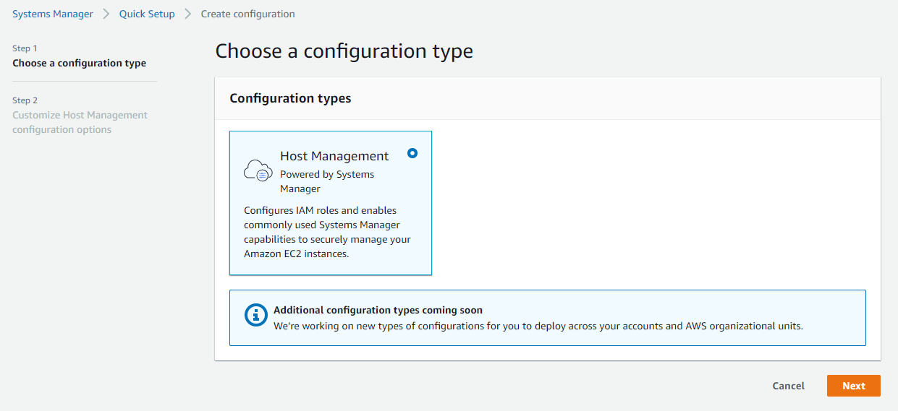
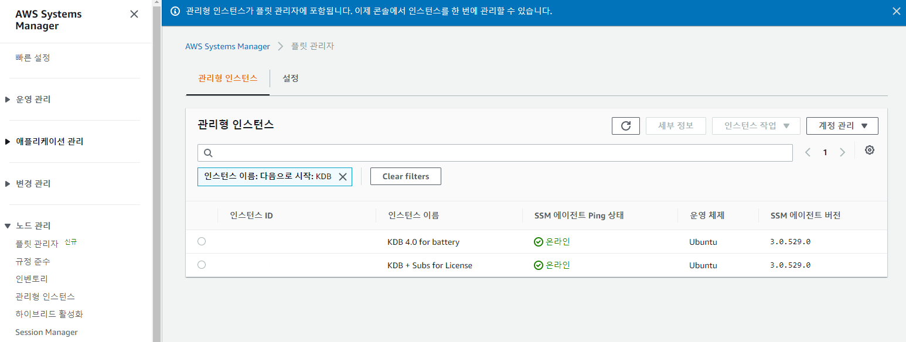
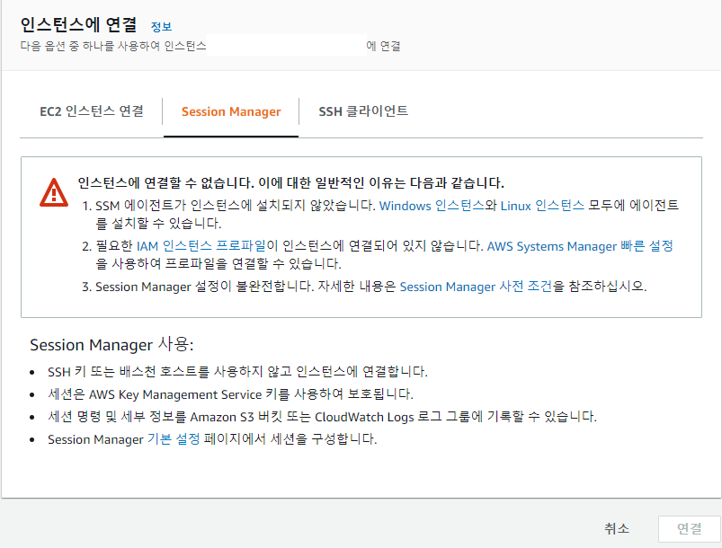
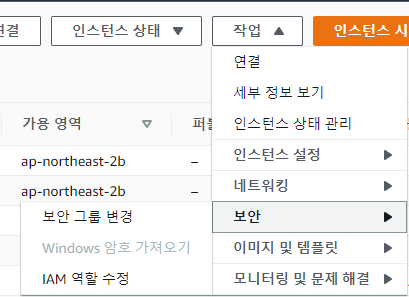
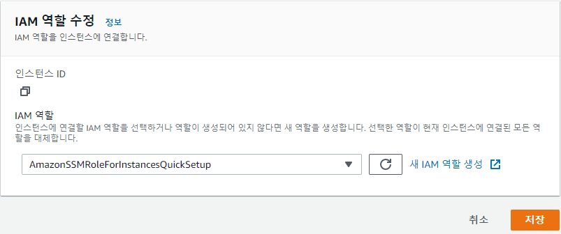
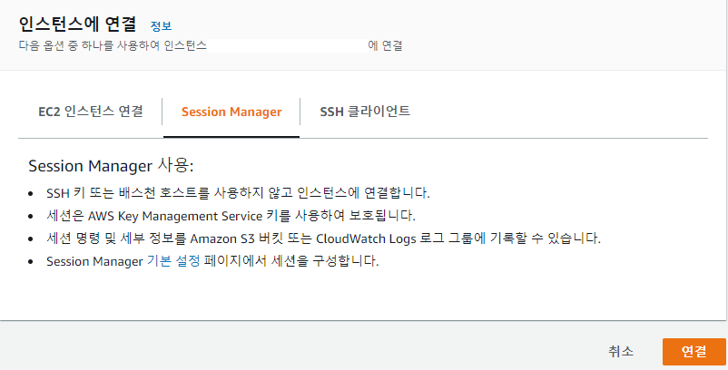
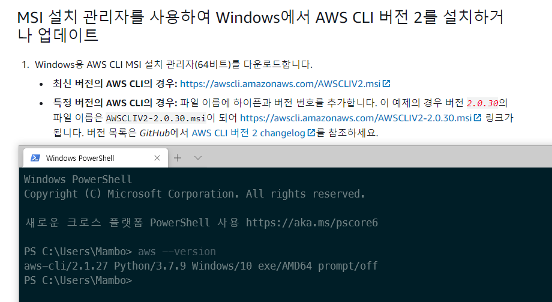
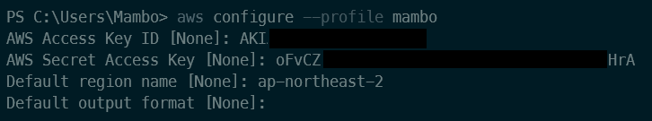
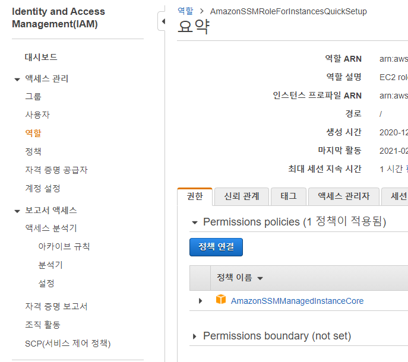
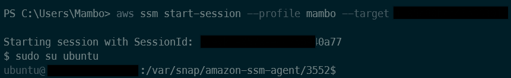

안녕하세요 Mambo입니다. 터미널에서 외부 호스트에 접근하기 위해서 `SSH(Secure Shell)`을 주로 사용합니다. AWS의 EC2 인스턴스를 생성할 때 발급된 PEM 파일과 함께 [SSH를 사용하여 Linux 인스턴스에 연결](https://docs.aws.amazon.com/ko_kr/AWSEC2/latest/UserGuide/AccessingInstancesLinux.html) 문서를 참고하여 인스턴스에 연결할 수 있습니다.

다만, SSH 클라이언트로 EC2 인스턴스에 접근하기 위해서는 인스턴스가 퍼블릭 DNS 또는 퍼블릭 IP 주소를 가져야합니다. 그래서 프라이빗 네트워크 환경에 존재하는 EC2에 접근하기 위해서는 `배스천(Bastion) 호스트`라고하는 일종의 게이트웨이 인스턴스를 퍼블릭 환경에 생성한 후 SSH 클라이언트로 배스천 호스트를 경유해서 프라이빗 EC2에 접근해야합니다.

또한, SSH 접근을 위해 EC2 인스턴스에 대한 PEM 파일에 대한 관리를 수행해야합니다. 결국 이 PEM 파일은 서로에게 공유되며 어디서 PEM 파일이 누군가에 의해 탈취되었는지 모르는 상황이 발생할 수 있습니다. 

AWS는 이러한 SSH에 대한 단점을 보완하기 위하여 `AWS Systems Manager`를 사용해서 EC2를 관리형 인스턴스로 등록한 후 SSH와 PEM 파일이 없어도 인스턴스에 접근할 수 있도록 [`SSM 에이전트`](https://docs.aws.amazon.com/ko_kr/systems-manager/latest/userguide/sysman-install-ssm-agent.html) 기능을 제공합니다. 

## AWS Systems Manager 관리형 인스턴스 활성화
EC2 인스턴스를 AWS 시스템 매니저에 관리형 인스턴스로 등록하기 위해서 `빠른 설정`을 통해 시스템 매니저가 EC2 인스턴스 관리를 위한 IAM 역할을 생성하고 등록할 수 있습니다.



> 2021년 2월 19일 현재까지 호스트 관리 기능만 제공합니다.



### EC2 인스턴스 SSM 에이전트
AWS 시스템 매니저를 통해 EC2 인스턴스에 접근하기 위해서는 해당 인스턴스 내에 SSM 에이전트가 설치되어있어야합니다. 

**SSM 에이전트 사전 설치 AMI 목록**
- Amazon Linux
- Amazon Linux 2
- Amazon Linux 2 ECS-Optimized AMIs
- Ubuntu Server 16.04, 18.04, and 20.04

> 모든 AMI에서 SSM 에이전트를 기본적으로 제공하지 않으므로 [수동](https://docs.aws.amazon.com/ko_kr/systems-manager/latest/userguide/sysman-manual-agent-install.html)으로 설치해야할 수 있어요.

### EC2 인스턴스 IAM 역할 지정
AWS 시스템 매니저의 빠른 설정을 수행하면 `AmazonSSMRoleForInstancesQuickSetup` IAM 역할이 생성됩니다. EC2 인스턴스에 대해 이 IAM 역할을 지정하면 SSM 에이전트를 통해 인스턴스에 접근할 수 있는 권한을 부여되고 세션 매니저가 활성화 됩니다.



위 AmazonSSMRoleForInstancesQuickSetup IAM 역할이 없으므로 SSM 에이전트로 인스턴스에 연결할 수 없습니다. 아래와 같이 





> 이제 AWS 시스템 매니저가 EC2 인스턴스를 관리형 인스턴스로 등록할거에요.



이제 EC2 인스턴스에 세션 매니저로 연결을 수행하거나 시스템 매니저에서 관리형 인스턴스에 세션을 연결할 수 있습니다.

## AWS SSM CLI
로컬 호스트에서 SSM 에이전트가 설치된 EC2 인스턴스에 접근하기 위해서 AWS CLI의 SSM 명령어를 사용할 수 있습니다.

### AWS CLI 설치
각 환경에 맞는 AWS CLI 인스톨러를 실행하여 AWS CLI를 설치합니다.



### 크레덴셜 프로파일 설정
AWS CLI을 사용하기 위하여 `AmazonSSMManagedInstanceCore` 정책이 부여된 크레덴셜을 프로파일로 등록합니다.



#### AmazonSSMManagedInstanceCore 정책



> AmazonEC2RoleforSSM 정책은 Deprecated 되었어요!

### SSM 세션 시작하기
AWS SSM CLI의 `start-session` 명령어로 관리형 인스턴스에 대한 세션을 시작할 수 있습니다.



#### SSM 포트 포워딩
세션을 시작할 때 포트 번호를 파라미터로 제공하여 SSH에서 처럼 포트 포워딩을 수행할 수 있습니다. 이때 파라미터 중 `portNumber`는 관리형 인스턴스의 포트이고 `localPortNumber`는 현재 로컬 호스트의 포트임을 감안하시기 바랍니다.

```sh
aws ssm start-session \
--profile mambo \ 
--target $instance_id \
--document-name AWS-StartPortForwardingSession \
--parameters '{"portNumber":["8080"], "localPortNumber":["5000"]}'

Starting session with SessionId: $session_id
Port 5000 opened for sessionId $session_id
Waiting for connections...
```

> 윈도우 터미널에서는 "를 \\"로 문자 처리해야해요.

## SSM CLI 고급 기능
SSM 에이전트를 통해 연결되는 세션은 SSH를 활용하는 것이 아니므로 EC2 인스턴스의 22번 포트에 정의된 보안 그룹이 무시됩니다. 또한, [SSH 연결 활성화](https://docs.aws.amazon.com/ko_kr/systems-manager/latest/userguide/session-manager-getting-started-enable-ssh-connections.html)를 통해 세션 매니저가 SSH 연결을 수행할 수 있습니다. 

세션 매니저를 통해 SSH 연결을 수행하는 경우 22번 포트가 인바운드 규칙에 없더라도 SSH 또는 SCP를 사용할 수 있습니다. PEM 파일이 누군가에 의해 탈취되었더라도 SSM 관리형 인스턴스 역할이 부여된 크레덴셜이 없으면 관리형 인스턴스에 접근할 수 없습니다.

> SSM CLI로 SSH 연결을 수행하는 예제는 [AWS SSM으로 EC2 인스턴스에 접근하기](https://musma.github.io/2019/11/29/about-aws-ssm.html)를 참고하세요.

### Gossm
[AWS SSM 이용해 EC2 접속하는 CLI 개발](https://medium.com/@gjbae1212/aws-ssm-%EC%9D%B4%EC%9A%A9%ED%95%B4-ec2-%EC%A0%91%EC%86%8D%ED%95%98%EB%8A%94-cli-%EA%B0%9C%EB%B0%9C-62c2f7357fb8)에서 소개하는 [gossm](https://github.com/gjbae1212/gossm)은 AWS SSM CLI을 좀 더 편하게 사용할 수 있도록 지원하니 활용하시면 좋습니다.

본 글에서 진행한 AWS 콘솔 화면은 회사에서 사용중인 계정을 통해 알아보았기 때문에 주요 정보는 전부 마스킹 처리되었습니다. 프라이빗 EC2 인스턴스에 대한 접근을 위해 배스천 호스트 대신에 SSM 에이전트를 사용해보세요.

감사합니다.