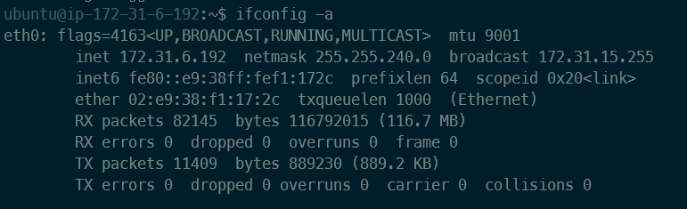
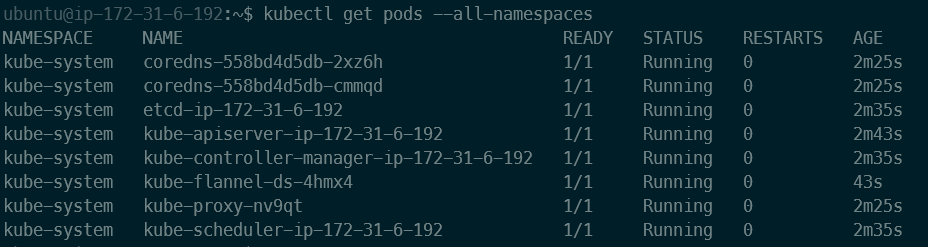
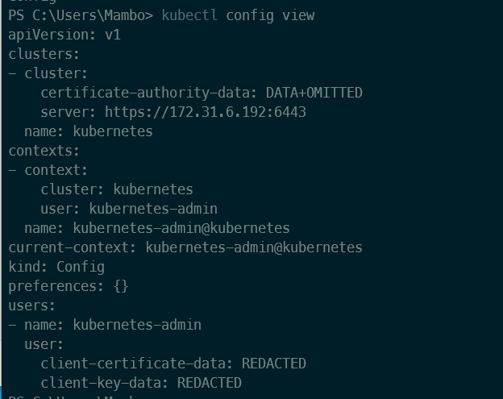
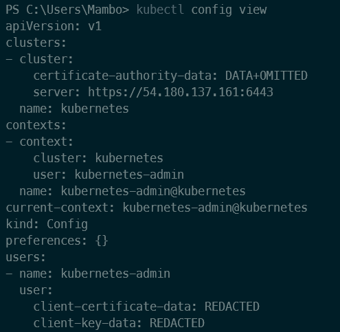
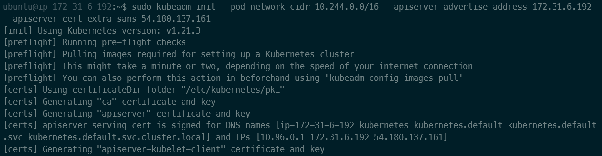
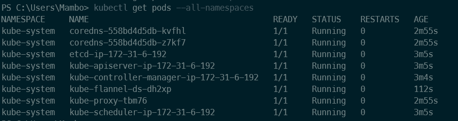
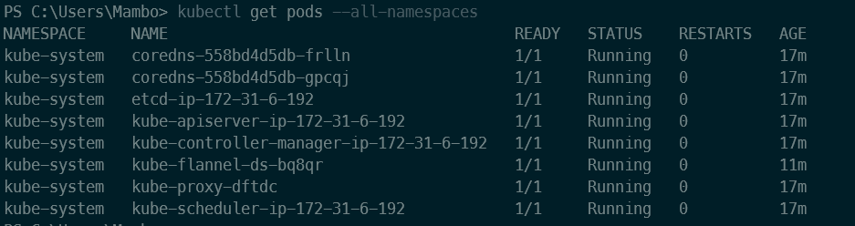

안녕하세요 Mambo입니다. 지난번에 [쿠버네티스 클러스터 구성하기](setup-kubernetes-cluster)에서 쿠버네티스 클러스터를 시작할 수 있는 방법에 대해서 배웠으며 이번에는 외부 호스트 환경에서 쿠버네티스 클러스터를 제어하는 것을 학습하고자 합니다. 이 글을 통해 우리는 쿠버네티스 클러스터를 마스터 노드가 아닌 환경에서도 쿠버네티스 클러스터를 제어할 수 있음을 확인할 수 있게 됩니다.

## 쿠버네티스 클러스터 제어 도구
쿠버네티스 클러스터 제어를 위해서는 쿠버네티스 클러스터에 실행중인 `kube-apiserver`를 통해 쿠버네티스 API를 사용해야합니다. 일반적으로는 쿠버네티스 클러스터를 제어하기 위해서 kubectl을 사용하게 됩니다. 지난 글인 **쿠버네티스 클러스터 구성하기**에서도 쿠버네티스 클러스터를 시작하고나서 마스터 노드에 설치한 kubectl을 사용하여 파드 네트워크 플러그인을 쿠버네티스 클러스터에 추가했습니다.

```sh Terminal
mkdir -p $HOME/.kube
sudo cp -i /etc/kubernetes/admin.conf $HOME/.kube/config
sudo chown $(id -u):$(id -g) $HOME/.kube/config
```

위 명령어를 통해 쿠버네티스 클러스터에 대한 모든 권한을 가지는 kubernetes-admin 이라는 사용자의 인증서 정보가 포함된 클러스터 구성 파일을 kubectl이 참조할 경로에 복사하면서 마스터 노드에서는 별다른 설정없이도 쿠버네티스 클러스터 제어권을 가지게 되었습니다. 그러면 쿠버네티스 클러스터를 제어하기 위해서 반드시 마스터 노드에 접속해서 kubectl 명령어를 실행해야하는 걸까요? 반드시 그런것은 아닙니다. 보안상으로는 마스터 노드에 접속할 수 있는 관리자만 클러스터 제어할 수 있는게 바람직하겠지만 다음의 쿠버네티스 공식 문서들을 보면 클러스터 접근을 위해 kubeconfig를 구성할 수 있고 kubectl는 이를 통해 쿠버네티스 클러스터에 접근하여 명령어를 실행하는 것을 확인할 수 있습니다.

- [kubeconfig 파일을 사용하여 클러스터 접근 구성하기](https://kubernetes.io/ko/docs/concepts/configuration/organize-cluster-access-kubeconfig/)
- [다중 클러스터 접근 구성](https://kubernetes.io/ko/docs/tasks/access-application-cluster/configure-access-multiple-clusters/)

위 문서들을 참고해보면 쿠버네티스 클러스터에 대한 접근을 구성하는데 사용하는 파일이 kubeconfig이며 kubectl는 kubeconfig를 지정하지 않는 경우 $HOME/.kube/config라는 이름의 파일을 기본으로 사용한다고 되어있습니다.

### 클러스터 외부 환경에서의 제어
쿠버네티스 클러스터의 마스터 노드가 아닌 외부 환경에서 kubectl를 사용하여 쿠버네티스 클러스터에 접근하기 위해서는 kubeconfig를 정의해야합니다. 지금은 kubeconfig를 정의하지않고 마스터 노드에서 사용중인 kubeconfig를 로컬 컴퓨터로 가져와서 쿠버네티스 클러스터에 접근할 수 있는지와 명령어가 수행되는지를 확인하겠습니다. 



마스터 노드의 내부 아이피는 172.31.6.192이며 쿠버네티스 클러스터 시작 시 API 서버의 주소를 172.31.6.192로 명시하겠습니다.

```sh Terminal
sudo kubeadm init --pod-network-cidr=10.244.0.0/16 --apiserver-advertise-address=172.31.6.192
[init] Using Kubernetes version: v1.21.3
...
Your Kubernetes control-plane has initialized successfully!

To start using your cluster, you need to run the following as a regular user:

mkdir -p $HOME/.kube
sudo cp -i /etc/kubernetes/admin.conf $HOME/.kube/config
sudo chown $(id -u):$(id -g) $HOME/.kube/config

kubectl apply -f https://raw.githubusercontent.com/coreos/flannel/master/Documentation/kube-flannel.yml
```

쿠버네티스 클러스터 구성이 완료되었으면 kubectl으로 다음과 같이 파드를 조회할 수 있게 됩니다.



쿠버네티스 클러스터에 워커 노드를 추가안하는 것에 의문이 들 수 있겠지만 이번 글의 목적은 쿠버네티스 클러스터에 대한 제어를 수행하는 것이며 쿠버네티스 클러스터 제어는 컨트롤 플레인의 API 서버인 **kube-apiserver**가 실행되는 마스터 노드만 있으면 됩니다.

마스터 노드에서 사용중인 kubeconfig 파일을 로컬 컴퓨터로 복사해옵니다. 마스터 노드에 접근할 수 있는 외부 아이피는 54.180.137.161 입니다.

```cmd Windows Terminal
mkdir .kube
scp -i .\keypair\mambo.pem ubuntu@54.180.137.161:/home/ubuntu/.kube/config .kube/config
```

로컬 컴퓨터에 kubectl을 설치하고 다음과 같이 쿠버네티스 클러스터 접근 구성 정보를 조회합니다.



쿠버네티스 클러스터 접근 구성 정보에 클러스터의 주소가 내부 아이피이므로 로컬 컴퓨터에서 클러스터에 접근할 수 있도록 마스터 노드의 외부 아이피인 54.180.137.161로 변경해야합니다.



쿠버네티스 클러스터 주소가 외부 아이피로 변경되었음을 확인했으니 kubectl으로 쿠버네티스 클러스터의 파드를 조회합니다.

```cmd Windows Terminal
kubectl get pods --all-namespaces
Unable to connect to the server: x509: certificate is valid for 10.96.0.1, 172.31.6.192, not 54.180.137.161
```

파드 조회를 시도했으나 X509 인증서 관련 오류가 발생하였습니다. 우리가 입력한 54.180.137.161는 인증서 정보에 포함되어있지 않아 클러스터에 접근할 수 없다는 내용입니다. 우리는 마스터 노드에 접근할 수 있는 외부 아이피를 입력했는데 왜 접근이 안되는 걸까요?

#### 클러스터 시작 시 인증서에 외부 아이피 추가하기
쿠버네티스 클러스터 시작 시 클러스터에 사용될 인증서를 자동으로 발행하게 됩니다. 기본적으로는 인증서 발행 시 내부 아이피가 자동으로 포함되게 됩니다. 이 인증서에 외부 아이피를 추가하기 위해서는 **kubeadm init** 명령어를 실행할 때 인증서에 포함될 SAN을 추가할 수 있는 **apiserver-cert-extra-sans** 파라미터를 추가해야합니다.

먼저, 이미 만들었던 쿠버네티스 클러스터를 초기화합니다. 

```sh Terminal
sudo kubeadm reset
rm $HOME/.kube/config
```

쿠버네티스 클러스터 시작 시 외부 아이피를 API 서버에 대한 인증서에 포함하도록 파라미터 옵션을 추가합니다.



위와 같이 쿠버네티스 클러스터 시작 시 출력되는 정보를 통해 우리가 파라미터로 입력한 외부 아이피(54.180.137.161)가 인증서에 포함됨을 확인할 수 있게 됩니다. 쿠버네티스 클러스터 구성이 완료되면 kubeconfig 파일을 로컬 컴퓨터로 복사하고 kubectl으로 파드 조회를 시도해봅니다.



클러스터 접근 구성 파일인 kubeconfig에 포함된 인증서에 외부 아이피가 포함되어있기 때문에 쿠버네티스 클러스터에 대한 접근이 허용되었으며 kubectl으로 클러스터를 제어할 수 있음을 확인되었습니다.

## 신규 사용자 및 인증서 발행
앞서 쿠버네티스 클러스터에 대한 접근 구성 파일을 통해 클러스터 외부 환경에서 클러스터를 제어할 수 있음을 확인했습니다. 그러나 마스터 노드에서 복사해온 클러스터 접근 구성 파일에는 쿠버네티스 클러스터의 모든 권한을 가지는 kubernetes-admin 사용자의 인증정보가 포함되어있습니다. 결국 마스터 노드에서 사용하는 접근 구성 파일을 외부로 내보내는 행위는 보안적으로 좋지 않습니다. 그래서 우리는 이 접근 구성 파일을 사용하지 않고 쿠버네티스 클러스터가 사용하는 루트 CA 인증서를 기반으로 특정 사용자가 사용할 하위 인증서를 발행하고 제공하는 게 좋습니다.

쿠버네티스 클러스터에는 사용자라는 오브젝트는 없지만 인증서에 포함되는 주체를 통해 그룹과 사용자 개념을 사용해서 인증을 수행합니다. 따라서, 우리는 다음의 두가지를 수행하고 쿠버네티스 클러스터 접근 구성 파일을 정의해야합니다.

- 쿠버네티스 클러스터 rootCA 인증서를 기반으로 하위 인증서 발행하기
- 하위 인증서에 포함된 주체에 대한 RBAC 기반의 Role을 쿠버네티스 클러스터에 생성하기

먼저, 쿠버네티스 클러스터 rootCA 인증서를 기반으로 하위 인증서를 발행하는 것은 쿠버네티스 공식 문서 중 [인증서](https://kubernetes.io/ko/docs/tasks/administer-cluster/certificates/#cfssl)를 통해 확인할 수 있습니다. 저는 IT 인프라 전문 인력이 아니므로 인증서를 발행하는 것을 잘 알지는 못합니다. 그래서 클라우드플레어에서 만든 `cfssl` 도구를 사용하여 JSON 기반으로 인증서를 발행하는 것이 쉬워보이므로 cfssl을 사용해서 사용자 인증서를 발행해보도록 하겠습니다.

마스터 노드에 다음의 명령어를 실행하여 cfssl 도구를 설치합니다.

```sh Terminal
curl -L https://github.com/cloudflare/cfssl/releases/download/v1.5.0/cfssl_1.5.0_linux_amd64 -o cfssl
curl -L https://github.com/cloudflare/cfssl/releases/download/v1.5.0/cfssljson_1.5.0_linux_amd64 -o cfssljson
curl -L https://github.com/cloudflare/cfssl/releases/download/v1.5.0/cfssl-certinfo_1.5.0_linux_amd64 -o cfssl-certinfo

chmod +x cfssl* 
sudo mv cfssl* /usr/bin/
```

사용자 인증서가 발행될 폴더를 만들고나서 쿠버네티스 클러스터가 사용중인 루트 CA 인증서 파일을 복사합니다. 루트 CA 인증서 파일은 일반적으로 /etc/kubernetes/pki 폴더에 있습니다.

```sh Terminal
# 인증서 발행 폴더 이동 및 쿠버네티스 클러스터 루트 CA 인증서 복사
mkdir cert && cd cert
sudo cp /etc/kubernetes/pki/ca* ./

# 하위 인증서 발행 정보 정의
cat <<EOF | tee mambo-config.json
{
  "signing": {
    "default": {
      "expiry": "8760h"
    },
    "profiles": {
      "mambo": {
        "usages": [
          "signing",
          "key encipherment",
          "server auth",
          "client auth"
        ],
        "expiry": "8760h"
      }
    }
  }
}
EOF

# 하위 인증서 서명 요청 정의
cat <<EOF | tee mambo-csr.json
{
  "CN": "mambo",
  "key": {
    "algo": "rsa",
    "size": 2048
  },
  "names":[
    {
      "O": "system:masters"
    }
  ]
}
EOF
```

가이드 문서에 따라서 루트 CA 인증서와 함께 인증서 발행을 위한 JSON 파일을 정의했습니다. 이제 cfssl로 인증서를 발행해보도록 합니다.

```sh Terminal
sudo cfssl gencert -ca=ca.crt -ca-key=ca.key -config=mambo-config.json -profile=mambo mambo-csr.json | cfssljson -bare mambo

ll
-rw-r--r-- 1 mambo mambo 1066 Jul 28 15:04 ca.crt
-rw------- 1 root  root  1679 Jul 28 15:04 ca.key
-rw-rw-r-- 1 mambo mambo  277 Jul 28 15:02 mambo-config.json
-rw-r--r-- 1 mambo mambo  920 Jul 28 15:08 mambo.csr
-rw-rw-r-- 1 mambo mambo  129 Jul 28 15:02 mambo-csr.json
-rw------- 1 mambo mambo 1675 Jul 28 15:08 mambo-key.pem
-rw-rw-r-- 1 mambo mambo 1204 Jul 28 15:08 mambo.pem
```

만들어진 인증서 파일(mambo.pem, mambo-key.pem)과 루트 CA 인증서 파일(ca.crt)를 로컬 컴퓨터로 복사합니다. 그리고 이 인증서 파일을 토대로 쿠버네티스 클러스터 접근 구성 파일을 정의합니다. 접근 구성 파일인 kubeconfig을 정의하기 위해서는 **kubectl config --kubeconfig=config** 명령어를 사용하면 됩니다.

```sh Windows Terminal
scp mambo@192.168.0.5:~/cert/ca.crt ./
scp mambo@192.168.0.5:~/cert/mambo*.pem ./

# 쿠버네티스 클러스터 구성파일 정의
kubectl config --kubeconfig=config set-cluster kubernetes --server=https://192.168.0.5:6443 --certificate-authority=ca.crt
kubectl config --kubeconfig=config set-credentials mambo --client-certificate=mambo.pem --client-key=mambo-key.pem
kubectl config --kubeconfig=config set-context kubernetes-master --cluster=kubernetes --user=mambo
kubectl config --kubeconfig=config use-context kubernetes-master
```

쿠버네티스 클러스터 접근 구성 파일 설정이 완료되었다면 kubectl이 참조하고 있는 클러스터 정보를 확인하고 파드 조회를 수행합니다.

```sh Terminal
# 쿠버네티스 클러스터 구성파일 정보 조회
kubectl --kubeconfig=config config view
apiVersion: v1
clusters:
- cluster:
    certificate-authority: ca.crt
    server: https://192.168.0.5:6443
  name: kubernetes
contexts:
- context:
    cluster: kubernetes
    user: mambo
  name: kubernetes-master
current-context: kubernetes-master
kind: Config
preferences: {}
users:
- name: mambo
  user:
    client-certificate: mambo.pem
    client-key: mambo-key.pem

# 쿠버네티스 클러스터 파드 조회
kubectl get pods -n kube-system --kubeconfig=config
NAME                                   READY   STATUS    RESTARTS   AGE
coredns-558bd4d5db-6fqm2               1/1     Running   0          4h16m
coredns-558bd4d5db-kgdfs               1/1     Running   0          4h16m
etcd-mambo-master                      1/1     Running   0          3h38m
kube-apiserver-mambo-master            1/1     Running   0          3h38m
kube-controller-manager-mambo-master   1/1     Running   0          3h38m
kube-flannel-ds-g59bl                  1/1     Running   0          4h7m
kube-flannel-ds-nf4xt                  1/1     Running   0          4h7m
kube-flannel-ds-q5hkb                  1/1     Running   0          4h16m
kube-proxy-7j5b6                       1/1     Running   0          4h16m
kube-proxy-8f47j                       1/1     Running   0          4h7m
kube-proxy-rflgf                       1/1     Running   0          4h7m
kube-scheduler-mambo-master            1/1     Running   0          3h38m
```

쿠버네티스 클러스터의 파드들이 조회되었습니다. 그런데 앞서 두가지를 수행해야한다고 했지만 우리는 mambo 사용자에 대한 Role을 쿠버네티스 클러스터에 생성하지 않았습니다. 쿠버네티스 클러스터에는 ClusterRole이라고 하는 미리 정의된 [Role](https://kubernetes.io/docs/reference/access-authn-authz/rbac/#user-facing-roles)이 존재하는데 그 중에서 `system:masters`는 모든 권한을 가지는 사용자 그룹을 가리키게되어 mambo라는 사용자는 모든 권한을 보유한 것으로 처리된 것입니다.

앞서 하위 인증서에 대한 서명 요청 파일을 정의할 때 **system:masters**을 지정했던 것을 확인할 수 있을 것입니다. 우리는 모든 권한을 가지는 사용자가 아니라 특정 권한을 가지는 사용자를 만들고 인증해야하므로 기존에 만들었던 인증서를 삭제하고 다시 만들어보도록 하겠습니다.

다음처럼 서명 요청 정의 시 미리 정의된 Role이 아닌 mambo 사용자에 대한 Role을 지정하겠습니다.

```sh Terminal
cat <<EOF | tee mambo-csr.json
{
  "CN": "mambo",
  "key": {
    "algo": "rsa",
    "size": 2048
  },
  "names":[
    {
      "O": "admin:mambo"
    }
  ]
}
EOF

sudo cfssl gencert -ca=ca.crt -ca-key=ca.key -config=mambo-config.json -profile=mambo mambo-csr.json | cfssljson -bare mambo
```

발행된 인증서 파일을 로컬 컴퓨터로 복사하고 쿠버네티스 클러스터에 파드 조회 명령어를 실행해보겠습니다.

```cmd Windows Terminal
kubectl get pods -n kube-system --kubeconfig=config
Error from server (Forbidden): pods is forbidden: User "mambo" cannot list resource "pods" in API group "" in the namespace "kube-system"
```

**system:masters**을 지정했던것과 다르게 mambo 사용자는 kube-system 네임스페이스에 대한 파드 조회를 수행할 수 없게되었습니다. 이것은 우리가 아직 쿠버네티스 클러스터에 mambo 사용자에 대한 Role을 생성하지 않았기 때문입니다. 이제 다음과 같이 쿠버네티스 클러스터에 Mambo 사용자가 파드 조회를 위한 권한을 가지도록 Role을 생성합니다. 

```sh Terminal
cat <<EOF | tee mambo-rbac.yaml
apiVersion: rbac.authorization.k8s.io/v1
kind: Role
metadata:
  namespace: kube-system
  name: mambo-rbac-role
rules:
- apiGroups: [""]
  resources: ["pods"]
  verbs: ["get", "watch", "list"]
---
apiVersion: rbac.authorization.k8s.io/v1
kind: RoleBinding
metadata:
  namespace: kube-system
  name: mambo-rbac-rolebinding
subjects:
- kind: User
  name: mambo
  apiGroup: rbac.authorization.k8s.io
roleRef:
  kind: Role
  name: mambo-rbac-role
  apiGroup: rbac.authorization.k8s.io
EOF

kubectl create -f mambo-rbac.yaml
role.rbac.authorization.k8s.io/mambo-rbac-role created
rolebinding.rbac.authorization.k8s.io/mambo-rbac-rolebinding created
```

kube-system 네임스페이스에 있는 파드에 대해서 조회할 수 있는 Role을 만들었고 해당 Role을 mambo라는 사용자에게 바인딩하였습니다. 
이제 다시 로컬 컴퓨터에서 kubectl로 쿠버네티스 클러스터의 파드를 조회할 수 있는지 확인합니다.

```sh Windows Terminal
kubectl get pods -n kube-system --kubeconfig=config
NAME                                   READY   STATUS    RESTARTS   AGE
coredns-558bd4d5db-6fqm2               1/1     Running   0          4h33m
coredns-558bd4d5db-kgdfs               1/1     Running   0          4h33m
etcd-mambo-master                      1/1     Running   0          3h54m
kube-apiserver-mambo-master            1/1     Running   0          3h54m
kube-controller-manager-mambo-master   1/1     Running   0          3h54m
kube-flannel-ds-g59bl                  1/1     Running   0          4h23m
kube-flannel-ds-nf4xt                  1/1     Running   0          4h23m
kube-flannel-ds-q5hkb                  1/1     Running   0          4h32m
kube-proxy-7j5b6                       1/1     Running   0          4h33m
kube-proxy-8f47j                       1/1     Running   0          4h23m
kube-proxy-rflgf                       1/1     Running   0          4h23m
kube-scheduler-mambo-master            1/1     Running   0          3h54m
```

신규 사용자에 대한 인증서를 발행하고 Role을 만들어 사용자에게 바인딩함으로써 쿠버네티스 클러스터에 동작중인 파드를 조회할 수 있게 되었습니다.

## 쿠버네티스 클러스터 인증서 갱신
쿠버네티스 클러스터 시작 시 발행되는 인증서는 기본적으로 1년동안 사용할 수 있게 만료일자가 설정됩니다. 따라서, 쿠버네티스 클러스터가 시작된 지 1년이 지나게되면 쿠버네티스 클러스터 동작이 정상적이지 않을 수 있습니다. 그래서 우리는 쿠버네티스 클러스터에서 사용중인 인증서가 만료되기전에 인증서를 갱신할 수 있어야합니다.

쿠버네티스 클러스터를 운영하고 있는 도중에는 클러스터를 초기화하고 다시 시작할 수 없습니다. 그래서 쿠버네티스 클러스터에서 사용중인 인증서를 다시 발행하기 위해서는 [kubeadm init phase certs](https://kubernetes.io/docs/reference/setup-tools/kubeadm/kubeadm-init-phase/#cmd-phase-certs) 명령어를 사용해야합니다. 

우리는 인증서를 다시 발행하면서 쿠버네티스 클러스터 인증서에 외부 아이피를 포함시켜보도록 하겠습니다.

```sh Terminal
cd /etc/kubernetes/pki
# 기존 인증서 삭제 또는 백업
sudo cp apiserver.crt apiserver.crt.old
sudo cp apiserver.key apiserver.key.old
sudo rm apiserver.crt apiserver.key

sudo kubeadm init phase certs apiserver --apiserver-advertise-address=172.31.6.192 --apiserver-cert-extra-sans=54.180.137.161
[certs] Generating "apiserver" certificate and key
[certs] apiserver serving cert is signed for DNS names [ip-172-31-6-192 kubernetes kubernetes.default kubernetes.default.svc kubernetes.default.svc.cluster.local] and IPs [10.96.0.1 172.31.6.192 54.180.137.161]

sudo cp -i /etc/kubernetes/admin.conf $HOME/.kube/config
```

앞서 쿠버네티스 클러스터를 시작할 때 외부 아이피를 지정하여 API 서버 인증서에 포함되었던 것처럼 외부 아이피가 포함되었음을 확인할 수 있게 됩니다. 



로컬 컴퓨터에서 쿠버네티스 클러스터에 정상적으로 접근할 수 있습니다.

### 클러스터 인증서 만료일자 조회하기
쿠버네티스 클러스터 인증서를 발행할 수 있는 방법은 알았지만 인증서가 언제 만료되는지에 대해서 알아야합니다. **kubeadm certs check-expiration** 명령어를 사용하면 쿠버네티스 클러스터에서 사용중인 인증서의 만료일자를 조회할 수 있습니다. 

```sh Terminal
sudo kubeadm certs check-expiration
[check-expiration] Reading configuration from the cluster...
[check-expiration] FYI: You can look at this config file with 'kubectl -n kube-system get cm kubeadm-config -o yaml'

CERTIFICATE                EXPIRES                  RESIDUAL TIME   CERTIFICATE AUTHORITY   EXTERNALLY MANAGED
admin.conf                 Jul 28, 2022 11:17 UTC   364d                                    no
apiserver                  Jul 28, 2022 11:17 UTC   364d            ca                      no
apiserver-etcd-client      Jul 28, 2022 11:17 UTC   364d            etcd-ca                 no
apiserver-kubelet-client   Jul 28, 2022 11:17 UTC   364d            ca                      no
controller-manager.conf    Jul 28, 2022 11:17 UTC   364d                                    no
etcd-healthcheck-client    Jul 28, 2022 11:17 UTC   364d            etcd-ca                 no
etcd-peer                  Jul 28, 2022 11:17 UTC   364d            etcd-ca                 no
etcd-server                Jul 28, 2022 11:17 UTC   364d            etcd-ca                 no
front-proxy-client         Jul 28, 2022 11:17 UTC   364d            front-proxy-ca          no
scheduler.conf             Jul 28, 2022 11:17 UTC   364d                                    no

CERTIFICATE AUTHORITY   EXPIRES                  RESIDUAL TIME   EXTERNALLY MANAGED
ca                      Jul 26, 2031 11:17 UTC   9y              no
etcd-ca                 Jul 26, 2031 11:17 UTC   9y              no
front-proxy-ca          Jul 26, 2031 11:17 UTC   9y              no
```

### 쿠버네티스 인증서 수동 갱신
쿠버네티스 인증서를 갱신하는 방법에는 쿠버네티스 클러스터 버전을 업그레이드하거나 인증서를 수동으로 갱신할 수 있는 명령어를 수행해야합니다. **kubeadm certs renew all** 명령어를 실행하면 쿠버네티스 클러스터에서 사용중인 인증서를 수동으로 갱신할 수 있습니다.

```sh Terminal
sudo kubeadm certs renew all
[renew] Reading configuration from the cluster...
[renew] FYI: You can look at this config file with 'kubectl -n kube-system get cm kubeadm-config -o yaml'

certificate embedded in the kubeconfig file for the admin to use and for kubeadm itself renewed
certificate for serving the Kubernetes API renewed
certificate the apiserver uses to access etcd renewed
certificate for the API server to connect to kubelet renewed
certificate embedded in the kubeconfig file for the controller manager to use renewed
certificate for liveness probes to healthcheck etcd renewed
certificate for etcd nodes to communicate with each other renewed
certificate for serving etcd renewed
certificate for the front proxy client renewed
certificate embedded in the kubeconfig file for the scheduler manager to use renewed

Done renewing certificates. You must restart the kube-apiserver, kube-controller-manager, kube-scheduler and etcd, so that they can use the new certificates.
```

마지막에 출력된 정보에 따라 갱신된 인증서를 사용할 수 있도록 kube-apiserver, kube-controller-manager, kube-scheduler, etcd 파드를 다시 실행해야하므로 kubectl을 사용하여 파드 삭제 명령을 실행하면 쿠버네티스 클러스터는 파드를 제거한 뒤 다시 실행하게 됩니다. 

```sh Terminal
# 삭제할 파드 조회
kubectl -n kube-system get pods
NAME                                   READY   STATUS    RESTARTS   AGE
coredns-558bd4d5db-6fqm2               1/1     Running   0          33m
coredns-558bd4d5db-kgdfs               1/1     Running   0          33m
etcd-mambo-master                      1/1     Running   0          33m
kube-apiserver-mambo-master            1/1     Running   0          33m
kube-controller-manager-mambo-master   1/1     Running   0          33m
kube-flannel-ds-g59bl                  1/1     Running   0          23m
kube-flannel-ds-nf4xt                  1/1     Running   0          23m
kube-flannel-ds-q5hkb                  1/1     Running   0          32m
kube-proxy-7j5b6                       1/1     Running   0          33m
kube-proxy-8f47j                       1/1     Running   0          23m
kube-proxy-rflgf                       1/1     Running   0          23m
kube-scheduler-mambo-master            1/1     Running   0          33m

# 인증서가 갱신된 파드를 삭제
kubectl -n kube-system delete pod kube-apiserver-mambo-master kube-controller-manager-mambo-master kube-scheduler-mambo-master etcd-mambo-master
pod "kube-apiserver-mambo-master" deleted
pod "kube-controller-manager-mambo-master" deleted
pod "kube-scheduler-mambo-master" deleted
pod "etcd-mambo-master" deleted

# 삭제한 파드가 다시 실행되었는지 조회
kubectl -n kube-system get pods
NAME                                   READY   STATUS    RESTARTS   AGE
coredns-558bd4d5db-6fqm2               1/1     Running   0          38m
coredns-558bd4d5db-kgdfs               1/1     Running   0          38m
etcd-mambo-master                      1/1     Running   0          11s
kube-apiserver-mambo-master            1/1     Running   0          11s
kube-controller-manager-mambo-master   1/1     Running   0          11s
kube-flannel-ds-g59bl                  1/1     Running   0          29m
kube-flannel-ds-nf4xt                  1/1     Running   0          29m
kube-flannel-ds-q5hkb                  1/1     Running   0          38m
kube-proxy-7j5b6                       1/1     Running   0          38m
kube-proxy-8f47j                       1/1     Running   0          29m
kube-proxy-rflgf                       1/1     Running   0          29m
kube-scheduler-mambo-master            1/1     Running   0          11s
```

쿠버네티스 클러스터의 kube-apiserver, kube-controller-manager, kube-scheduler, etcd가 다시 실행되었으므로 쿠버네티스 클러스터에서 사용중인 인증서에 대한 만료일자를 다시 조회합니다.

```sh Terminal
sudo kubeadm certs check-expiration
[check-expiration] Reading configuration from the cluster...
[check-expiration] FYI: You can look at this config file with 'kubectl -n kube-system get cm kubeadm-config -o yaml'

CERTIFICATE                EXPIRES                  RESIDUAL TIME   CERTIFICATE AUTHORITY   EXTERNALLY MANAGED
admin.conf                 Jul 28, 2022 11:45 UTC   364d                                    no
apiserver                  Jul 28, 2022 11:45 UTC   364d            ca                      no
apiserver-etcd-client      Jul 28, 2022 11:45 UTC   364d            etcd-ca                 no
apiserver-kubelet-client   Jul 28, 2022 11:45 UTC   364d            ca                      no
controller-manager.conf    Jul 28, 2022 11:45 UTC   364d                                    no
etcd-healthcheck-client    Jul 28, 2022 11:45 UTC   364d            etcd-ca                 no
etcd-peer                  Jul 28, 2022 11:45 UTC   364d            etcd-ca                 no
etcd-server                Jul 28, 2022 11:45 UTC   364d            etcd-ca                 no
front-proxy-client         Jul 28, 2022 11:45 UTC   364d            front-proxy-ca          no
scheduler.conf             Jul 28, 2022 11:45 UTC   364d                                    no

CERTIFICATE AUTHORITY   EXPIRES                  RESIDUAL TIME   EXTERNALLY MANAGED
ca                      Jul 26, 2031 11:17 UTC   9y              no
etcd-ca                 Jul 26, 2031 11:17 UTC   9y              no
front-proxy-ca          Jul 26, 2031 11:17 UTC   9y              no
```

쿠버네티스 클러스터의 만료일자가 갱신되었음을 확인할 수 있습니다.

이상으로 쿠버네티스 클러스터 제어에 대한 학습을 마치겠습니다.