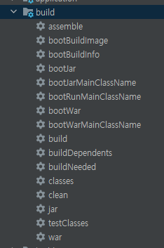

안녕하세요 Mambo 입니다. 이번 글은 AWS Elastic Beanstalk의 `Java SE 플랫폼 환경`을 사용하여 개발된 스프링 부트 애플리케이션을 배포하는 과정에 대해서 학습합니다. AWS를 사용중이라면 `Elastic Beanstalk` 서비스를 통해 애플리케이션이 실행되는 환경을 빠르고 쉽게 구성할 수 있으며 애플리케이션을 배포하고 환경 성능 지표에 따라 프로비저닝할 수 있는 기능을 적용할 수 있습니다.

저와 같이 Elastic Beanstalk 경험이 부족한 초보 개발자 또는 회사에서 서비스 배포를 담당하지 않는 개발자분들은 이 글을 통해 Elastic Beanstlak로 자바 웹 애플리케이션을 배포할 수 있는 환경을 구성하고 어떤 방식으로 애플리케이션을 배포할 수 있는지를 이해할 수 있을 것 입니다. 

> 개발 경력은 4년이 지났으나 애플리케이션 배포를 담당하는 것은 얼마되지 않았어요...

## AWS Elastic Beanstalk
AWS에서 제공하는 [Elastic Beanstalk](https://docs.aws.amazon.com/ko_kr/elasticbeanstalk/latest/dg/Welcome.html)서비스는 AWS 클라우드 환경에서 빠르게 애플리케이션을 배포하고 애플리케이션이 구동되는 환경을 쉽게 관리할 수 있는 AWS의 주요 서비스입니다. Beanstalk을 사용하면 Go, Java, Node.js, Python 등 다양한 언어로 개발된 애플리케이션을 배포할 수 있습니다.

이 글에서 배포할 애플리케이션 소스 코드는 깃허브 [beanstalk-deploy-sample](https://github.com/kdevkr/beanstalk-deploy-sample)에 공유되어있으니 참고하시기를 바랍니다.

> 엄청 간단한 애플리케이션이에요!

### Java SE 플랫폼
Elastic Beanstalk는 다양한 언어로 작성된 애플리케이션을 배포할 수 있게 여러 [플랫폼 환경](https://docs.aws.amazon.com/ko_kr/elasticbeanstalk/latest/dg/concepts.platforms.html)을 지원합니다. 이 중에서 제가 준비한 애플리케이션을 배포할 수 있는 환경은 [Java SE 플랫폼](https://docs.aws.amazon.com/ko_kr/elasticbeanstalk/latest/platforms/platforms-supported.html#platforms-supported.javase)입니다.

> 별도로 Tomcat 플랫폼이 존재하기는 하지만 이 글에서의 주요 관심사는 아니에요.

[Elastic Beanstalk Java SE 플랫폼](https://docs.aws.amazon.com/ko_kr/elasticbeanstalk/latest/dg/java-se-platform.html)은 자체적으로 실행가능하도록 컴파일된 JAR 파일으로 애플리케이션을 실행할 수 있는 환경으로 제가 준비한 애플리케이션이 스프링 부트 기반으로 작성되어있으므로 이 환경이 애플리케이션을 배포할 수 있는 가장 적합한 환경입니다. 스프링 부트에서 제공하는 지원 중 하나는 [실행가능한 JAR 또는 WAR 파일](https://docs.spring.io/spring-boot/docs/current/reference/html/appendix-executable-jar-format.html)으로 패키징할 수 있는 부분입니다.

#### 기본 배포 유형
Elastic Beanstalk의 Java SE 플랫폼 환경은 두가지 방식으로 환경에 업로드된 애플리케이션 파일을 배포할 수 있게 지원합니다. 기본적으로 배포되는 방식은 단일 파일로 자체적으로 실행가능하도록 컴파일된 JAR 파일을 이용하는 것으로 다음의 명령어를 수행하여 Java SE 플랫폼 환경에서 애플리케이션을 구동합니다.

```sh 기본 실행 명령어
java -jar application.jar
```

위 명령에서 애플리케이션 파일명이 `application.jar`인 이유는 우리가 환경에 업로드한 애플리케이션 파일을 application.jar라는 이름으로 변경하기 때문이며 여러분이 어떤 파일의 이름으로 제공하든 상관이 없습니다.

#### 사용자 정의 배포
두번째는 다수의 컴파일된 JAR 또는 `Procfile`이라는 명령어 파일을 통해 애플리케이션을 실행할 수 있는 방식입니다. 이 방식을 사용하면 하나의 환경에서 여러개의 애플리케이션을 실행할 수 있거나 직접 실행할 수 있는 명령어를 정의하므로 JVM 옵션 또는 커맨드 라인 파라미터를 설정할 수 있습니다.

```config Procfile
web: java -Dfile.encoding=UTF-8 -Djava.net.preferIPv4Stack=true -Xmx1g -jar app.jar
```

이렇게 패키징된 JAR 파일과 Procfile을 묶어서 제공하는 파일을 Elastic Beanstalk에서는 소스 번들(Source Bundle)이라고 말합니다. 소스 번들 파일을 Java SE 플랫폼 환경에 업로드하여 배포하는 방식은 아마존 웹 서비스에서도 추천하는 방식입니다.

### Linux 플랫폼 확장
소스 번들 파일로 사용자 정의 배포 방식을 사용하는 경우 .ebextensions, .platform이라는 폴더를 포함시켜 Java SE 플랫폼 환경에 대한 확장을 수행할 수 있도록 지원합니다. 플랫폼 확장에 대한 자세한 내용은 AWS Elastic Beanstalk 개발자 가이드의 [Elastic Beanstalk Linux 플랫폼 확장](https://docs.aws.amazon.com/ko_kr/elasticbeanstalk/latest/dg/platforms-linux-extend.html)를 통해 확인할 수 있습니다.

[인스턴스 배포 워크플로우](https://docs.aws.amazon.com/ko_kr/elasticbeanstalk/latest/dg/platforms-linux-extend.html#platforms-linux-extend.workflow)를 참고하면 업로드된 소스 번들 파일을 통해 Elastic Beanstalk이 어떻게 애플리케이션을 배포하는지 확인할 수 있습니다. 플랫폼 확장을 통해 다음의 작업을 수행할 수 있습니다.

- 애플리케이션 실행하기 전 명령어 수행
- 역방향 프록시 구성

우아한 형제들 기술 블로그의 [Elastic Beanstalk Configuration files(.ebextensions)](https://woowabros.github.io/woowabros/2017/08/07/ebextension.html)에서처럼 플랫폼 확장을 통해 모니터링 패키지를 설치하거나 로컬 타임을 변경할 수 있습니다.

## 빌드부터 배포까지
Elastic Beanstalk의 Java SE 플랫폼 환경에 대해서 알게되었으니 이제부터 제가 준비한 애플리케이션을 Java SE 플랫폼 환경에 배포하는 과정을 확인하면서 빌드부터 배포까지의 프로세스를 숙지해보도록 하겠습니다.

여러분들도 따라하고 싶다면 [kdevkr/beanstalk-deploy-sample](https://github.com/kdevkr/beanstalk-deploy-sample)을 참고하시기 바랍니다.

### 실행가능한 JAR 파일 준비하기
스프링 부트는 그래들(Gradle) 또는 메이븐(Maven) 도구를 사용하여 실행가능한 JAR 또는 WAR 파일을 패키징할 수 있는 방법을 제공합니다. 저는 그래들을 빌드 도구로 사용하는 스프링 부트 프로젝트를 구성하여 다음과 같이 빌드 태스크에 `bootJar`와 `bootWar`가 포함되어있습니다. 



실행가능한 JAR 파일로만 배포할 수 있는 것이 아님을 확인하기 위해 저는 bootWar 태스크로 애플리케이션을 실행가능한 WAR 파일로 패키징하겠습니다. 이 태스크로 패키징된 WAR 파일을 `build/libs` 폴더에 생성됩니다.


이렇게 패키징된 WAR 파일을 확인할 수 있으나 Java SE 플랫폼에 애플리케이션을 배포하는 방식 중 사용자 정의 배포 방식을 위해 생성된 WAR 파일과 함께 이 파일을 실행하는 명령어를 정의한 `Procfile`을 만들어 하나의 소스 번들로 만드는 과정을 진행하겠습니다.

소스 번들 파일을 만들기 위해서 build/libs 폴더에 직접 Procfile을 생성하여 실행 명령어를 정의하면 안됩니다. build 폴더는 Git에서 무시되는 경로이며 clean 태스크에 의해서 쉽게 삭제될 수 있습니다. 가장 쉽게 떠오르는 방법은 프로젝트 루트 경로에 Procfile을 만들어서 build/libs에 패키징된 WAR파일과 압축하는 것입니다.

다행히도 그래들 태스트 유형 중에서 아카이브(압축 파일)을 만들 수 있는 [Zip](https://docs.gradle.org/current/userguide/working_with_files.html#sec:creating_archives_example) 태스크 유형이 있으므로 이 유형에 대한 태스크를 작성하여 소스 번들을 만드는 태스크를 수행하도록 하겠습니다.

먼저, 프로젝트 루트 경로에 `Procfile`을 만들어 애플리케이션 실행 명령어를 작성합니다.

```config Procfile
web: java -Xmx1g -jar demo.war
```

그리고 패키징된 WAR 파일과 Procfile을 압축한 파일을 생성하는 태스크를 작성합니다.

```groovy build.gradle
task zipSourceBundle(type: Zip, dependsOn: 'bootWar') {
    from ('Procfile') {
        include('Procfile')
    }
    from ('build/libs') {
        println bootWar.archiveName
        include(bootWar.archiveName)
    }
    baseName = 'beanstalk'
}
```

작성된 zipSourceBundle 태스크를 수행하면 `build/distributions` 폴더에 `beanstalk.zip`이라는 소스 번들 파일이 생성됨을 확인할 수 있습니다.


그런데 말입니다. 만약, bootWar 태스크에 의해 만들어지는 파일명이 `demo.war`가 아니라면 어떻게 될까요? Procfile에 정의한 명령어와 일치하지 않아 애플리케이션을 배포하는 과정에서 오류가 발생할 것입니다. 이 문제를 해결할 수 있는 좋은 방법은 그래들 빌드 과정에서 Procfile을 생성하는 것입니다.

```groovy build.gradle
task procfile(dependsOn: 'bootWar') {
    doFirst {
        new File("build/libs", "Procfile").text = "web: java -Xmx1g -jar ${bootWar.archiveName}"
    }
}
```

작성된 procfile 태스크는 bootWar 태스크에 의해 만들어지는 WAR 파일명을 주입하여 Procfile을 build/libs 위치에 생성합니다. 그리고 앞서 작성한 zipSourceBundle를 보완한 zipBeanstalk 태스크를 작성합니다. 

```groovy build.gradle
task zipBeanstalk(type: Zip, dependsOn: 'procfile') {
    from ('build/libs') {
        println bootWar.archiveName
        include(bootWar.archiveName)
        include("Procfile")
    }
    baseName = 'beanstalk'
}
```

이제 zipBeanstalk 태스크를 수행하였더니 다음과 같이 애플리케이션 소스 번들 파일이 생성되었습니다.


그래들 빌드 시 프로젝트 버전(project.version)이 명시되어도 Procfile과 패키징된 WAR 파일명이 다른 경우가 발생하지 않습니다.

> 프로젝트 버전을 명시하면 아카이브 파일명에 프로젝트 버전이 포함되요!


> 오옷! 좋아요.

### Java SE 플랫폼 환경 시작하기
애플리케이션 소스 번들 파일이 준비되었으므로 Elastic Beanstalk 서비스에서 자바 애플리케이션을 배포할 수 있는 환경을 생성합니다. 환경에 대한 이름, 도메인을 설정한 후 우리가 준비한 스프링 부트 애플리케이션은 자체적으로 실행되는 JAR로 컴파일된 애플리케이션이므로 `Java SE 플랫폼 환경`을 선택합니다.


앞서 준비한 애플리케이션 소스 번들파일을 선택하여 업로드합니다. 


**주의!**

위 화면에서 환경 생성 버튼을 누르면 기본으로 정의되어있는 인스턴스 프로파일이 구성된 Java SE 플랫폼 환경을 구성하여 애플리케이션을 배포할 수 있습니다. 그러나 주의해야될 사항은 다음 처럼 환경을 생성하고나서 **변경할 수 없는 부분들이 있다**는 점입니다.


기본 Java SE 플랫폼은 **CLB(Classic Load Balancer)** 를 로드밸런서로 사용하는데 환경이 생성된 이후에 로드 밸런서 유형을 변경하고자 구성 편집을 시도하였지만 유형을 변경하는 것을 제공하지 않습니다. 따라서, L7 레벨의 로드밸런서인 **ALB(Application Load Balancer)** 또는 L4 레벨의 **NLB(Network Load Balancer)** 를 환경에 대한 로드밸런서로 사용하기 위해서는 추가 옵션 구성 기능으로 사용자 정의 환경을 생성해야합니다.


> aws ec2 create-default-vpc 명령으로 기본 VPC를 다시 만들수는 있다...

Java SE 플랫폼에서 기본적으로 제공하는 Nginx 프록시 구성은 HTTP(80) 트래픽에 대해 5000 포트를 사용하는 애플리케이션으로 라우팅되도록 설정되어있습니다. Beanstalk에 의해 생성된 EC2 인스턴스에 접속해서 Nginx 설정 정보를 찾아보면 다음과 같이 `00_application.conf` 파일에 프록시 구성이 정의되어 있음을 확인할 수 있습니다.

```sh /etc/nginx/conf.d/elasticbeanstalk/00_application.conf
[root@ip-172-31-40-185 ~]# cat /etc/nginx/conf.d/elasticbeanstalk/00_application.conf 
location / {
    proxy_pass          http://127.0.0.1:5000;
    proxy_http_version  1.1;

    proxy_set_header    Connection          $connection_upgrade;
    proxy_set_header    Upgrade             $http_upgrade;
    proxy_set_header    Host                $host;
    proxy_set_header    X-Real-IP           $remote_addr;
    proxy_set_header    X-Forwarded-For     $proxy_add_x_forwarded_for;
}
```

그런데 제가 배포한 스프링 부트 애플리케이션은 별도로 실행되는 포트를 지정하지 않아 8080 포트를 할당합니다. 

```sh
[root@ip-172-31-40-185 ~]# netstat -tnlp
Active Internet connections (only servers)
Proto Recv-Q Send-Q Local Address           Foreign Address         State       PID/Program name           
tcp6       0      0 :::8080                 :::*                    LISTEN      3512/java 
```

Elastic Beanstalk은 5000 포트에 대한 애플리케이션 상태를 확인하므로 Elastic Beanstalk은 환경 상태를 올바르지 않다고 피드백하게 됩니다. 따라서, 로드밸런서가 트래픽을 애플리케이션으로 라우팅할 수 있도록 애플리케이션을 5000 포트로 할당하도록 해야합니다. 다만, 애플리케이션이 5000 포트를 사용하도록 애플리케이션 프로퍼티 중 **server.port** 를 5000으로 지정하고 다시 패키징하여 배포하는 것은 불편할 수 있습니다.

다시 패키징하지 않더라도 애플리케이션이 구동되는 포트를 변경할 수 있는 방법을 고려해보도록 하죠.

1. 기본 [역방향 프록시 구성](https://docs.aws.amazon.com/ko_kr/elasticbeanstalk/latest/dg/java-se-nginx.html) 파일에 정의된 포트 변경
 - PORT 환경 속성으로 기본 애플리케이션이 수신 대기하는 포트를 재정의
2. JVM 옵션을 지정하여 애플리케이션 실행 포트 변경

1번 방법은 기본으로 정의되는 Nginx 프록시 구성을 변경하는 방법으로 `PORT`라는 환경 속성에 따라 00_application.conf의 내용을 정의합니다.


```sh 00_application.conf
[root@ip-172-31-40-185 ~]# cat /etc/nginx/conf.d/elasticbeanstalk/00_application.conf 
location / {
    proxy_pass          http://127.0.0.1:8080;
    proxy_http_version  1.1;

    proxy_set_header    Connection          $connection_upgrade;
    proxy_set_header    Upgrade             $http_upgrade;
    proxy_set_header    Host                $host;
    proxy_set_header    X-Real-IP           $remote_addr;
    proxy_set_header    X-Forwarded-For     $proxy_add_x_forwarded_for;
}
```

> PORT 환경 속성에 따라 애플리케이션 프록시 포트가 변경되었어요!


스프링 부트 기반의 애플리케이션을 개발하는 개발자라면 환경 속성이라는 이름을 보고 스프링 부트가 지원하는 [외부화 구성(Externalized Configuration)](https://docs.spring.io/spring-boot/docs/current/reference/html/spring-boot-features.html#boot-features-external-config)을 떠올랐을 수 있습니다. 외부화 구성 순서 5번 항목에 `OS 환경 변수`가 있는데 인텔리제이로 애플리케이션을 구동할 때 환경 변수를 지정하여 프로퍼티 값을 설정할 수 있는 것이 이 부분입니다.


이번에는 PORT 환경 속성이 아닌 `SERVER_PORT` 환경 속성에 5000을 설정하여 애플리케이션이 5000 포트로 구동되는지를 확인해봅시다.


```sh
[root@ip-172-31-40-185 ~]# netstat -tnlp
Active Internet connections (only servers)
Proto Recv-Q Send-Q Local Address           Foreign Address         State       PID/Program name              
tcp6       0      0 :::5000                 :::*                    LISTEN      6244/java           
```

> SERVER_PORT 환경 속성에 정의된 포트로 애플리케이션이 실행되었어요!

#### JVM 옵션 설정
환경 속성을 통해 SERVER_PORT를 정의하여 애플리케이션 프로퍼티를 변경할 수 있지만 JVM 옵션으로 `server.port`에 대한 값으로 5000을 지정하는 것을 시도해보겠습니다. 일반적으로 JVM 옵션을 지정하기 위해서는 -Dserver.port와 같이 java 명령어를 수행할 때 지정해야합니다. 하지만 우리는 Procfile에 실행 명령어를 정의해놓았으므로 추가적인 JVM 옵션을 지정할 수 있는 방안이 없습니다.

Elastic Beanstalk에서 JVM 옵션을 지정하는 방법을 검색해보면 [JAVA_TOOL_OPTIONS](https://www.oracle.com/java/technologies/javase/envvars.html#gbmsy) 환경 변수로 지정할 수 있음을 찾을 수 있습니다. JAVA_TOOL_OPTIONS 환경 변수 외에도 JVM 마다 JAVA_OPTS 또는 [_JAVA_OPTIONS](https://stackoverflow.com/questions/28327620/difference-between-java-options-java-tool-options-and-java-opts)를 사용할 수 있습니다만 JAVA_TOOL_OPTIONS이 `JVMTI` 표준 스펙이므로 JAVA_TOOL_OPTIONS을 사용하여 JVM 옵션을 설정하는 게 올바른 방법입니다.

> Java SE 플랫폼 환경의 Correcto JDK는 _JAVA_OPTIONS 환경 속성도 적용되요!

다음은 Elastic Beanstalk Java SE 플랫폼 환경에서 JAVA_TOOL_OPTIONS와 _JAVA_OPTIONS 환경 속성을 지정했을 때 적용 순서입니다.
```sh
Mar  5 16:37:54 ip-172-31-40-185 web: Picked up JAVA_TOOL_OPTIONS: -Dserver.port=5000
Mar  5 16:37:54 ip-172-31-40-185 web: Picked up _JAVA_OPTIONS: -Dserver.port=5001

[root@ip-172-31-40-185 ~]# jps -v
3634 war -Dserver.port=5000 -Xmx1g -Dserver.port=5001
3740 Jps -Dapplication.home=/usr/lib/jvm/java-11-amazon-corretto.x86_64 -Xms8m -Djdk.module.main=jdk.jcmd
```

JAVA_TOOL_OPTIONS 보다 _JAVA_OPTIONS 환경 속성이 나중에 적용되며 Procfile에 정의된 JVM 옵션과의 순서도 다른 것을 확인할 수 있습니다.

### 추가 옵션 구성
기본으로 정의된 환경으로 시작하기보다는 `추가 옵션 구성` 기능을 통해 사용자 정의된 Java SE 플랫폼 환경을 구성하는 것이 좋습니다. 사전 설정을 통해 인스턴스 규모를 선택할 수 있으나 직접 환경 옵션을 정의하기 위해 **사용자 지정 구성** 을 선택합니다.


사용자 지정 구성 선택시 제공되는 기본 옵션은 다음과 같습니다. 몇가지 옵션에 대해서 수정을 해보도록 하죠.


#### 소프트웨어
가장 먼저, 소프트웨어 옵션을 편집하여 기본으로 지정된 애플리케이션 프록시 포트에 맞게 실행될 수 있도록 SERVER_PORT 환경변수를 등록합니다.


#### 용량
용량 옵션을 편집하여 Elastic Beanstalk이 EC2 인스턴스를 어떻게 실행하고 관리할지 설정할 수 있습니다. 기본 단일 인스턴스 환경은 로드밸런서를 사용할 수 없으므로 오토 스케일링 기능을 활성화하기 위하여 로드 밸런싱 수행 환경으로 변경합니다. 로드 밸런싱 수행 환경이지만 처음에는 **단일 인스턴스** 로 시작하기 위하여 인스턴스의 최대 크기를 1로 지정합니다.

만약, 여러분의 애플리케이션이 요구하는 메모리 크기와 CPU 성능이 있다면 인스턴스 유형을 변경합니다. 저는 간단한 애플리케이션을 배포하므로 기본으로 설정된 t2.micro를 사용하겠습니다.

> t2.micro는 1GB의 메모리 크기를 가집니다.


#### 로드밸런서
용량 옵션에서 로드 밸런싱 환경을 선택하면 로드밸런서 옵션을 설정할 수 있게 활성화됩니다. 


기본으로 지정된 로드밸런서는 L7 레벨의 ALB(Application Load Balancer)으로 변경할 필요는 없지만 회사에서는 빠른 트래픽 처리를 위해 L4 레벨의 NLB(Network Load Balancer)를 사용하므로 NLB로 지정하겠습니다. 

각 로드밸런서가 지원하는 기능이 궁금하다면 [Elastic Load Balancing 기능](https://aws.amazon.com/ko/elasticloadbalancing/features/)을 참고하세요. 로드밸런서가 트래픽을 처리하는 리스너와 프로세스를 설정할 수 있지만 여기서는 넘어가도록 하겠습니다.

#### 보안
보안 옵션을 편집하여 EC2 인스턴스에 접근할 수 있는 권한을 설정할 수 있습니다. 키 페어를 지정하면 EC2 콘솔을 통해 연결할 수 있습니다.


#### 네트워크
네트워크 옵션을 편집하여 VPC를 선택하고 로드밸런서와 인스턴스가 사용할 서브넷 대역을 설정할 수 있습니다. 


이제 옵션 구성이 끝났으므로 환경 생성 버튼을 클릭하여 Elastic Beanstalk이 환경을 구성하는 것을 기다립니다. Elastic Beanstalk가 생성한 환경의 상태를 확인하고 애플리케이션으로 트래픽이 처리되는지를 확인하면 됩니다.

Elastic Beanstalk이 환경을 생성하는 것을 기다렸으나 제가 실수로 인스턴스 서브넷을 잘못 지정하여 인스턴스가 생성되지 못하였으나 Elastic Beanstalk는 환경 생성을 위해 상태를 계속 확인하고 기다리는 무한 루프 증상에 빠져버렸습니다.


인스턴스 서브넷을 올바르게 지정하기 위해서 환경 구성 페이지로 가보았지만 Elastic Beanstalk는 환경에 대한 이벤트를 수행하고 있어 어떠한 작업도 진행할 수 없습니다.

> 이처럼 환경에 대한 작업이 수행되고 있을때는 어떠한 요청도 수행할 수 없는 단점이...


#### 제대로 생성되지 않는 Beanstalk 환경 삭제하기
Elastic Beanstalk 서비스에서는 위 환경 생성 작업을 중지할 수 있는 방법이 없습니다. 다만, AWS 서비스 중 CloudFormation을 검색하여 들어가보면 Elastic Beanstalk 환경을 구성하는 스택을 찾을 수 있고 `CREATE_IN_PROGRESS` 상태에 머물러 있는 것을 확인할 수 있습니다. 이 스택을 선택하여 삭제하면 됩니다.

> Java SE 플랫폼 환경을 CloudFormation로 정의해서 구성하는군요?


Beanstalk 환경을 생성하는 스택이 삭제되어 Beanstalk 서비스로 다시 가보면 생성할 때 오류가 발생했던 환경이 삭제되고 있음을 확인할 수 있습니다. 다행입니다.


> 단, 삭제된 환경 이름을 다시 사용하고 싶은 경우 1시간동안 기다려야해요...

환경을 정상적으로 구성한 경우 다음과 같이 배포가 완료되었음을 확인할 수 있습니다.


> 휴...

## 플랫폼 확장 구성
Elastic Beanstalk은 애플리케이션 소스 번들에 포함된 구성 및 플랫폼 파일을 통해 환경에 대한 구성을 확장하는 것을 지원합니다. 구성 파일은 **.ebextensions** 폴더, 플랫폼 파일은 **.platform** 폴더에 위치하게 됩니다. 저는 인프라에 대한 튜닝 방법에 대해서는 잘 모르기 때문에 인터넷에 공유된 내용을 소개하도록 하겠습니다.

### EC2 인스턴스 타임존 변경하기
AWS의 [elastic-beanstalk-samples/configuration-files](https://github.com/awsdocs/elastic-beanstalk-samples/tree/main/configuration-files)에는 EC2 인스턴스의 타임존을 변경할 수 있는 구성 파일 예제(timezone-linux.config)가 있습니다.

```config .ebextensions/00-timezone-linux.config
option_settings:
  - namespace: aws:elasticbeanstalk:application:environment
    option_name: TZ
    value: "Asia/Seoul"

files:
  "/tmp/set_timezone.sh":
    mode: "000755"
    owner: root
    group: root
    content: |
      #!/bin/bash
      NEWTIMEZONE="$(/opt/elasticbeanstalk/bin/get-config environment -k TZ)"
      if [ -z $NEWTIMEZONE ] ; then
          echo "TZ" environment property not set
          exit 1
      fi
      if [ ! -f /usr/share/zoneinfo/$NEWTIMEZONE ] ; then
          echo /usr/share/zoneinfo/$NEWTIMEZONE does not exist
          exit 1
      fi
      echo 'ZONE="'$NEWTIMEZONE'"' > /etc/sysconfig/clock
      echo 'UTC=true' >> /etc/sysconfig/clock
      ln -f -s /usr/share/zoneinfo/$NEWTIMEZONE /etc/localtime

commands:
  00-custom-timezone:
    command: /tmp/set_timezone.sh
```

기존 예제와 다르게 ntpdate로 NTP 서버 동기화 명령어를 수행하지 않고 [Linux 인스턴스의 시간 설정](https://docs.aws.amazon.com/ko_kr/AWSEC2/latest/UserGuide/set-time.html)에 따라 Amazon Time Sync Service와 동기화되는 시간을 그대로 사용하겠습니다.


```sh
[root@ip-10-1-0-52 ~]# date
Sun Mar  7 13:58:57 KST 2021
```

> 명령어가 수행되어 한국 시간으로 표시된다.

### Node Exporter 에이전트 설치
OKKY에서 운영회원으로 활동중이신 창천향로님의 [AWS Beanstalk 성능 튜닝 시리즈](https://github.com/jojoldu/aws-beanstalk-tunning)에서처럼 애플리케이션 성능 모니터링을 위한 APM 에이전트를 설치할 수도 있습니다. 저는 프로메테우스로 EC2 인스턴스에 대한 매트릭을 수집할 수 있도록 Beanstalk로 생성되는 EC2 인스턴스에 Node Exporter를 설치하고 실행하도록 확장 구성을 진행해보겠습니다.

먼저 Nginx 프록시 구성에 Node Exporter에 대한 프록시 구성 파일을 추가합니다.

```conf .platform/nginx/conf.d/elasticbeanstalk/01_node_exporter.conf
location /metrics {
    proxy_pass          http://127.0.0.1:9100/metrics;
    proxy_http_version  1.1;

    proxy_set_header    Connection          $connection_upgrade;
    proxy_set_header    Upgrade             $http_upgrade;
    proxy_set_header    Host                $host;
    proxy_set_header    X-Real-IP           $remote_addr;
    proxy_set_header    X-Forwarded-For     $proxy_add_x_forwarded_for;
}
```

역방향 프록시 구성을 통해 `/metrics`에 대한 트래픽을 Node Exporter로 라우팅할 수 있게 됩니다. 그럼 이제 Node Exporter를 설치하고 실행하는 구성 파일을 만듭니다.

```config .ebextensions/99-install-node-exporter.config
commands:
  command block:
    cwd: /home/webapp
    command: |
      curl -L https://github.com/prometheus/node_exporter/releases/download/v1.1.2/node_exporter-1.1.2.linux-amd64.tar.gz | tar zxv
      cd node_exporter-1.1.2.linux-amd64
      nohup ./node_exporter > /dev/null 2>&1 &
```

여러가지 명령어를 하나로 합칠 수 있는 `command block`을 사용했으며 Node Exporter를 백그라운드로 실행하도록 하였습니다. 이제 이 파일들을 소스 번들에 포함하여 환경에 배포하면 다음과 같이 EC2 인스턴스에 대한 지표를 수집할 수 있게 됩니다.


### Beanstalk 배포 프로세스 확인
Elastic Beanstalk로 애플리케이션을 배포하기까지 문제가 발생했을때 어떤 부분을 체크해야하는지 알아보도록 하죠. 


#### 로그
가장 먼저 확인해야될 부분은 로그입니다.

```sh /var/log
[root@ip-10-1-0-52 log]# ll -h
total 736K
drwx------ 3 root    root      17 Mar  7 11:58 amazon
-rw------- 1 root    root    8.3K Mar  7 11:58 boot.log
-rw------- 1 root    utmp     15K Mar  7 13:36 btmp
-rw-r--r-- 1 root    root    6.9K Mar  7 14:45 cfn-hup.log
-rw-r--r-- 1 root    root     23K Mar  7 14:04 cfn-init-cmd.log
-rw-r--r-- 1 root    root     14K Mar  7 14:04 cfn-init.log
-rw-r--r-- 1 root    root     39K Mar  7 14:04 cfn-wire.log
drwxr-xr-x 2 chrony  chrony     6 Mar  7 11:58 chrony
-rw-r--r-- 1 root    root     93K Mar  7 11:58 cloud-init.log
-rw-r--r-- 1 root    root    2.5K Mar  7 11:58 cloud-init-output.log
-rw------- 1 root    root    9.4K Mar  7 14:40 cron
-rw-r--r-- 1 root    root     27K Mar  7 11:58 dmesg
-rw-r--r-- 1 root    root       0 Mar  7 11:58 eb-cfn-init-call.log
-rw-r--r-- 1 root    root     41K Mar  7 11:58 eb-cfn-init.log
-rw-r--r-- 1 root    root    137K Mar  7 14:04 eb-engine.log
-rw-r--r-- 1 root    root    1.3K Mar  7 14:30 eb-publish.log
-rw-r--r-- 1 root    root     455 Mar  7 12:30 eb-tools.log
drwxr-xr-x 3 healthd healthd   39 Mar  7 12:00 healthd
-rw------- 1 root    root     204 Mar  7 11:58 maillog
-rw------- 1 root    root    205K Mar  7 14:47 messages
drwxr-xr-x 4 nginx   nginx     71 Mar  7 12:45 nginx
drwxr-xr-x 2 root    root       6 Mar  7 11:58 rotated
drwxr-xr-x 2 root    root      18 Mar  7 11:58 sa
-rw------- 1 root    root     41K Mar  7 14:32 secure
-rw------- 1 root    root     21K Mar  7 14:33 web.stdout.log
-rw-rw-r-- 1 root    utmp    7.9K Mar  7 14:32 wtmp
drwxr-xr-x 2 xray    xray       6 Feb 25 22:54 xray
```

로그 파일들은 **/var/log** 폴더에 위치하게 되는데 주로 확인하는 로그는 **eb-engine.log** 와 **web.stdout.log** 입니다. 

- eb-engine.log: Beanstalk 프로세스 로그
- web.stdout.log: 현재 실행되고 있는 애플리케이션의 로그
- cfn-init-cmd.log: .eb-extensions 구성 파일에 정의한 명령어를 수행한 로그

#### 소스 번들 파일
업로드된 소스 번들에 포함된 파일들은 Elastic Beanstalk에 의해서 다양한 위치로 복사됩니다. 

먼저, 현재 배포되고 있는 애플리케이션에 대한 소스 번들 파일과 환경 속성이 정의된 파일은 /opt/elasticbeanstalk/deployment에서 찾을 수 있습니다.

```sh /opt/elasticbeanstalk/deployment
[root@ip-10-1-0-52 deployment]# ll -h
total 18M
-rw-r--r-- 1 root root  18M Mar  7 14:04 app_source_bundle
-rw-r--r-- 1 root root   92 Mar  7 14:04 app_version_manifest.json
-rw-r--r-- 1 root root 4.0K Mar  7 14:04 cfn-metadata-cache.json
-r-------- 1 root root  211 Mar  7 14:04 env
```

그리고 소스 번들(app_source_bundle)에 포함된 WAR 파일과 Procfile은 /var/app/current에 복사되어 실행합니다. 현재 배포되고 있는 애플리케이션이 제대로된 버전으로 실행되고 있는지 파악할 수 있겠습니다.

```sh /var/app/current
[root@ip-10-1-0-52 current]# ll -h
total 20M
-rw-r--r-- 1 webapp webapp 20M Mar  7 14:02 demo-1.0.0.war
-rw-r--r-- 1 webapp webapp  36 Mar  7 14:02 Procfile
```

플랫폼(.platform)에 추가된 프록시 구성파일은 해당 프록시 하위로 복사됩니다. 예를 들어, 앞서 작성해본 01_node_exporter.conf 프록시 구성 파일은 /etc/nginx/conf.d/elasticbeanstalk에 복사됩니다.

```sh /etc/nginx/conf.d/elasticbeanstalk
[root@ip-10-1-0-52 elasticbeanstalk]# ll -h
total 12K
-rw-r--r-- 1 root   root   397 Mar  7 14:04 00_application.conf
-rw-r--r-- 1 webapp webapp 420 Mar  7 00:05 01_node_exporter.conf
-rw-r--r-- 1 root   root   215 Mar  7 14:04 healthd.conf
```

/etc/nginx/conf.d/elasticbeanstalk 폴더에는 기본으로 제공되는 프록시 구성 파일과 함께 소스 번들에 포함된 프록시 구성 파일이 존재하는 것을 확인할 수 있습니다.

## 끝마치며
실제로 실무에서 Elastic Beanstalk로 애플리케이션을 배포하는 것은 다양한 부분에서 검토를 진행해야합니다. 개발된 애플리케이션이 요구하는 최소 환경 사양에 따라 인스턴스 유형을 설정해야하며 서비스 구조에 따라 유연하게 트래픽을 처리할 수 있는 ALB를 적용할 지 빠른 트래픽 처리를 위해 NLB로 로드 밸런싱을 단순화 해야할지를 정해야할 수 있습니다. 

Elastic Beanstalk로 애플리케이션을 배포하는 것이 쉽다는 장점은 있지만 **문제가 발생했을때 해결하는 것이 쉽지 않다는 단점** 이 분명히 존재합니다. 실제로 최근에 애플리케이션을 배포하는 과정에서 많은 변경사항들로 인하여 배포 전환이 용이하지 않아 별도로 환경을 구성하고 트래픽을 전환하는 과정을 수행하기도 했습니다. 실무에서 예기치 못하게 발생하는 문제들로 인하여 쉽게 배포되겠지라는 생각과 달리 배포가 쉽지 않아 작성해보았습니다. 이상으로 AWS Elastic Beanstalk Java SE 플랫폼 환경으로 애플리케이션 배포하기를 마치겠습니다.

감사합니다.