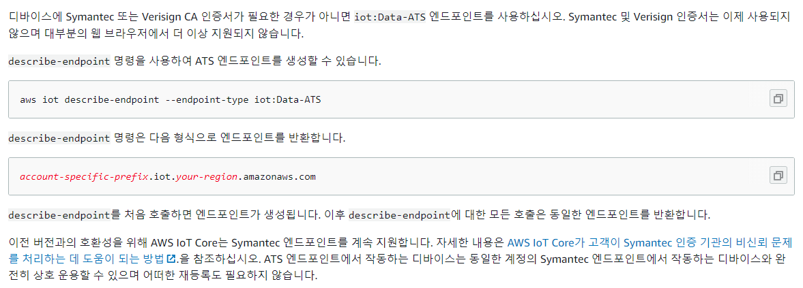

안녕하세요. Mambo 입니다. 

이번에 공유할 내용은 OpenJDK에서 Symantec에서 발급된 TLS 인증서를 JDK에서 신뢰하지 않는 문제를 경험하고 이에 대한 문제를 임시조치하고 해결책을 찾아본 이야기입니다. 

## 어떤 문제가 발생했나요?
현재 일하고 있는 회사에서 개발중인 프로젝트에서는 업무 협약으로 [텔레노어 커넥션(Telenor Connecxion)](https://www.telenorconnexion.com/ko/)에서 제공하는 [Thing API](https://docs.telenorconnexion.com/mic/thing-api/)를 사용하여 MQTT 기능을 접목하였습니다. 텔레노어 커넥션에서 제공하는 Thing API는 [AWS IoT](https://aws.amazon.com/iot/)를 사용하여 MQTT version 3.1.1 기반의 브로커 서비스를 제공합니다. 

그런데 얼마전 텔레노어 커넥션의 Managed IoT Cloud에 MQTT 클라이언트를 연결하려고 시도하였으나 다음과 같은 오류가 발생하였습니다.

```sh
javax.net.ssl.SSLHandshakeException: 
TLS Server certificate issued after 2019-04-16 and anchored by a distrusted legacy Symantec root CA
```

위 오류는 JDK에서 TLS 연결 시 시만텍 CA 인증서를 신뢰하지 않으므로 오류를 발생한 내용입니다. 왜 신뢰하지 않고 왜 갑자기 이런 오류가 뜨는걸까요?

### OpenJDK Distrust Symantec CA
[구글의 '시만텍 불신' 빌미 된 한국 파트너](https://zdnet.co.kr/view/?no=20170331133307)라는 기사에서 구글이 시만텍에서 발급된 인증서를 신뢰하지 않기로 했다는 내용을 확인하였고 더 찾아보니 [Chrome’s Plan to Distrust Symantec Certificates](https://security.googleblog.com/2017/09/chromes-plan-to-distrust-symantec.html)와 에서 구글 뿐만 아니라 모질라, 애플, 마이크로소프트에서 조차 시만텍에서 서명한 인증서를 신뢰하지 않겠다고 발표함으로써 오라클에서도 JDK에서 **2019년 4월 16일 이후에 서명된 시만텍 인증서**를 신뢰하지 않기로 조치하였습니다.

- [Oracle's Plan for Distrusting Symantec TLS Certificates in the JDK](https://blogs.oracle.com/java-platform-group/jdk-distrusting-symantec-tls-certificates)
- [Release Note: Distrust TLS Server Certificates Anchored by Symantec Root CAs](https://bugs.openjdk.java.net/browse/JDK-8215012)

## 어떻게 조치하셨나요?

### 임시조치
[Oracle's Plan for Distrusting Symantec TLS Certificates in the JDK](https://blogs.oracle.com/java-platform-group/jdk-distrusting-symantec-tls-certificates)에서 시만텍 인증서를 신뢰하지 않도록 처리되는 내용과 함께 `jdk.security.caDistrustPolicies` 옵션을 수정하여 SYMANTEC_TLS에 대한 신뢰하지 않는 것을 무시하도록 설정할 수 있음을 알려주고 있습니다.

또한, 스택오버플로우에서 [동일한 문제](https://stackoverflow.com/questions/58437531/how-to-fix-javax-net-ssl-sslhandshakeexception-tls-server-certificate-issued-a)에 대한 답변으로 위 속성을 주석처리하라는 것을 확인하였으며 이에 따라 임사로 Dockerfile로 도커 이미지를 구성할 때와 Beanstalk 자바 플랫폼 환경을 확장하는 파일에 다음과 같이 변경하여 조치하였습니다.

__에이전트 실행 환경 이미지__  
```dockerfile Dockerfile
FROM amazoncorretto:11
RUN sed -i.old 's/^jdk\.security\.caDistrustPolicies=SYMANTEC_TLS$/#&/g' /usr/lib/jvm/java-11-amazon-corretto/conf/security/java.security
```

__AWS Beanstalk 구성 확장__  
```config .ebextensions/00-java-ca-distrust-policies.config
files:
  "/tmp/set_symantec_tls.sh":
    mode: "000755"
    owner: root
    group: root
    content: |
      #!/bin/bash
      sed -i.old 's/^jdk\.security\.caDistrustPolicies=SYMANTEC_TLS$/#&/g' /usr/lib/jvm/java-11-amazon-corretto.x86_64/conf/security/java.security

commands:
  00-set_symantec_tls:
    command: /tmp/set_symantec_tls.sh
```

위 작업 후 시만텍 인증서를 신뢰하지 않는 정책에 대한 옵션이 적용되지 않아 JDK에서 정상적으로 TLS 연결을 수행하는 것을 확인할 수 있었습니다. 이제 이것이 임시로 조치된 작업인 이유를 알아보도록 하겠습니다.

### 근본적인 해결책
앞서 AWS IoT의 엔드포인트는 레거시와 ATS를 지원한다고 하였는데요. 이 부분에서 이상함을 느끼고 관련 문서들을 찾아보기 시작했습니다. 

AWS IoT는 TLS와 X.509 인증서를 사용하여 [인증](https://docs.aws.amazon.com/ko_kr/iot/latest/developerguide/server-authentication.html)을 수행해야합니다. 그리고 Aws IoT Core는 VeriSign에서 서명한 인증서를 제공하는 레거시 엔드포인트와 ATS(Amazon Trust Services) CA에서 서명한 인증서를 제공하는 ATS 엔드포인트를 지원합니다. AWS IoT에서는 시만텍 인증서를 더이상 사용하지 않는다며 레거시 엔드포인트가 아닌 ATS를 사용하는 것을 권장하고 있었습니다.



음... 그러면 텔레노어의 Thing API가 레거시 엔드포인트만 지원하는 걸까?


텔레노어의 Managed IoT Cloud도 AWS IoT 플랫폼을 사용하므로 동일하게 레거시 엔드포인트를 사용할 수는 있었고 텔레노어 측 문서에서조차 ATS 엔드포인트를 언급하고 있었습니다. 사실 텔레노어 API 연동 작업을 제가 적용했던 것은 아니고 이 부분을 진행하셨던 분이 퇴사하신 상황이었습니다. 그리고 얼마전 개발자 한분이 텔레노어 관련 코드를 수정하면서 시만텍 인증서를 신뢰하지 않는다는 오류가 발생한 상황입니다.

그럼 수정한 내역 중에서 이 문제가 발생한 근본적인 원인이 있을테니 이를 검토해보았습니다. 프로젝트는 Git으로 소스코드에 대한 변경사항을 버저닝하므로 변경 내역을 트래킹할 수 있어 깃허브에 들어가 관련 커밋을 찾아보았습니다.


저희는 커밋 메시지에 관련된 이슈(작업) 번호를 명시하도록 하였기에 쉽게 해당 이슈와 관련된 커밋들을 추적할 수 있었습니다. 


회사 코드이므로 주요 정보는 마스킹 처리했으며 잘 살펴보니 뭔가 다르게 변경된 내용이 있었습니다.


엔드포인트?! 기존에 사용하던 엔드포인트 주소는 -ats가 붙어있지만 변경된 엔드포인트는 ats가 없었습니다. ATS 엔드포인트 유형의 형태는 어떻게 되는지 찾아보았는데요.

__[How AWS IoT Core is Helping Customers Navigate the Upcoming Distrust of Symantec Certificate Authorities](https://aws.amazon.com/ko/blogs/iot/aws-iot-core-ats-endpoints/)__


__[AWS IoT device endpoints](https://docs.aws.amazon.com/ko_kr/iot/latest/developerguide/connect-to-iot.html#iot-device-endpoint-intro)__


ATS 엔드포인트 형태는 **prefix-ats.iot.region.amazonaws.com**가 된다고 합니다. 그러니까 결국 ATS 엔드포인트로 제대로 사용하고 있던 기존 설정을 레거시 엔드포인트로 변경해버려서 발생한 오류였습니다. 텔레노어 계정을 변경하기 위하여 다시 발급하면서 엔드포인트를 변경해버렸고 시만텍 인증서를 제공하는 엔드포인트이므로 JDK에서 신뢰하지 못하는 것으로 처리된 것이었습니다.

## 끝마치며
알고보니 `개발자의 사소한 실수(?)`로 발생한 문제였으나 JDK에서 신뢰하지 못하도록 하는 정책 옵션이 있다는 것도 알게되었고 시만텍에서 서명한 인증서를 신뢰하지 못하게 된 사건도 알게되는 꽤 유익한 트러블이었던 것 같습니다. 

다음의 JDK 버전은 시만텍에서 서명한 인증서를 신뢰하지 못하도록 처리되었으니 참고하시기 바랍니다.

- JDK 7u221 이상 
- JDK 8u212 이상
- JKD 11.0.3 이상

감사합니다.