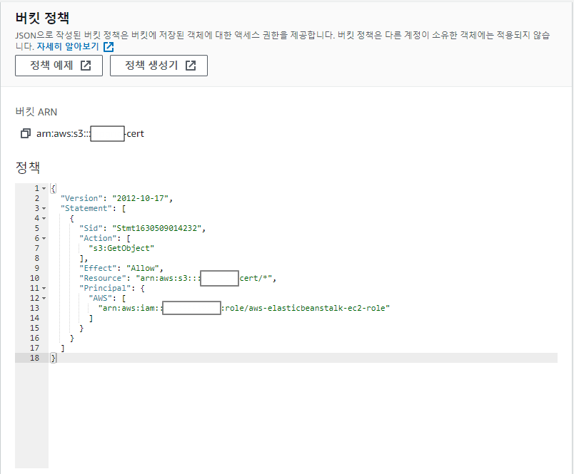

안녕하세요 Mambo 입니다.

오늘은 Elastic Beanstalk 구성 시 S3 프라이빗 저장소에서 파일을 받아오는 것을 알아보고자 합니다. 지난 [TLS 오프로드](../tls-offload)에서 Nginx 에서 사용할 SSL 인증서를 Beanstalk 환경 구성 파일의 [파일 키](https://docs.aws.amazon.com/ko_kr/elasticbeanstalk/latest/dg/customize-containers-ec2.html#linux-files)를 사용하여 생성했었습니다. 하지만, 보안을 중요시하는 회사라면 애플리케이션 소스 번들에 인증서와 개인키를 포함시키는 것을 허용하지 않을 수 있습니다. 그렇기 때문에 애플리케이션 소스 번들에 인증서를 포함하지 않고 애플리케이션 배포 단계에서 가져올 수 있는 방안을 마련해야합니다.

## Beanstalk S3 Auth
Beanstalk 확장 구성 파일에서 CloudFormation의 [AWS::CloudFormation::Authentication](https://docs.aws.amazon.com/ko_kr/AWSCloudFormation/latest/UserGuide/aws-resource-authentication.html) 리소스를 사용하여 S3 버킷에 대한 자격 증명을 지정할 수 있고 인증을 수행하여 S3 저장소에 등록되어있는 인증서를 가져올 수 있습니다. [프라이빗 키를 Amazon S3에 안전하게 저장](https://docs.aws.amazon.com/ko_kr/elasticbeanstalk/latest/dg/https-storingprivatekeys.html)에서 알려주는 대로 Beanstalk 구성 시 [Fn::GetOptionSetting](https://docs.aws.amazon.com/ko_kr/elasticbeanstalk/latest/dg/ebextensions-functions.html#ebextensions-functions-getoptionsetting) 함수를 활용하면 됩니다.

### S3 Bucket Policy
먼저, **AWS::CloudFormation::Authentication** 리소스로 S3 버킷에 대한 자격 증명을 가질 수 있도록 S3 버킷에 보안 정책을 설정해야 합니다. 일반적으로 Beanstalk으로 애플리케이션을 배포하는 경우 **aws-elasticbeanstalk-ec2-role**을 인스턴스 프로파일로 가지게 됩니다. 인증서 파일이 저장된 S3 버킷은 퍼블릭 액세스가 차단되어있으므로 EC2 인스턴스가 [버킷에 대한 권한을 가지도록 정책을 추가](https://docs.aws.amazon.com/ko_kr/AmazonS3/latest/userguide/add-bucket-policy.html)합니다.



### Extend Nginx
이제 이전에 작성하였던 SSL 인증서를 만들어내는 구성 파일을 S3에서 받아오도록 작성해야합니다. files 키의 **content** 항목을 제거하고 다음의 항목을 추가합니다.

- source : S3 인증서 오브젝트 URL
- authentication : 인증 속성 이름

```yaml .ebextensions/nginx-cert.config
Resources:
    AWSEBAutoScalingGroup:
        Metadata:
            AWS::CloudFormation::Authentication:
                S3Auth:
                    type: S3
                    buckets:
                        - mambo-cert
                    roleName:
                        Fn::GetOptionSetting:
                            Namespace: aws:autoscaling:launchconfiguration
                            OptionName: IamInstanceProfile
                            DefaultValue: aws-elasticbeanstalk-ec2-role
files:
    "/etc/nginx/cert/server.crt":
        mode: "000400"
        owner: nginx
        group: nginx
        source: https://mambo-cert.s3.ap-northeast-2.amazonaws.com/server.crt
        authentication: S3Auth
    "/etc/nginx/cert/server.key":
        mode: "000400"
        owner: nginx
        group: nginx
        source: https://mambo-cert.s3.ap-northeast-2.amazonaws.com/server.key
        authentication: S3Auth
    "/etc/nginx/cert/server.ca-bundle":
        mode: "000400"
        owner: nginx
        group: nginx
        source: https://mambo-cert.s3.ap-northeast-2.amazonaws.com/server-ca-bundle
        authentication: S3Auth

commands:
    00-chain-ca-bundle:
        cwd: /etc/nginx/cert
        command: |
            cat server.crt server.ca-bundle > server-ca.pem
            chown nginx:nginx server-ca.pem
            chmod 400 server-ca.pem
    99-remove-bak:
        cwd: /etc/nginx/cert
        command: rm -f *.bak
```

### Beanstalk Resources
아마존 웹 서비스의 리소스들은 CloudFormation으로 만들어지며 Elastic Beanstalk 환경도 **CloudFormation 스택을 구성**하여 만들어지게 됩니다.

```yaml .ebextensions/nginx-cert.config
Resources:
    AWSEBAutoScalingGroup:
        Metadata:
            AWS::CloudFormation::Authentication:
                S3Auth:
                    type: S3
                    buckets:
                        - mambo-cert
                    roleName:
                        Fn::GetOptionSetting:
                            Namespace: aws:autoscaling:launchconfiguration
                            OptionName: IamInstanceProfile
                            DefaultValue: aws-elasticbeanstalk-ec2-role
```

그래서 구성 파일의 리소스 키를 정의하는 것은 CloudFormation 템플릿에 리소스를 추가하는 것과 같습니다. 위 예시에서는 Beanstalk 환경 시작 시 만들어지는 CloudFormation 스택에 미리 정의된 웹 서버 환경의 리소스 항목인 [AWSEBAutoScalingGroup](https://docs.aws.amazon.com/ko_kr/AWSCloudFormation/latest/UserGuide/aws-properties-as-group.html)을 사용했습니다. 

그리고 AWSEBAutoScalingGroup에는 [LaunchConfiguration(AWS::AutoScaling::LaunchConfiguration)](https://docs.aws.amazon.com/ko_kr/AWSCloudFormation/latest/UserGuide/aws-properties-as-launchconfig.html)라는 EC2 인스턴스에 대한 시작 구성을 정의하는 항목이 있으며 시작 구성에 정의된 내용 중에는 [IamInstanceProfile](https://docs.aws.amazon.com/ko_kr/AWSCloudFormation/latest/UserGuide/aws-properties-as-launchconfig.html#cfn-as-launchconfig-iaminstanceprofile) 속성이 있습니다. IamInstanceProfile 속성은 EC2 인스턴스에 대한 인스턴스 프로파일로 지정된 **IAM Role**에 대한 이름을 제공합니다.

따라서, Beanstalk 환경 구성 시 선택한 IAM Role을 가져와서 **AWS::CloudFormation::Authentication** 리소스를 활용해 S3 버킷에 대한 자격 증명을 지정한 것입니다. 우리는 앞서 aws-elasticbeanstalk-ec2-role이라는 IAM Role이 인증서가 저장된 S3 버킷에 읽기 권한을 부여했기 때문에 파일 키에 정의된 파일을 생성할 때 외부 소스(S3 저장소)에서 가져올 수 있게된 것입니다. 이렇게 해서 우리는 애플리케이션 소스 번들에 인증서를 포함시키지 않고 EC2 인스턴스에서만 접근할 수 있는 S3 버킷에 인증서를 저장하고 사용할 수 있는 구성을 할 수 있게 되었습니다.

이 글을 보시는 분들이 인증서의 개인키와 같은 민감한 파일들을 애플리케이션 소스 번들에 포함하고 있다면 프라이빗 S3 저장소에 저장하여 더 안전한 방식으로 애플리케이션을 배포하는 것을 고려해보시기 바랍니다.

감사합니다.


