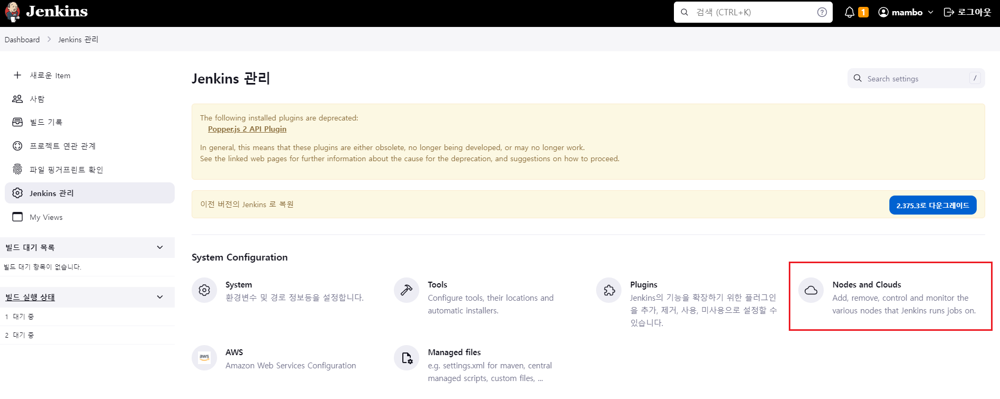
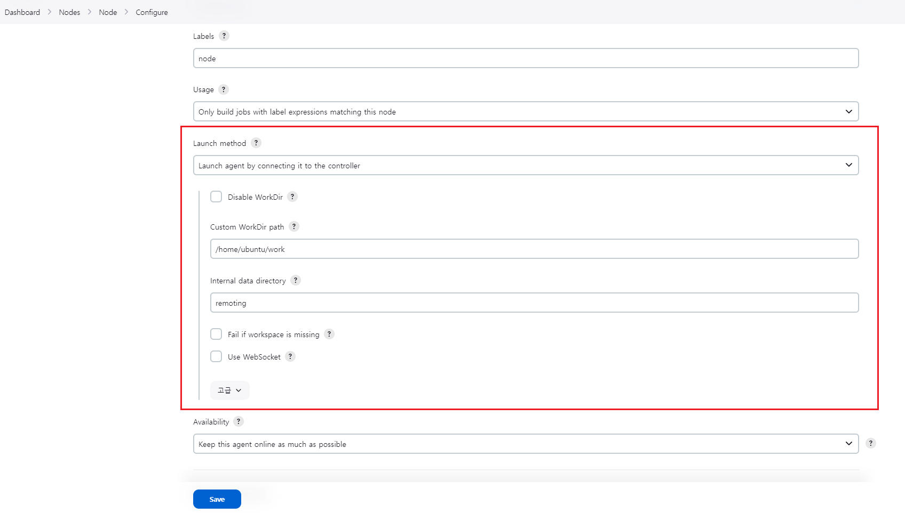
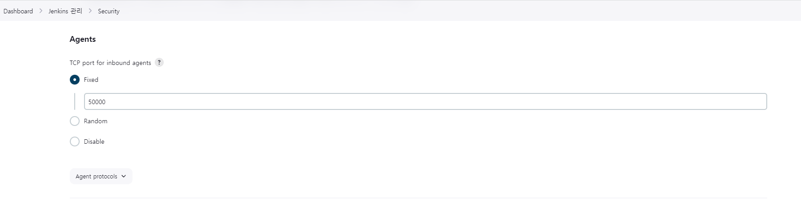
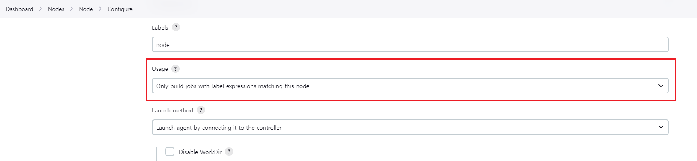
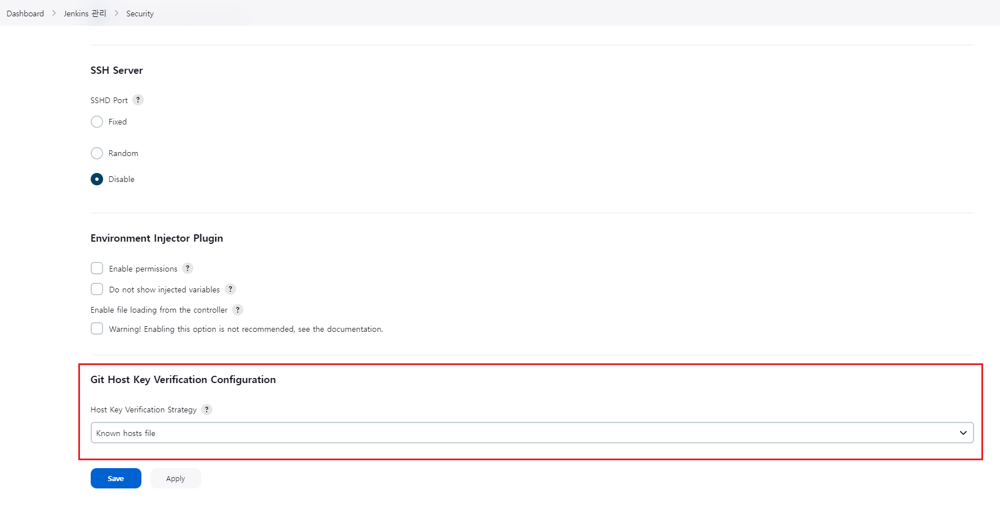
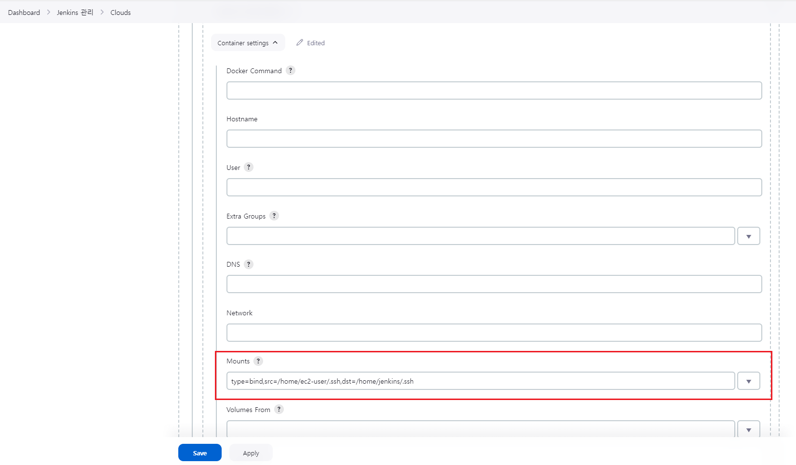

현재 회사의 개발 조직에서는 하나의 모놀리식 프로젝트를 다양한 환경을 위해서 빌드 및 배포하고 있다. 그리고 빌드와 배포를 위해서 하나의 마스터로 동작하는 젠킨스 서버를 구성하여 사용하고 있고 하나의 서버에서 빌드를 수행해도 무방할 만큼 서비스 규모가 크거나 시스템에 대한 배포가 자주 수행되진 않기에 단일 빌드 서버로 운용해도 충분하다고 볼 수 있다. 개인적으로는 인터넷에 공유된 글들을 통해 대부분의 회사에서는 프로덕션을 위한 빌드 환경을 위해 다양한 CI/CD 도구들을 활용하기도 하고 젠킨스 서버에 대해 컨트롤러(마스터)와 에이전트(슬레이브)로 구성되는 클러스터(분산 빌드 환경)으로 구성한다는 것을 알고 있었다. 

컨트롤러와 에이전트로 동작하는 빌드 환경을 만들어야하는 요구사항이 필요하게 된 건 분산 빌드의 목적보다는 젠킨스 서버가 Amazon Linux 2 AMI 이미지로 실행된 EC2 서버에 설치되었기 때문에 [Node.js 18 LTS 버전을 지원하지 않는 제약사항](https://okky.kr/articles/1451364)이 발생했기 때문이다. 일부 환경에 대해서 인수 테스트를 통한 품질 강화를 위해서 Jest를 도입하게 되면서 Node.js 12 또는 14 LTS에 의존했던 것을 Node.js 18 LTS로 호환성 버전을 올리고자 했기 때문이다. (Node.js 16 또는 18 LTS 버전을 호환성 범위로 체크했다.)

> Node.js 14도 호환성 버전 후보에 있으나 ARM 아키텍처로 동작하는 M1 또는 M2 맥 환경에서 Node.js 14 LTS는 공식 빌드가 포함되어있지 않기 때문에 [Using NodeJs 14 with Mac Silicon (M1)](https://devzilla.io/using-nodejs-14-with-mac-silicon-m1)와 같은 정보들을 참고해서 터미널이 AMD 64 아키텍처로 동작하도록 변경해서 사용해야 하는 불편함에 의해 제외시켰다.

젠킨스 서버를 Amzon Linux 2023 또는 Ubuntu 20.24 이상의 EC2 서버로 이관하는 방법도 있지만 젠킨스 서버를 [지원 종료되는 AL1](https://endoflife.date/amazon-linux)에서 Amazon Linux 2로 이관한 지 얼마되지 않았기 때문에 인프라 엔지니어에게 요청하는 것은 비효율적이다라는 생각이 들었기 때문이다. 굳이 젠킨스 서버를 새로운 EC2 서버로 재구성하거나 컨테이너 기반으로 실행하지 않아도 분산 빌드 환경으로 제공하는 에이전트(노드나 클라우드) 기능으로 별도의 서버나 컨테이너에서 빌드를 수행하는 것을 지원하기 때문에 클러스터 구성을 시도하고자 한다.

> 젠킨스 분산 빌드 환경을 구성해보는 것은 좋은 경험이었다고 생각되나 별도의 서버에서 프로젝트 빌드를 수행할 수 있도록 설정하기 까지 생각보다 어려웠다. 이러한 이유로 빌드에 성공하기까지의 과정에서 발생한 문제들을 기록해보고자 한다.

#### 젠킨스 관리 > Nodes and Clouds



분산 빌드 환경의 젠킨스 클러스터를 구성하는 것은 젠킨스 관리에서 Nodes and Clouds 메뉴를 통해 수행할 수 있다. 에이전트를 등록하는 방식에 따라 노드는 리눅스 서버 또는 VM 머신에서 빌드를 수행하고 클라우드는 도커 컨테이너 또는 쿠버네티스와 같은 환경으로 빌드를 수행하는 것이라고 생각하면 된다. 젠킨스 서버가 EC2에 설치되어있다고 하더라도 EC2에 도커 엔진과 컨테이너가 설치되어있다면 도커 엔진의 유닉스 도메인 소켓을 통해 클라우드 에이전트를 등록할 수 있다.

노드 에이전트를 등록하는 방법에는 젠킨스 서버에서 SSH와 같은 방식으로 연결을 관리하는 것과 별도의 윈도우나 리눅스 서버와 같은 곳에서 실행된 노드 에이전트가 젠킨스 서버에 특정 포트를 사용하여 연결을 요구하는 방식으로 나누어진다. 젠킨스 서버에 Elastic IP가 할당되어있으므로 굳이 VPC 간 연결을 수행할 수 있도록 작업을 하지 않더라도 노드 에이전트에서 젠킨스 서버에 TCP 연결을 수행할 수 있도록 인바운드 규칙만 설정하면 되는 간단한 방식이라 후자를 선택했다. 노드 에이전트가 실행될 서버는 오류 트래킹 시스템이 구동되는 서버로 미달 프로비저닝 상태로 보고된 EC2(Amazon Linux 2023으로 실행된 유일한 EC2)를 노드로 추가하기로 했다.

##### Launch method → Launch agent by connecting it to the controller



자바로 실행되는 노드 에이전트에서 컨트롤러(마스터)에 연결하는 방식으로 노드 에이전트에서 젠킨스 서버에 연결할 수 있는 TCP 포트를 요구하므로 젠킨스 관리 > Security 메뉴의 Agents 항목에서 TCP port for inbound agents에 대한 설정을 Fixed로 선택하여 50000번 포트로 입력했다. 젠킨스 서버에서 노드를 추가하면 젠킨스 서버로 부터 자바 에이전트 파일을 다운로드할 수 있는 여러가지 명령어를 제공해준다. 노드 에이전트를 설치하려는 환경에 맞게 복사해서 호출하면 된다.



> 젠킨스 서버에 자바 에이전트가 연결할 수 있도록 보안 그룹에 TCP 50000번 포트를 인바운드 규칙으로 추가해야 한다. 또한, 일반적으로 노드 에이전트를 연결하는 포트가 50000번을 사용하는 것으로 알려져 있기에 보안적인 관점을 두어야한다면 별도의 포트를 지정하는 것을 추천한다.

##### Usage → Only build jobs with label expressions matching this node



노드 에이전트를 추가하는 이유는 분산 빌드의 목적이 아닌 Node.js 18 LTS를 사용하여 프론트엔드 애플리케이션 코드를 빌드하여 배포할 수 있는 환경을 만들고자 함에 있으므로 기존에 동작하던 프로젝트들은 그대로 젠킨스 서버에서 수행할 수 있도록 특정 프로젝트에서 별도로 라벨을 지정하여야만 해당 노드를 통해 빌드를 수행할 수 있도록 하였다. 젠킨스 서버에 노드 에이전트를 추가하는 과정에서도 일부 프로젝트가 빌드될 가능성이 있으므로 잘못된 환경에서 빌드되어 배포되는 것을 막고자하는 최소한의 조치이다.

#### Clouds > Docker Cloud details
노드가 아닌 도커 컨테이너 환경에서 빌드를 수행하고자 하는 경우 클라우드를 통해 도커 에이전트를 등록하면 된다. 앞서 언급했듯이 젠킨스 서버 내에 설치한 도커 엔진에 연결하고자 하는 경우 유닉스 도메인 소켓 방식의 unix:///var/run/docker.sock을 지정하면 되며 별도의 서버의 도커 엔진에 연결하고자 하는 경우에는 해당 서버에서 도커 엔진을 실행할 때 TCP 연결을 수행할 수 있도록 아래와 같이 서비스를 수정하고 다시 실행해야한다.

```shell
vi /lib/systemd/system/docker.service
ExecStart=/usr/bin/dockerd -H tcp://0.0.0.0:2375 -H unix:///var/run/docker.sock

sudo systemctl daemon-reload
sudo service docker restart

curl http://localhost:2375/version
```

> 만약, 리눅스 서버가 아닌 윈도우 또는 맥 환경의 도커 데스크탑에서는 TCP 연결을 활성화할 방법이 없을 수 있으니 별도의 방법을 찾아보아야 한다. 맥의 경우 [socat을 통해 TCP와 유닉스 도메인 소켓을 연결하는 우회 방법](https://github.com/docker/for-mac/issues/1156#issuecomment-273764881)이 있는 것 같다.

##### 도커 에이전트 이미지 (Optional)
처음에는 도커 에이전트를 추가하고나서 에이전트 템플릿을 등록하는 과정에서 에이전트 이미지를 [jenkins/agent](https://github.com/jenkinsci/docker-agent)를 사용하도록 했으나 실제로 프로젝트를 빌드하려는 과정에서 일부 패키지가 없어서 오류가 발생함에 따라 jenkins/agent:jdk17를 베이스로 하여 별도의 에이전트 이미지를 만들어서 사용해야했다.

```dockerfile Dockerfile
FROM jenkins/agent:jdk17
USER root
RUN apt-get update \
 && apt-get install build-essential python3 -y
USER jenkins
```

> 위 이미지는 사용중인 라이브러리에 따라 g++ 또는 python3 를 찾을 수 없다는 오류가 발생하여 추가한 것으로 조직에서 사용하는 도커 허브 계정의 퍼블릭 리파지토리에 올렸으며 프라이빗 환경이라면 Registry Authentication 설정이 요구된다.

#### 젠킨스 관리 > Security > Git Host Key Verification configuration


프로젝트에서 빌드할 소스코드를 가져오기 위해 깃을 사용하는 경우 [SSH Host Key verification](https://plugins.jenkins.io/git-client/#plugin-content-ssh-host-key-verification)의 Host Key Verification Strategy가 Known hosts file이 기본값인 관계로 슬레이브 노드 에이전트나 클라우드로 추가한 도커 에이전트에서 빌드를 수행하는 경우 `No ECDSA host key is known for github.com and you have requested strict checking.
Host key verification failed.` 와 같은 오류가 발생할 수 있다.

```shell
git ls-remote -h git@github.com:[user]/[project].git HEAD
```

노드 머신이나 도커 에이전트로 실행되는 컨테이너에 ~/.ssh/known_hosts 파일이 없기 때문이며 위와 같이 깃허브 호스트에 대한 지문을 최소한 한번이라도 추가하여 known_hosts 파일을 만드는 것이 요구될 수 있다. 만약, 도커 에이전트에서 도커 컨테이너를 만드는 경우 위 명령어를 수행할 수 없기에 도커 에이전트로 연결되는 서버에서 위 명령어를 수행한 후 마운트 옵션을 통해 known_hosts 파일을 전달하도록 설정하는 것도 방법이다.

##### Container settings > Mounts


위와 같이 Docker Agent Templates를 등록하는 설정에서 Container settings > Mounts 옵션을 통해 위 명령어로 만들어진 known_hosts 파일을 공유할 수 있도록 `type=bind,src=/home/ec2-user/.ssh,dst=/home/jenkins/.ssh`와 같은 방식으로 입력하면 된다.

젠킨스 서버의 분산 빌드 환경 구성에 대한 튜토리얼은 아니기 때문에 생략한 정보가 많을 수 있지만 일부의 내용만으로도 도움이 되기를 바래본다.