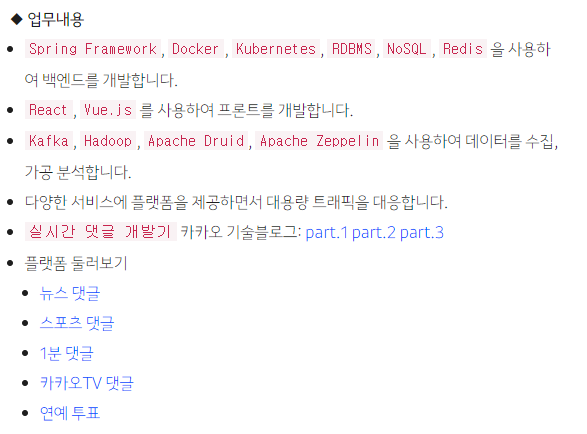
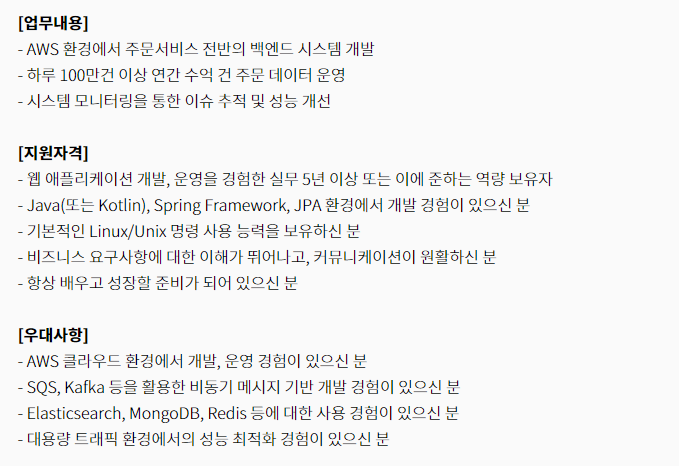
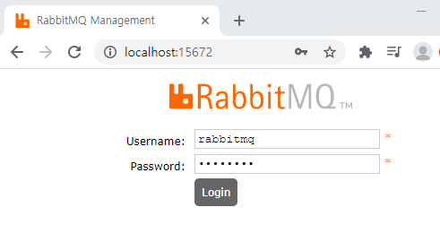
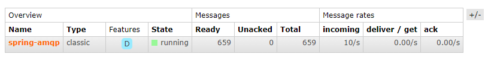
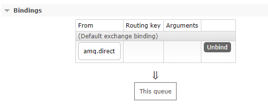

안녕하세요 맘보(Mambo)입니다. 제가 부족하다고 느끼는 기술 스택 중 하나는 `메시지 큐(MQ)`입니다. 메시지 큐는 더 많은 트래픽을 처리하기 위하여 데이터를 비동기로 처리하거나 서로 다른 시스템에서도 데이터를 활용할 수 있도록 사용하는데요. 현재 일하고 있는 회사에서 진행하는 프로젝트에서는 메시지 큐를 도입하지 않아서 메시지 큐에 대한 기술 경험이 전무한 상태입니다. 따라서, 간단하게나마 메시지 큐에 대해서 알아보고 언제라도 메시지 큐를 도입할 수 있게 준비하고자 합니다.

## 메시지 큐

### 메시지 큐를 활용한 개발 경험
카카오 또는 우아한 형제들과 같이 대용량 트래픽을 처리하는 서비스들의 채용 공고를 보면 메시지 큐에 대한 경험이 우대 사항으로 있는 것을 확인할 수 있습니다. 모든 프로젝트에 메시지 큐를 도입할 필요성은 없지만 빠르게 생성되는 데이터를 처리하기 위해서 메시지 큐는 필수적으로 사용해야하는 기술임을 확인할 수 있습니다.





위와 같이 트래픽이 많은 서비스를 개발하는 직군의 경우 메시지 처리 기술에 대한 경험을 우대하는 것을 확인할 수 있습니다. 개발자로 일하면서 대용량 트래픽을 처리하는 서비스를 개발하는 회사로 갈 수 있을지는 모르겠습니다. 😅

> 저런 회사가서 일 해보고 싶긴하네요...

### 메시지 큐 시스템
메시지 큐를 제공하는 메시지 큐 시스템은 상당히 많습니다. 위 공고에서 확인할 수 있는 [`Apache Kafka`](https://kafka.apache.org/)부터 시작해서 [`ActiveMQ`](https://activemq.apache.org/), [`ZeroMQ`](https://zeromq.org/), [`Apache Pulsar`](http://pulsar.apache.org/), [`NATS`](https://nats.io/) 그리고 `RabbitMQ`와 같은 것들이 있죠. 아파치 카프카는 분산 메시지 스트리밍 환경을 제공하는 오픈소스 시스템으로 많은 기업들이 사용하고 관심있는 듯 합니다. 

[Benchmarking Apache Kafka, Apache Pulsar, and RabbitMQ: Which is the Fastest?](https://www.confluent.io/blog/kafka-fastest-messaging-system/)

아파치 카프카에 대해서는 나중에 추가적으로 학습해볼 예정이고 오늘 알아볼 메시지 큐 시스템은 [AMQP(Advanced Message Queuing Protocol)](https://www.amqp.org/) 기반의 `래빗MQ(RabbitMQ)` 입니다. [래빗MQ](https://www.rabbitmq.com/)는 `Pivotal`에서 개발한 오픈소스 메시지 큐 브로커로써 [스프링 AMQP](https://spring.io/projects/spring-amqp) 프로젝트는 기본적으로 래빗MQ를 지원하기도 합니다.

> Pivotal Software는 2020년 2월 VMware에 인수되었습니다.

## RabbitMQ
스프링 AMQP 프로젝트에서 Pivotal에서 개발한 RabbitMQ를 지원하는 것은 당연할 수 있습니다. 래빗MQ는 얼랭(Erlang)으로 개발되었으나 오픈소스에 기여할 것이 아니라면 이 언어에 대해서 알 필요는 없습니다. 래빗MQ 설치 문서를 참고하여 서버에 직접 설치하지만 저는 학습 목적으로 윈도우 환경에서 도커를 통해 래빗MQ 컨테이너를 구성하고 실행하도록 하겠습니다.

### 공식 도커 이미지
[RabbitMQ Docker Official Images](https://hub.docker.com/_/rabbitmq)

도커에서 공식적으로 래빗MQ에 대한 이미지를 지원하므로 도커 컴포즈 문서를 생성하고 쉽게 실행할 수 있습니다.

```yaml https://github.com/mambo-dev/spring-amqp-rabbitmq/blob/main/docker-compose.yml
version: '3'
services:
  rabbitmq:
    container_name: rabbitmq
    image: rabbitmq:3-management
    ports:
      - 5672:5672
      - 15672:15672
      - 15692:15692
    environment:
      RABBITMQ_DEFAULT_USER: rabbitmq
      RABBITMQ_DEFAULT_PASS: rabbitmq
      RABBITMQ_DEFAULT_VHOST: /
    volumes:
      - ./rabbitmq/enabled_plugins:/etc/rabbitmq/enabled_plugins
```

도커 컴포즈 명령어로 래빗MQ가 구성된 컨테이너를 실행하고 래빗MQ [Management Plugin](https://www.rabbitmq.com/management.html)이 활성화되어 웹 브라우저에서 `localhost:15672`로 웹 UI에 접근할 수 있습니다.



### 메시지 처리 다이어그램


위 그림은 CloudAMQP 블로그의 [Part 1: RabbitMQ for beginners - What is RabbitMQ?](https://www.cloudamqp.com/blog/part1-rabbitmq-for-beginners-what-is-rabbitmq.html) 글에서 확인할 수 있는 다이어그램으로 래빗MQ에 의해 처리되는 메시지 프로세스를 확인할 수 있습니다. 래빗MQ에 메시지 큐를 구성해놓고 `프로듀서(Producer)`가 여러가지 방식으로 메시지를 발행(Publish)하고 메시지 큐에 저장된 데이터를 `컨슈머(Consumer)`가 수신(Subscribe)하는 프로세스입니다.

### 스프링 AMQP 프로젝트
[스프링 AMQP 프로젝트](https://spring.io/projects/spring-amqp)는 스프링 기반의 애플리케이션에서 래빗MQ와 같은 AMQP 구현체를 활용하여 쉽게 메시지 큐 기능을 지원합니다. 제가 이 글을 작성하기 위해서 진행한 관련 코드는 깃허브 [spring-amqp-rabbitmq](https://github.com/mambo-dev/spring-amqp-rabbitmq) 리파지토리를 통해 참고하실 수 있습니다.

#### 메시지 큐 생성
스프링 AMQP를 통해 래빗MQ에 큐(Queue)를 쉽게 생성할 수 있습니다. 큐를 생성할 Configuration 클래스를 만들고 Queue 클래스를 빈으로 등록합니다.

```java AmqpConfig.RabbitMQConfig
public class AmqpConfig {

    private AmqpConfig() {}

    @Profile({"rabbitmq"})
    @Configuration
    static class RabbitMQConfig {

        public static final String SPRING_AMQP_QUEUE = "spring-amqp";

        @Bean
        public Queue springAmqpQueue() {
            return new Queue(SPRING_AMQP_QUEUE);
        }

    }
}
```

이제 애플리케이션이 구동될 때 `spring-amqp`라는 이름의 큐가 존재하지 않으면 래빗MQ에 생성합니다. 메시지 큐가 생성되었으므로 이제 래빗MQ에 메시지를 발행할 프로듀서와 메시지를 수신할 컨슈머를 구성해야합니다. 프로듀서와 컨슈머가 동일한 애플리케이션에 구성될 필요는 없으나 학습 목적이므로 동일한 애플리케이션에서 프로듀서와 컨슈머를 서비스 유형의 빈으로 등록하겠습니다.

#### 프로듀서 생성
프로듀서는 `RabbitTemplate` 유형의 빈을 가지는 클래스입니다. 저는 스프링 부트 애플리케이션으로 구성하였기에 `RabbitAutoConfiguration`라는 자동 구성 클래스에 의해 RabbitTemplate가 빈으로 자동으로 등록됩니다.

```java DefaultProducer
@Service
public class DefaultProducer {

    private final RabbitTemplate rabbitTemplate;

    public DefaultProducer(RabbitTemplate rabbitTemplate) {
        this.rabbitTemplate = rabbitTemplate;
    }

    @Scheduled(fixedRate = 100, initialDelay = 500)
    public void publish() {
        String message = "uuid:" + UUID.randomUUID().toString();
        rabbitTemplate.convertAndSend(SPRING_AMQP_QUEUE, message);
    }
}
```

위 프로듀서는 0.1초마다 랜덤 문자열을 메시지 큐에 발행합니다. 프로듀서만 생성하고 애플리케이션을 실행하면 래빗MQ에 생성한 `spring-amqp` 큐에 메시지가 적재됩니다.



#### 컨슈머 생성
이제 래빗MQ에 적재된 메시지를 소비할 컨슈머를 등록해야합니다. 컨슈머는 `@RabbitListener` 또는 `@RabbitHandler`를 메소드에 선언하여 등록할 수 있습니다. 

```java DefaultConsumer
@Slf4j
@Service
public class DefaultConsumer {

    @RabbitListener(queues = {SPRING_AMQP_QUEUE}, concurrency = "3-5")
    public void consume(Message message) {
        log.info("consume {}", new String(message.getBody()));
    }

}
```

`spring-amqp` 큐에 적재된 메시지를 3개 ~ 5개의 컨슈머로 동시에 처리하도록 하였고 메시지에 대한 작업이 오래걸리지 않으므로 순식간에 메시지 큐가 비어지는 것을 확인할 수 있을 것입니다.

### 메시지 발행 유형
앞서 프로듀서가 메시지를 단순하게 큐 이름을 지정해서 발행하였는데요. 사실은 래빗MQ와 같은 AMQP 기반의 메시지 큐 시스템에서는 다양한 방식으로 메시지를 발행할 수 있는 기능을 지원하고 있습니다. 메시지 처리 다이어그램에서 확인할 수 있는 익스체인지(Exchange)와 바인딩(Binding)이 바로 그 개념입니다. 

#### 익스체인지
[익스체인지 유형](https://www.rabbitmq.com/tutorials/amqp-concepts.html#exchanges)에는 다이렉트(Direct), 팬아웃(Fanout), 토픽(Topic), 헤더(Header)가 있으며 앞서 프로듀서가 큐 이름을 지정해서 메시지를 발행할 수 있던 것이 [기본 익스체인저](https://www.rabbitmq.com/tutorials/amqp-concepts.html#exchange-default) 유형으로 만들어져 있는 다이렉트 익스체인지를 사용한 경우입니다.

RabbitTemplate의 convertAndSend라는 이름의 함수를 찾아보면 익스체인지 유형과 라우팅 키를 지정할 수 있도록 오버로딩되어있는 것을 확인할 수 있습니다.

```java
public class RabbitTemplate {
    @Override
    public void convertAndSend(String routingKey, final Object object) throws AmqpException {
        convertAndSend(this.exchange, routingKey, object, (CorrelationData) null);
    }

    @Override
    public void convertAndSend(String exchange, String routingKey, final Object object) throws AmqpException {
        convertAndSend(exchange, routingKey, object, (CorrelationData) null);
    }
}
```

#### 바인딩
래빗MQ에서 프로듀서가 발행한 메시지를 큐로 전달하기 위해서 추가적으로 적용되는 개념이 바인딩입니다. 익스체인지와 큐를 연결해주는 규칙이라고 이해하시면 됩니다. 

스프링 AMQP에서는 @RabbitListener에 @QueueBinding로 바인딩 규칙을 설정할 수 있게 지원하고 있습니다.

```java
@RabbitListener(
    concurrency = "3-5",
    bindings = {
        @QueueBinding(value = @Queue(name = SPRING_AMQP_QUEUE), exchange = @Exchange(name = "amq.direct"))
    }
)
public void consume(Message message) {
    log.info("consume {}", new String(message.getBody()));
}
```

위 예시는 앞선 큐 이름을 지정한 것과 비슷하게 래빗MQ에 기본적으로 생성되어있는 다이렉트 익스체인지와 바인딩되도록 설정한 경우입니다. 애플리케이션이 구동되는 경우 `spring-amqp` 큐는 `amq.direct` 익스체인지와 연결되는 것을 확인할 수 있습니다.



이렇게 해서 간단하게 래빗MQ에 대해서 알아보고 스프링 AMQP 프로젝트를 의존성에 추가하여 프로듀서가 메시지를 래빗MQ에 발행해보았으며 메시지 큐에 저장되는 메시지를 컨슈머가 받아서 처리할 수 있음을 확인했습니다. 실제로 프로젝트에 도입하기 위해서는 다양한 부분에 대해서 검토해야겠지만 그것은 미래의 맘보에게 떠넘기도록 하겠습니다.

감사합니다.

## 참고

- [Part 1: RabbitMQ for beginners - What is RabbitMQ?](https://www.cloudamqp.com/blog/part1-rabbitmq-for-beginners-what-is-rabbitmq.html)
- [Benchmarking Apache Kafka, Apache Pulsar, and RabbitMQ: Which is the Fastest?](https://www.confluent.io/blog/kafka-fastest-messaging-system/)
- [AMQP 0-9-1 Model Explained](https://www.rabbitmq.com/tutorials/amqp-concepts.html)
- [Part 4: RabbitMQ Exchanges, routing keys and bindings](https://www.cloudamqp.com/blog/part4-rabbitmq-for-beginners-exchanges-routing-keys-bindings.html)
