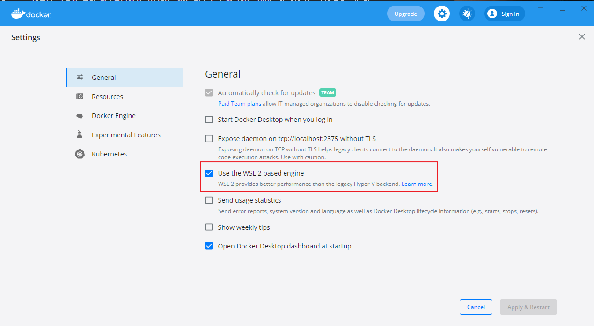
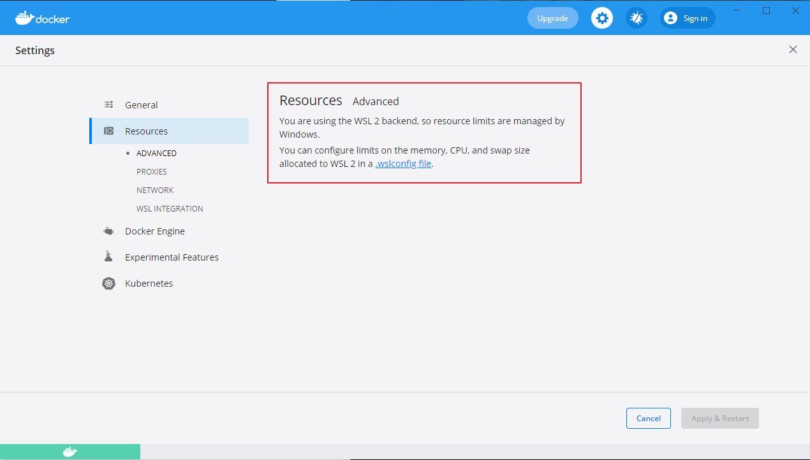
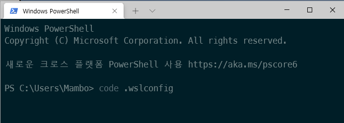
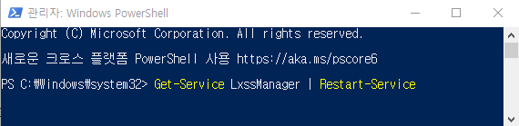
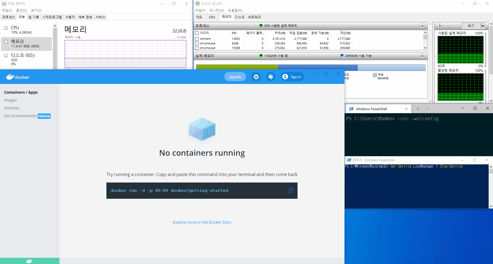
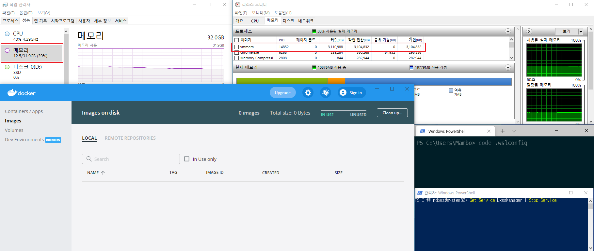
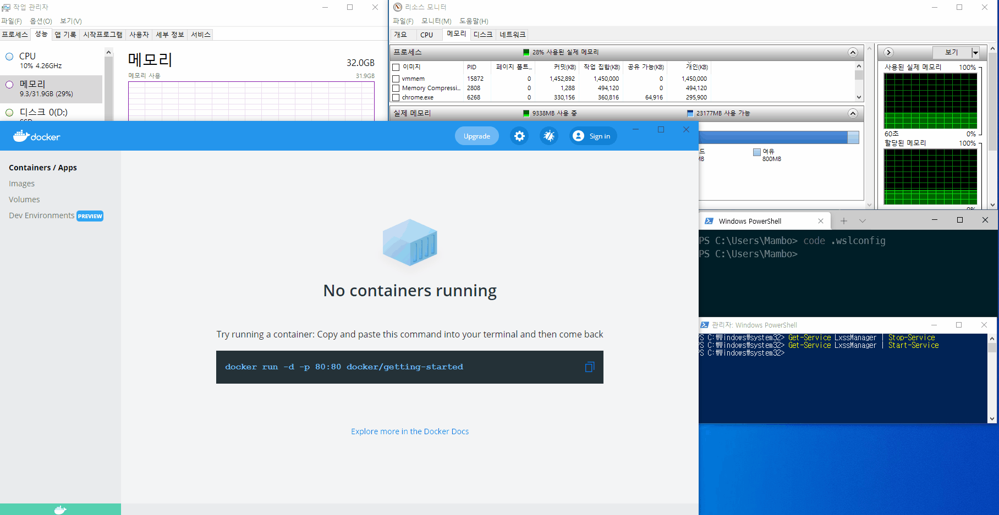
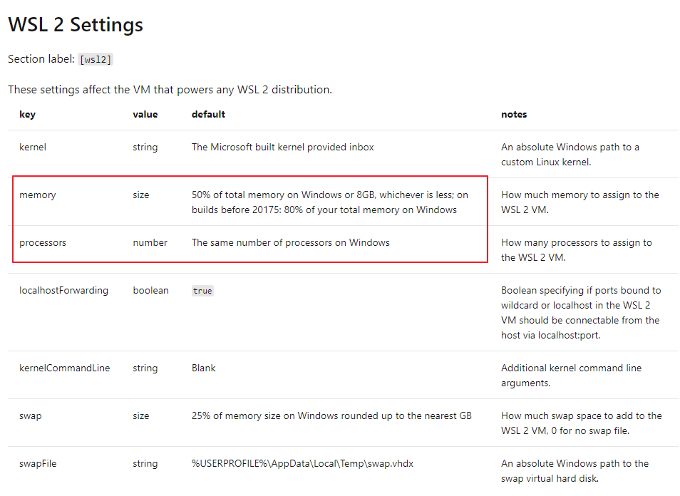

안녕하세요 Mambo 입니다. 

오늘은 **윈도우 환경의 도커 데스크탑에서 사용하는 WSL 리소스를 제한하는 방법**에 대하여 공유하고자 합니다. 윈도우에서 도커 데스크탑을 사용할 때 컴퓨터가 느려진다는 느낌을 받고있다면 현재 도커 데스크탑과 WSL에 의해 점유되는 메모리를 확인하시고 이 글에서 소개하는 방법으로 WSL가 점유하는 리소스를 제한하시는게 좋습니다.

## Docker Desktop WSL 2
윈도우 10 환경에서 WSL 2를 설치하고 활성화했다면 도커 데스크탑에서 WSL 2를 사용해서 컨테이너를 구동될 수 있도록 지원하고 있습니다. 



> Docker Desktop uses the dynamic memory allocation feature in WSL 2 to greatly improve the resource consumption. This means, Docker Desktop only uses the required amount of CPU and memory resources it needs, while enabling CPU and memory-intensive tasks such as building a container to run much faster.

도커 데스크탑 공식 문서에서는 WSL 2을 사용하면 메모리를 동적으로 할당할 수 있고 리소스를 효율적으로 소비한다고 소개합니다. 그런데 실제로 도커를 사용하여 다수의 컨테이너를 실행하다보면 컴퓨터 성능이 점점 느려지는 것을 체감하실 수도 있는 분들도 계실텐데요. 이 문제는 WSL 깃허브에 이슈로 등록되어있는데 WSL가 점유하는 메모리를 제대로 반환하지 못하는 현상인 것 같습니다.

[WSL 2 consumes massive amounts of RAM and doesn't return it](https://github.com/microsoft/WSL/issues/4166)

이슈가 등록된 날짜는 2019년이지만 아직도 해결되지 않고 오픈된 상태로 남아있는 이슈입니다. 개발자 한분은 [WSL2 VM이 점유하는 리소스를 제한하는 방법](https://github.com/microsoft/WSL/issues/4166#issuecomment-526725261)을 사용하여 WSL에서 사용하는 메모리를 제한하라고 해결책을 제시합니다.

### WSL Configuration
위에서 소개한 방법은 이미 도커 데스크탑에서도 설정 메뉴에서 소개하고 있는 부분으로 리소스 제한은 윈도우에 의해 관리되므로 CPU, 메모리 등을 제한하기 위해서는 WSL 2의 설정을 수행하라고 합니다.




#### .wslconfig 정의
사용자 폴더 위치에서 .wslconfig 파일을 직접 생성하거나 다음과 같이 윈도우 터미널에서 비쥬얼 스튜디오 코드를 사용하여 생성할 수 있습니다. 

> 파일을 만들기 위한 파워 쉘 명령어가 별도로 존재하지만 비쥬얼 스튜디오 코드로 여는게 더 편하다고 생각합니다.



비쥬얼 스튜디오 코드로 열어진 .wslconfig 파일의 내용을 다음과 같이 입력하고 저장합니다.

```plain .wslconfig
[wsl2]
memory=4GB
processors=2
swap=0
```

#### .wslconfig 반영
파일에 정의한 내용을 WSL에 반영하기 위해서는 도커 데스크탑을 종료하고 **PowerShell**을 관리자 권한으로 실행한 다음 **LxssManager**를 다시 실행해야합니다.



### 비교해보기
다음은 간단하게 WSL 2의 기본 설정에 의해 동작하는 것과 .wslconfig을 정의해서 WSL 에서 사용할 리소스를 제한하였을 경우를 비교한 내용입니다. 대략적으로 어떤 차이를 보이는지만 확인해주시기 바랍니다.

#### 기본 WSL 2
먼저, 기본 WSL 2 설정에 의해 도커 데스크탑이 점유하게 되는 리소스를 확인해보죠.



기다리기 지겨워하실 분들을 위해서 설명하자면 컨테이너를 실행할때마다 메모리가 올라가면서 4GB를 점유한 것을 보여주고 있습니다. 사용하는 만큼 메모리를 점유하는 것은 당연한 부분일 수 있으나 문제는 그 다음부터 발생합니다.



위 화면을 살펴보시면 도커 데스크탑으로 실행했던 컨테이너를 전부 종료하고 이미지 그리고 볼륨을 전부 삭제했음에도 불구하고 **WSL2에서 점유중인 메모리의 일부는 반환되지 않고 있음**을 보여줍니다. 

#### 사용자 정의 WSL 2
이제 WSL 2에서 점유하여 사용할 프로세서를 2개, 메모리를 2GB 그리고 스왑을 하지않도록 설정하고 앞서 컨테이너를 실행했던 것을 다시 시도 해본 결과를 확인해보겠습니다.



기본 설정때와는 다르게 여러개의 컨테이너를 실행하더라도 WSL2에서 할당하는 메모리는 2GB를 넘지않게 됨을 확인할 수 있습니다. 물론, 점유하고 있는 리소스가 제한되어있기 때문에 컨테이너 성능은 줄어들게 당연한 부분입니다. 따라서, 시스템 자원이 여유롭다면 적당하게 제한하시는 것을 추천합니다.

## 느려짐을 체감하는 이유
.wslconfig 파일을 정의하지 않고 기본 설정으로 WSL 2를 사용하고 있을때 도커 데스크탑이 시스템 자원을 어느정도 까지 사용할 수 있을 지 확인해보겠습니다.



기본적으로 ***프로세서는 전부 사용***한다고 하며 메모리는 **총 메모리의 절반 또는 8GB 중 작은쪽으로 설정**됩니다. 저의 경우는 32GB의 메모리이므로 메모리의 절반보다 작은 8GB가 설정되게 됩니다. 일반적으로 개발자가 사용하는 컴퓨터의 메모리 용량 16GB이라면 동일하게 8GB이므로 **무려 총 메모리의 절반이나 점유**할 수 있게 되고 컨테이너를 종료하더라도 일부의 메모리는 점유하고 있을 수 있다는 이야기입니다.

윈도우의 리소스 모니터를 사용해서 vmmem에 할당된 메모리가 높은지 확인해보시기 바라며 이상으로 도커 데스크탑이 사용하는 WSL 리소스 제한하기를 마치겠습니다.

감사합니다.