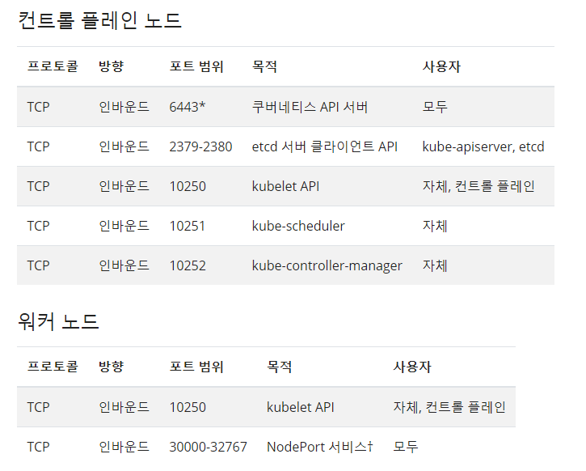
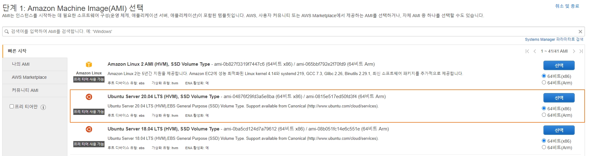
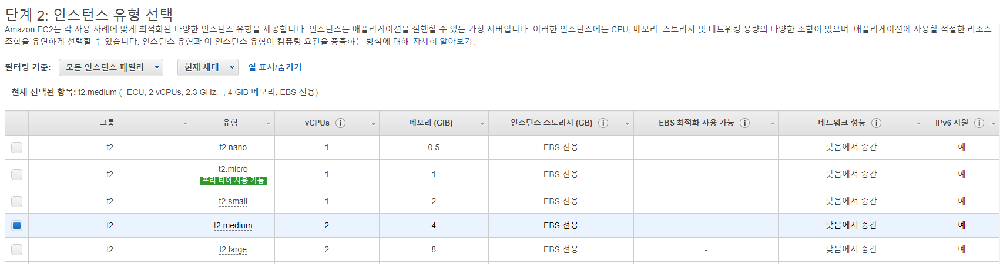

안녕하세요 Mambo입니다. 오늘은 쿠버네티스 클러스터를 구성하는 것에 대해 학습해보고 정리하고자 합니다. 저는 IT 인프라를 담당하는 전문 인력이 아닌 중소기업에 다니고 있는 일반 개발자이기 때문에 IT 인프라에 대한 전문 지식이 요구되는 쿠버네티스에 대한 이해가 어려웠습니다. 저는 개발 또는 애플리케이션에 필요한 인스턴스를 도커 컴포즈 문서(docker-compose.yaml)를 작성하여 컨테이너로 실행하는 편이지만 회사에서는 AWS의 Beanstalk를 사용해서 배포하고 운영하기 때문에 컨테이너 환경 기반의 오케스트레이션 도구인 쿠버네티스에 대한 도입은 필요하지 않았습니다.

그러나 얼마전에 회사에서 2021년 클라우드 플래그십 프로젝트 중 에너지 분야에 참여한다고하여 현재 운영중인 애플리케이션을 나무기술의 **칵테일 클라우드**라고하는 PaaS를 통해 배포되고 운영되도록 전환해야하는 필요성이 요구되었습니다. 

## 쿠버네티스 클러스터
쿠버네티스는 다수의 호스트가 통신하며 클러스터를 구성하는데 컨트롤 플레인 노드가 동작하는 마스터 노드와 함께 애플리케이션이 실행될 컨테이너가 동작하게 될 워커 노드로 구성됩니다. 쿠버네티스가 오픈소스 기술인 만큼 다양한 오픈소스와 결합할 수 있음으로 인하여 기술적인 어려움을 느낄 수도 있게 됩니다.

실제로 쿠버네티스 클러스터 구성을 PaaS로 제공하고 있는 [파스-타(PaaS-TA)](https://paas-ta.kr/intro/guideInstall) 또는 [칵테일 클라우드](https://www.cocktailcloud.io/main.do)도 kubespray, istio 등 여러가지 오픈소스를 결합한 솔루션을 만들어 제공하고 있는 것입니다. 또한, 쿠버네티스 클러스터 운영 관리의 어려움으로 인하여 쿠버네티스 클러스터를 쉽게 구성하고 관리할 수 있는 AWS의 [Amazon EKS](https://docs.aws.amazon.com/eks/latest/userguide/what-is-eks.html) 또는 구글 클라우드 플랫폼의 GKE와 같은 서비스가 제공되었을 것 입니다.

쿠버네티스 관리형 서비스 또는 쿠버네티스 PaaS 솔루션을 사용하면 쉽게 쿠버네티스 클러스터를 구성할 수 있으나 저는 쿠버네티스 학습을 위해 쿠버네티스 클러스터를 시작할 수 있는 도구로 쿠버네티스 클러스터 환경을 구성해보고자 합니다.

### 쿠버네티스 클러스터 배포 도구
쿠버네티스 클러스터를 구성할 수 있는 도구도 kubeadm, kops, kubespray 뿐만 아니라 IoT를 목적으로 경량화된 클러스터 구성을 목적으로하는 [k3s](https://k3s.io/), [MicroK8s](https://microk8s.io/)등 여러가지 오픈소스가 존재합니다. 저는 쿠버네티스 공식 문서에서도 가이드를 제공하고 온-프레미스 환경에서 일반적으로 많이 사용될 수 있는 기본적인 배포 도구인 `kubeadm`을 사용하겠습니다.

쿠버네티스 클러스터는 데비안 계열의 배포판인 우분투 리눅스로 구성하며 kubeadm 패키지와 함께 kubelet, kubectl을 같이 설치해야합니다.

다음은 우분투 리눅스에서 kubeadm, kubelet, kubectl를 설치하는 명령어입니다.

```sh
sudo apt-get update
sudo apt-get install -y apt-transport-https ca-certificates curl

sudo curl -fsSLo /usr/share/keyrings/kubernetes-archive-keyring.gpg https://packages.cloud.google.com/apt/doc/apt-key.gpg
echo "deb [signed-by=/usr/share/keyrings/kubernetes-archive-keyring.gpg] https://apt.kubernetes.io/ kubernetes-xenial main" | sudo tee /etc/apt/sources.list.d/kubernetes.list

sudo apt-get update
sudo apt-get install -y kubelet kubeadm kubectl
sudo apt-mark hold kubelet kubeadm kubectl
```

위 명령어에 의해 설치된 패키지는 다음의 역할을 수행하게 됩니다.

- kubeadm : 쿠버네티스 클러스터 배포
- kubelet : 컨트롤 플레인 노드와 통신하여 컨테이너가 파드에 실행될 수 있도록 도와주는 에이전트
- kubectl : 쿠버네티스 클러스터에 명령을 내리기 위해 사용하는 CLI

> 쿠버네티스 클러스터를 구성하는 모든 호스트에 위 패키지들을 설치해야합니다.

### 컨테이너 인프라 환경의 가용성
쿠버네티스 클러스터를 구성하는 호스트들이 컨테이너 인프라 환경을 구성할 수 있는지 가용성을 확인해야합니다.

#### 메모리 스왑 기능 비활성화
정확한 이유는 모르지만 쿠버네티스 클러스터 노드에서 동작하는 kubelet이 정상적으로 동작하기 위해서는 반드시 우분투 리눅스의 메모리 스왑 기능을 비활성화 해야한다고 합니다.

```sh Terminal
sudo swapoff -a && sudo sed -i '/ swap / s/^\(.*\)$/#\1/g' /etc/fstab
```
> [Node swap support](https://github.com/kubernetes/enhancements/issues/2400)으로 확인할 수 있듯이 스왑 기능을 활성화하기 위한 작업을 진행중입니다.

#### 클러스터 노드의 고유 주소 확인
쿠버네티스 클러스터를 구성하는 호스트들이 고유한 주소를 가지고 있는지 MAC 주소 및 product_uuid를 확인해야한다고 합니다.

```sh Terminal
sudo apt install net-tools
sudo ifconfig -a
sudo cat /sys/class/dmi/id/product_uuid
```

그리고 호스트가 쿠버네티스 클러스터를 구성하게될 노드에 맞게 사용될 포트를 점유하고 있는지 확인해야합니다.



#### 컨테이너 런타임 선택하기
쿠버네티스 클러스터에서 파드 안에 컨테이너를 실행하기 위해 사용하게 될 컨테이너 런타임을 선택하고 설치해야합니다. 이미 많은 블로그에서 도커를 컨테이너 런타임으로 사용하는 것으로 소개하고있지만 앞으로 최신 쿠버네티스 클러스터 버전에서는 [컨테이너 런타임 인터페이스를 준수하지 않는 도커](https://kubernetes.io/blog/2020/12/02/dont-panic-kubernetes-and-docker/)를 컨테이너 런타임으로 지원하지 않을 예정입니다. 

따라서, 저는 [CRI-O](https://cri-o.io/)를 컨테이너 런타임으로 선택하고 설치하겠습니다. 설치해야하는 CRI-O 버전은 [호환 매트릭스](https://github.com/cri-o/cri-o#compatibility-matrix-cri-o--kubernetes)에 따라 설치한 쿠버네티스 버전과 일치하도록 하면 됩니다.

CRI-O를 설치하기 전에 우분투의 iptables가 브릿지된 트래픽을 바라보도록 설정해야합니다.

```sh Termianl
cat <<EOF | sudo tee /etc/modules-load.d/crio.conf
overlay
br_netfilter
EOF

sudo modprobe overlay
sudo modprobe br_netfilter

cat <<EOF | sudo tee /etc/sysctl.d/99-kubernetes-cri.conf
net.bridge.bridge-nf-call-iptables  = 1
net.ipv4.ip_forward                 = 1
net.bridge.bridge-nf-call-ip6tables = 1
EOF

sudo sysctl --system
```

위 작업이 완료되었다면 다음의 명령어로 CRI-O 관련 패키지를 설치합니다.

```sh Terminal
echo "deb https://download.opensuse.org/repositories/devel:/kubic:/libcontainers:/stable/xUbuntu_20.04/ /" | sudo tee /etc/apt/sources.list.d/devel:kubic:libcontainers:stable.list
echo "deb http://download.opensuse.org/repositories/devel:/kubic:/libcontainers:/stable:/cri-o:/1.21/xUbuntu_20.04/ /" | sudo tee /etc/apt/sources.list.d/devel:kubic:libcontainers:stable:cri-o:1.21.list

curl -L https://download.opensuse.org/repositories/devel:kubic:libcontainers:stable:cri-o:1.21/xUbuntu_20.04/Release.key | sudo apt-key add -
curl -L https://download.opensuse.org/repositories/devel:/kubic:/libcontainers:/stable/xUbuntu_20.04/Release.key | sudo apt-key add -

sudo apt-get update
sudo apt-get install -y cri-o cri-o-runc
sudo apt-mark hold cri-o cri-o-runc
sudo systemctl daemon-reload
sudo systemctl enable crio --now
```

#### 파드 네트워크 플러그인 결정하기
쿠버네티스 클러스터의 파드 내 컨테이너 간 통신을 위해서 사용되는 [컨테이너 네트워크 인터페이스(CNI)](https://github.com/containernetworking/cni)도 결정해야합니다. 파드 네트워크 플러그인에 따라 쿠버네티스 클러스터를 시작할 때 CIDR 블록을 지정해야할 수 있습니다. 

예를 들어, [플라넬(Flannel)](https://github.com/flannel-io/flannel)을 CNI로 사용하는 경우 쿠버네티스 클러스터 시작 시 **10.244.0.0/16**를 파드 네트워크 CIDR 블록으로 지정해야합니다.

```sh Terminal
sudo kubeadm init --pod-network-cidr=10.244.0.0/16
sudo kubectl apply -f https://raw.githubusercontent.com/coreos/flannel/master/Documentation/kube-flannel.yml
```

#### 네트워크 정책 플러그인
파드 네트워크 플러그인으로 결정한 **플라넬**이라는 CNI는 네트워크 정책 기능을 포함하고 있지 않는 순수하게 네트워크 통신을 목적으로 만들어진 오픈소스입니다. 만약, 우리의 쿠버네티스 클러스터의 파드에 대한 트래픽 제어를 위해서 인그레스 또는 이그레스와 같은 기능을 적용해야한다면 네트워크 정책 기능이 포함된 플러그인을 파드 네트워크 플러그인으로 사용해야합니다.

일반적으로 구현 방식의 차이가 있지만 다음과 같은 네트워크 정책을 포함하는 플러그인을 사용합니다.

- [Antrea](https://github.com/antrea-io/antrea)
- [Calico](https://github.com/projectcalico/calico)
- [Weave Net](https://github.com/weaveworks/weave)
- [Canal](https://docs.projectcalico.org/getting-started/kubernetes/flannel/flannel)

예를 들어, 플라넬을 CNI로 사용하고 싶다면 캘리코(Calico)를 네트워크 정책 공급자로 사용할 수 있는 카날(Canal)을 선택하면 됩니다.

```sh Terminal
sudo kubeadm init --pod-network-cidr=10.244.0.0/16
sudo kubectl apply -f https://docs.projectcalico.org/manifests/canal.yaml
```

### 쿠버네티스 클러스터 DNS 서버
쿠버네티스 클러스터에 서비스 디스커버리를 적용하기 위하여 DNS 서버를 설치해야합니다. 쿠버네티스 클러스터 1.11+ 부터는 [kube-dns](https://github.com/kubernetes/dns) 보다는 [CoreDNS](https://coredns.io/)을 권장하고 우리가 사용하게 될 kubeadm은 기본적으로 **CoreDNS**를 포함하고 있습니다.

> 쿠버네티스 클러스터를 시작 시 CoreDNS는 대기중이었다가 파드 네트워크 플러그인이 설치되면 자동으로 실행됩니다.

## 쿠버네티스 클러스터 시작하기
쿠버네티스 클러스터 구성 시 확인해야할 몇가지 사항에 대해서 알아보았습니다. 이제 쿠버네티스 클러스터를 구성할 호스트를 준비하고 쿠버네티스 클러스터 배포 도구를 통해 쿠버네티스 클러스터를 시작해보겠습니다.

먼저, 쿠버네티스 클러스터를 구성하게 될 우분투를 준비해야하므로 간단하게 AWS의 EC2 인스턴스로 우분투를 실행하도록 하겠습니다.



kubeadm는 클러스터 시작을 위해 CPU 2코어 이상, 메모리 2GB 이상을 요구하므로 t2.medium 인스턴스를 선택했습니다.



학습 목적이므로 마스터 노드 그리고 워커 노드를 담당할 우분투 인스턴스 2개를 준비합니다.

### 클러스터 환경 사전작업
준비된 인스턴스에 앞서 알아본 쿠버네티스 인프라 환경을 구성하기 위한 사전작업을 수행합니다.

- 메모리 스왑 기능 비활성화
- CRI-O 컨테이너 런타임 설치하기

```sh Terminal
# 메모리 스왑 기능 비활성화
sudo swapoff -a && sudo sed -i '/ swap / s/^\(.*\)$/#\1/g' /etc/fstab

# iptables bridge
cat <<EOF | sudo tee /etc/modules-load.d/crio.conf
overlay
br_netfilter
EOF

sudo modprobe overlay
sudo modprobe br_netfilter

cat <<EOF | sudo tee /etc/sysctl.d/99-kubernetes-cri.conf
net.bridge.bridge-nf-call-iptables  = 1
net.ipv4.ip_forward                 = 1
net.bridge.bridge-nf-call-ip6tables = 1
EOF

sudo sysctl --system

# CRI-O 컨테이너 런타임 설치
echo "deb https://download.opensuse.org/repositories/devel:/kubic:/libcontainers:/stable/xUbuntu_20.04/ /" | sudo tee /etc/apt/sources.list.d/devel:kubic:libcontainers:stable.list
echo "deb http://download.opensuse.org/repositories/devel:/kubic:/libcontainers:/stable:/cri-o:/1.21/xUbuntu_20.04/ /" | sudo tee /etc/apt/sources.list.d/devel:kubic:libcontainers:stable:cri-o:1.21.list

curl -L https://download.opensuse.org/repositories/devel:kubic:libcontainers:stable:cri-o:1.21/xUbuntu_20.04/Release.key | sudo apt-key add -
curl -L https://download.opensuse.org/repositories/devel:/kubic:/libcontainers:/stable/xUbuntu_20.04/Release.key | sudo apt-key add -

sudo apt-get update
sudo apt-get install -y cri-o cri-o-runc
sudo apt-mark hold cri-o cri-o-runc
sudo systemctl daemon-reload
sudo systemctl enable crio --now
```

### 컨트롤 플레인 노드 초기화
쿠버네티스 클러스터는 **kubeadm init** 명령어로 컨트롤 플레인 노드를 초기화하면서 시작할 수 있습니다. 컨트롤 플레인 노드가 형성된 호스트를 마스터 노드라 지칭하게 됩니다. 그리고 kubeadm init 명령어가 수행되면서 출력된 **kubeadm join** 명령어로 쿠버네티스 클러스터에 워커 노드로써 참여시킬 수 있습니다.

```sh Terminal
sudo kubeadm init --pod-network-cidr=10.244.0.0/16

...
Your Kubernetes control-plane has initialized successfully!

To start using your cluster, you need to run the following as a regular user:

  mkdir -p $HOME/.kube
  sudo cp -i /etc/kubernetes/admin.conf $HOME/.kube/config
  sudo chown $(id -u):$(id -g) $HOME/.kube/config

Alternatively, if you are the root user, you can run:

  export KUBECONFIG=/etc/kubernetes/admin.conf

You should now deploy a pod network to the cluster.
Run "kubectl apply -f [podnetwork].yaml" with one of the options listed at:
  https://kubernetes.io/docs/concepts/cluster-administration/addons/

Then you can join any number of worker nodes by running the following on each as root:

kubeadm join 172.31.11.193:6443 --token oov7g6.bi85jo3kv15oeryf \
--discovery-token-ca-cert-hash sha256:08874017445a8ddf06dde3e9e7be79097c470883f0384c046290e207ec3342bd
```

쿠버네티스 클러스터에서 사용할 파드 네트워크 플러그인을 플라넬로 사용하기 위해서 쿠버네티스 클러스터 시작 시 파드 네트워크 CIDR 블록을 `10.244.0.0/16`으로 지정하였습니다. 

파드 네트워크 플러그인을 설치하기에 앞서 쿠버네티스 클러스터 구성 파일을 복사하는 명령어를 수행하고 kubectl으로 쿠버네티스 클러스터에 실행된 파드를 살펴보겠습니다.

```sh Terminal
mkdir -p $HOME/.kube
sudo cp -i /etc/kubernetes/admin.conf $HOME/.kube/config
sudo chown $(id -u):$(id -g) $HOME/.kube/config

kubectl get pods --all-namespaces
NAMESPACE     NAME                                       READY   STATUS    RESTARTS   AGE
kube-system   coredns-558bd4d5db-b9t9v                   0/1     Pending   0          106s
kube-system   coredns-558bd4d5db-bkhc4                   0/1     Pending   0          106s
kube-system   etcd-ip-172-31-11-193                      1/1     Running   0          117s
kube-system   kube-apiserver-ip-172-31-11-193            1/1     Running   0          117s
kube-system   kube-controller-manager-ip-172-31-11-193   1/1     Running   0          2m4s
kube-system   kube-proxy-gm8tr                           1/1     Running   0          106s
kube-system   kube-scheduler-ip-172-31-11-193            1/1     Running   0          2m5s
```

쿠버네티스 클러스터가 시작되었을 뿐 파드 네트워크 플러그인이 설치되지 않았으므로 CoreDNS가 대기중 상태에 있는 것을 확인할 수 있습니다.

### 네트워크 플러그인 설치
파드 네트워크 플러그인으로 플라넬을 사용하고 네트워크 정책 플러그인으로 캘리코를 사용하기 위하여 카날을 쿠버네티스 클러스터에 큐브컨트롤(kubectl)으로 설치합니다.

```sh Terminal
kubectl apply -f https://docs.projectcalico.org/manifests/canal.yaml
...

kubectl get pods --all-namespaces
NAMESPACE     NAME                                       READY   STATUS    RESTARTS   AGE
kube-system   calico-kube-controllers-78d6f96c7b-ltz89   1/1     Running   0          22s
kube-system   canal-2mmz5                                2/2     Running   0          23s
kube-system   coredns-558bd4d5db-t4w4s                   1/1     Running   0          94s
kube-system   coredns-558bd4d5db-wg7zg                   1/1     Running   0          94s
kube-system   etcd-ip-172-31-11-193                      1/1     Running   0          102s
kube-system   kube-apiserver-ip-172-31-11-193            1/1     Running   0          109s
kube-system   kube-controller-manager-ip-172-31-11-193   1/1     Running   0          102s
kube-system   kube-proxy-gmp4q                           1/1     Running   0          93s
kube-system   kube-scheduler-ip-172-31-11-193            1/1     Running   0          102s
```

파드 네트워크 플러그인이 정상적으로 설치되었으므로 대기중이었던 `CoreDNS`가 실행되었습니다.

### 쿠버네티스 클러스터 워커 노드 추가
쿠버네티스 클러스터 시작 시 출력된 **kubeadm join** 명령어를 복사하여 호스트를 쿠버네티스 클러스터의 워커 노드로 참여시킵니다.

```sh Terminal
kubeadm join 172.31.11.193:6443 --token oov7g6.bi85jo3kv15oeryf \
--discovery-token-ca-cert-hash sha256:08874017445a8ddf06dde3e9e7be79097c470883f0384c046290e207ec3342bd 

This node has joined the cluster:
* Certificate signing request was sent to apiserver and a response was received.
* The Kubelet was informed of the new secure connection details.

Run 'kubectl get nodes' on the control-plane to see this node join the cluster.
```

다시 마스터 노드인 호스트에 돌아가서 **kubectl get nodes** 명령어를 실행하면 쿠버네티스 클러스터에 참여된 워커 노드를 확인할 수 있게 됩니다.

```sh Terminal
kubectl get nodes
NAME               STATUS   ROLES                  AGE     VERSION
ip-172-31-11-193   Ready    control-plane,master   3m18s   v1.21.3
ip-172-31-41-106   Ready    <none>                 42s     v1.21.3
```

이렇게 쿠버네티스 배포 도구를 통해 쿠버네티스 클러스터를 시작하고 구성하기 위한 방법에 대해 학습해보았습니다. 쿠버네티스 클러스터 외부에서 [kubectl으로 쿠버네티스 클러스터에 명령어를 실행하기 위한 접근 구성](https://kubernetes.io/ko/docs/concepts/configuration/organize-cluster-access-kubeconfig/)을 수행하거나 [쿠버네티스 클러스터에서 사용중인 인증서를 갱신](https://kubernetes.io/ko/docs/tasks/administer-cluster/kubeadm/kubeadm-certs/)하는 부분에 대해서는 별도로 학습을 해야합니다.