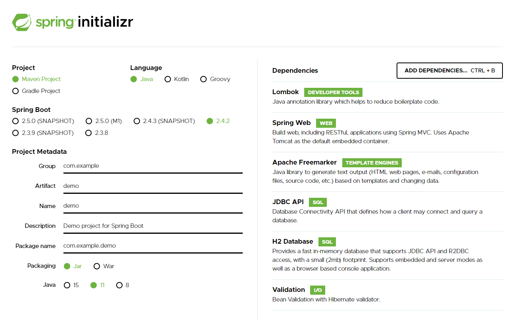

> 관련 소스코드는 Github [spring-boot-integration-vuejs](https://github.com/kdevkr/spring-boot-integration-vuejs) 리포지토리에서 제공합니다.

최근에는 스프링 프레임워크로 애플리케이션 개발 시 프론트엔드 클라이언트를 Vue를 활용하여 개발하고 배포합니다. 이번 글에서는 스프링 부트 프로젝트를 시작하고 Vue CLI를 통해 프론트엔드 클라이언트를 개발할 때 어떻게 진행하는지 설명합니다. 제가 알려드리는 방법과 구조는 정확한 정답은 아님을 미리 밝히는 바 입니다.

## Spring Initializr
스프링 부트 프로젝트는 [Spring Initializr](https://start.spring.io/)에서 쉽게 여러분이 스프링 부트 애플리케이션을 시작할 수 있도록 지원합니다. 저는 메이븐(Maven)이 아닌 `그래들(Gradle)` 프로젝트를 선호하며 언어는 `Java`로 개발합니다.



그리고 위와 같이 프로젝트에서 사용할 의존성(Dependencies)를 찾아 선택합니다. 이렇게 만들어지는 스프링 부트 프로젝트는 다음과 같은 디렉토리 구조를 가지게 됩니다.

```
src
 ├─ main
 │ ├─ java
 │ └─ resources
gradle
build.gradle
```

## Vue CLI
앞서 `Spring Initializr`를 통해 스프링 부트 프로젝트를 구성하였습니다. 이제는 스프링 부트 애플리케이션과 함께 개발할 Vue 프로젝트를 구성합니다. Vue 프로젝트는 Vue CLI를 활용하여 쉽게 시작할 수 있습니다.

```sh
# Vue CLI는 NPM으로 설치합니다.
npm i -g @vue/cli
# 그리고 create 명령어로 프로젝트를 시작합니다.
vue create --preset kdevkr/vue-preset [project-name]
```

위 예시처럼 Vue 프로젝트를 시작할 때 자주 사용하는 플러그인을 프리셋 형태(preset.json)로 구성하여 지정할 수 있습니다. 저의 [kdevkr/vue-preset](https://github.com/kdevkr/vue-preset) 프리셋은 다음의 라이브러리들을 포함하는 Vue 프로젝트를 구성합니다.
- Babel
- ESLint + Prettier
- SCSS (with dart-sass)
- Vuex
- Vue Router
- Bootstrap Vue
- Fontawesome

### src/main/vue
보통은 프로젝트 루트 경로에 Vue 프로젝트를 구성해도 상관없으나 저는 `src/main/java`처럼 `src/main/vue`로 구성하는 것을 추천합니다. 이제 src/main/vue 폴더에서 프론트엔드 클라이언트 코드를 관리하게 됩니다.

```sh
cd src/main
vue create --preset kdevkr/vue-preset vue
```

Vue CLI에 의해 [src/main/vue](https://github.com/kdevkr/spring-boot-integration-vuejs/tree/main/src/main/vue)에 Vue 프로젝트가 만들어집니다.

### Vue Configuration
Vue 프로젝트에 대한 설정은 `vue.config.js`를 통해 변경할 수 있습니다. Vue 프로젝트는 만들었지만 몇가지 설정을 진행해야합니다. 가장 먼저 Vue를 통해 개발할 때는 [webpack-dev-server](https://cli.vuejs.org/config/#devserver)를 실행해서 개발합니다.

스프링 부트 애플리케이션은 별다른 설정이 없으면 `8080` 포트를 사용하게 됩니다. 따라서, Vue 개발용 서버는 `8081` 포트를 사용하도록 합니다.
```js
module.exports = {
  devServer: {
    port: 8081,
    proxy: 'http://localhost:8080',
    disableHostCheck: true
  }
}
```

이제 `http://localhost:8081`으로 접속하여 웹 페이지를 개발할 수 있게 되고 프록시 설정을 통해 Vue 개발용 서버가 처리하지 못하는 모든 요청은 8080 포트로 요청합니다. 따라서, Vue 컴포넌트 내에서 스프링 부트 애플리케이션이 제공하는 API를 호출할 수 있게 됩니다.

> API 호출을 위해 `jQuery.ajax` 또는 `axios`를 사용하는 것은 본 글의 주된 관심사가 아닙니다.

### Production build
Vue 프로젝트로 개발한 프론트엔드 클라이언트는 `build` 명령을 사용하여 빌드할 수 있습니다.

```sh
npm run build
```

위 명령을 통해 빌드되는 파일은 `dist/` 폴더에 생성됩니다. 따라서, `src/main/vue/dist`에 만들어지게 됩니다. 만약, 스프링 부트 애플리케이션을 빌드하여 실행하였다면 해당 파일들은 스프링 부트 애플리케이션이 리소스를 읽어 배포할 수 없게 됩니다.

스프링 부트 애플리케이션이 기본적으로 리소스를 읽어 배포하는 경로는 [`spring.web.resources.static-locations`](https://docs.spring.io/spring-boot/docs/2.4.2/reference/html/appendix-application-properties.html#spring.web.resources.static-locations) 프로퍼티로 확인할 수 있습니다. 저는 `src/main/resources/static/dist`를 Vue 프로젝트의 빌드 경로로 잡고 스프링 부트 애플리케이션에서 해당 빌드 파일을 배포할 수 있게 설정하도록 하겠습니다.

먼저 애플리케이션 프로퍼티에 클래스패스를 기준으로 `static/dist`의 리소스를 읽을 수 있게 합니다.
**application.properties**
```properties
spring.web.resources.static-locations=classpath:/META-INF/resources/, classpath:/resources/, classpath:/static/, classpath:/public/, classpath:/static/dist
```

그리고 Vue 프로젝트 빌드 경로는 `outputDir`로 설정할 수 있습니다.
**vue.config.js**
```js
const path = require('path')

module.exports = {
  outputDir: path.resolve(__dirname, '../resources/static/dist')
}
```

## Freemarker Template Engine
Vue 프로젝트로 빌드된 프론트엔드 클라이언트를 위한 파일들은 `html-webpack-plugin`에 의해 만들어지는 `index.html`에 자동으로 파일들이 포함됩니다. 그런데 스프링 부트 애플리케이션에서 템플릿 엔진을 사용하여 페이지에 대한 정보나 세션 정보를 웹 페이지에 포함시키고 싶을 수 있습니다. 예를 들어, Spring Initializr에서 프리마커를 템플릿 엔진으로 사용하기 위하여 의존성을 추가하였다면 `src/main/resources/templates` 하위에 위치한 `*.ftlh`을 View로 제공할 수 있습니다.

따라서, 다음과 같이 `indexPath`를 설정하여 index.ftlh이 만들어지는 위치를 지정할 수 있습니다.
**vue.config.js**
```js
module.exports = {
  indexPath: '../../templates/index.ftlh'
}
```

### html-webpack-plugin
앞서 index 파일은 `html-webpack-plugin`에 의해 만들어진다고 하였습니다. 우리가 위에서 indexPath를 지정한 것은 단순히 확장자를 `.ftlh`로 바꾼 것과 다를 바 없습니다. 템플릿 엔진을 사용하는 목적은 해당 템플릿 엔진에서 지원하는 문법으로 정보를 표현하기 위함입니다. 이를 위해 플러그인에 대한 옵션을 변경하도록 합니다.

예를 들어, \<html\> 태그에 lang 속성에 요청에 따른 언어값을 부여하고 싶을 수 있습니다. 그러면 다음과 같이 index.ftlh가 만들어져야 합니다.

```html
<!DOCTYPE html>
<html lang="${.locale?split("_")[0]}">
</html>
```

아쉽게도 html-webpack-plugin은 위 내용을 읽다가 값을 처리할 수 없어 오류를 보여줍니다. 다행스럽게도 약간의 트릭을 쓰면서 플러그인 옵션을 건드려서 가능하게 할 수 있습니다.

**index.html**
```html
<!DOCTYPE html>
<html lang="<%= '\${.locale?split(\"_\")[0]}' %>">
</html>
```

**vue.config.js**
```js
module.exports = {
  chainWebpack: config => {
    config.plugin('html')
        .tap(args => {
          args[0].minify = false
          args[0].interpolate = true
          return args
        })
  }
}
```

`minify` 옵션을 끄는 것은 스프링 부트 애플리케이션이 프리마커 템플릿 엔진으로 `index.ftlh`을 읽을 때 발생하는 오류를 방지하기 위함입니다.

이제 빌드된 [index.ftlh](https://github.com/kdevkr/spring-boot-integration-vuejs/blob/main/src/main/resources/templates/index.ftlh)는 다음과 같이 만들어집니다.

```html
<!DOCTYPE html>
<html lang="${.locale?split("_")[0]}">
  <head>
    <meta charset="utf-8">
    <meta http-equiv="X-UA-Compatible" content="IE=edge">
    <meta name="viewport" content="width=device-width,initial-scale=1.0">
    <link rel="icon" href="/favicon.ico">
    <title></title>
  <link href="/js/about.d6d714df.js" rel="prefetch"><link href="/css/app.f94ee837.css" rel="preload" as="style"><link href="/css/chunk-vendors.01c183df.css" rel="preload" as="style"><link href="/js/app.247cb7a3.js" rel="preload" as="script"><link href="/js/chunk-vendors.65fb301b.js" rel="preload" as="script"><link href="/css/chunk-vendors.01c183df.css" rel="stylesheet"><link href="/css/app.f94ee837.css" rel="stylesheet"></head>
  <body>
    <noscript>
      <strong>We're sorry but vue doesn't work properly without JavaScript enabled. Please enable it to continue.</strong>
    </noscript>
    <div id="app"></div>
    <!-- built files will be auto injected -->
  <script type="text/javascript" src="/js/chunk-vendors.65fb301b.js"></script><script type="text/javascript" src="/js/app.247cb7a3.js"></script></body>
</html>
```

이제 여러분도 스프링 부트 애플리케이션을 Vue와 함께 개발할 수 있게 되었습니다. 감사합니다. 😀
