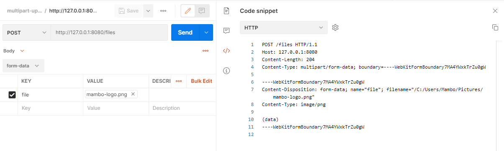
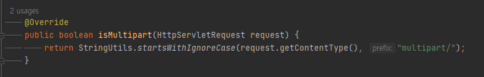
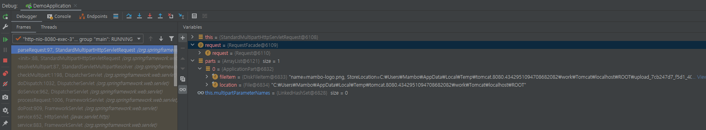
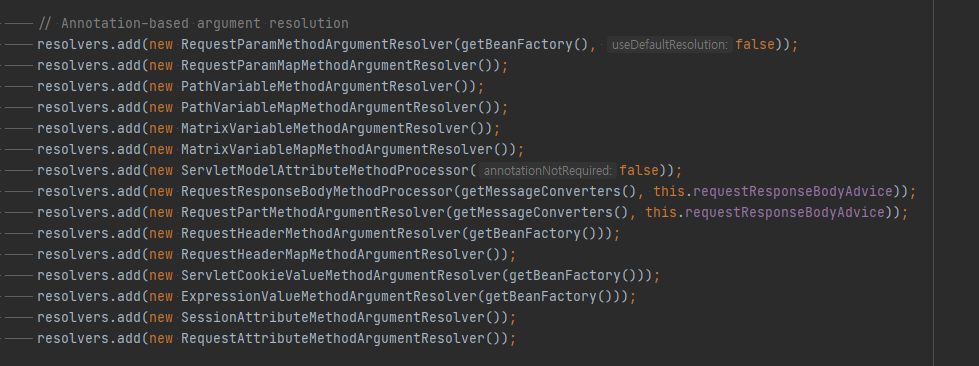

안녕하세요 Mambo 입니다. 오늘은 스프링 웹 모듈에 포함되어 있는 **멀티파트 리졸버(MultipartResolver)** 에 대한 이야기를 해볼까합니다. 멀티파트 리졸버는 HTTP 요청 페이로드에 포함되는 멀티파트를 쉽게 가져올 수 있도록 지원하기 위한 추상화로 여러분이 파일 업로드 기능을 구현하기 위하여 컨트롤러에 핸들러 함수를 작성할 때 멀티파트 관련 클래스를 사용할 수 있게 도와주는 시작점입니다.

본 글을 통해 멀티파트 폼 데이터가 포함된 요청을 분석하고 처리해주는 멀티파트 리졸버를 알아보고 컨트롤러 핸들러 함수 매개변수에 데이터가 바인딩되기까지의 과정을 이해할 수 있게 도와드리겠습니다.

관련 코드는 [mambo-dev/learning-spring/multipart-uploads](https://github.com/mambo-dev/learning-spring/tree/main/multipart-uploads)에서 제공합니다.

## 멀티파트 폼 데이터
클라이언트(일반적으로 웹 브라우저)가 HTTP 프로토콜을 사용하여 바이너리 데이터를 보낼때는 HTTP 요청 페이로드에 포함된 데이터가 멀티파트 형식이라고 알려주기 위해서 Content-Type 헤더에 `multipart/form-data`를 사용하여 전송합니다.


[**What does enctype='multipart/form-data' mean?**](https://stackoverflow.com/questions/4526273/what-does-enctype-multipart-form-data-mean)


다음은 HTTP 요청 클라이언트 중 하나인 Postman으로 멀티파트 폼 데이터 형식으로 파일 데이터를 전송할 때 확인할 수 있는 예시입니다.



## 멀티파트 리졸버
스프링의 디스패처 서블릿은 HTTP 요청에 대해서 멀티파트 유형의 데이터가 포함된 요청인지 확인하는 멀티파트 필터(MultipartFilter)로 요청에 대한 처리를 위임하며 멀티파트 필터는 멀티파트 리졸버(MultipartResolver)를 사용하여 멀티파트 관련 요청인지 확인하는 과정을 수행합니다.

```java MultipartResolver
public interface MultipartResolver {
	boolean isMultipart(HttpServletRequest request);
	MultipartHttpServletRequest resolveMultipart(HttpServletRequest request) throws MultipartException;
	void cleanupMultipart(MultipartHttpServletRequest request);
}
```

위 코드처럼 멀티파트 리졸버는 인터페이스로 추상화되어있으며 이를 구현한 두개의 MultipartResolver 구현체를 제공합니다. 하나는 서블릿 3.0 이전에 사용하던 Apache Commons FileUpload 라이브러리를 사용하던 CommonsMultipartResolver이며 서블릿 3.0 Part API를 사용하는 StandardServletMultipartResolver입니다.

- **CommonsMultipartResolver**
  Apache Commons FileUpload를 사용하는 멀티파트 리졸버
- **StandardServletMultipartResolver**
  Servlet 3.0+ Part API를 사용하는 표준 멀티파트 리졸버

스프링 3.1에서는 Servlet 3.0 지원을 위한 클래스들이 많이 추가되었습니다. 그 중 하나가 바로 서블릿 표준의 Part API를 사용하는 StandardServletMultipartResolver이며 스프링 3.1 이후에는 굳이 Apache Commons FileUpload 라이브러리에 대한 의존성을 가지지 않아도 멀티파트를 처리할 수 있게 되었습니다.

스프링 5의 웹 모듈을 살펴보면 멀티파트 필터(MultipartFilter)에서 루트 애플리케이션 컨텍스트에 **filterMultipartResolver** 이름의 빈을 찾지 못하는 경우 자체적으로 StandardServletMultipartResolver를 기본적으로 사용하도록 되어있습니다. 따라서, 클라이언트의 HTTP 요청은 멀티파트 필터를 거쳐 StandardServletMultipartResolver에 의해 멀티파트 데이터 유형인지를 확인합니다.



앞서 포스트맨 클라이언트에서 요청한 멀티파트 폼 데이터는 컨텐트 타입이 multipart/로 시작하므로 멀티파트 유형의 요청이며 resolveMultipart 함수에 의해 기본 HttpServletRequest가 멀티파트 관련 함수를 제공하는 MultipartHttpServletRequest로 감싸져있는 요청 클래스로 리턴하게됩니다.



위 그림처럼 멀티파트 리졸버에 의해 래핑된 MultipartHttpServletRequest에서 임베디드 톰캣의 임시 폴더에 저장된 파일을 확인할 수 있습니다. 이렇게 멀티파트 리졸버에 의해 생성된 임시 파일들은 최종적으로 cleanupMultipart 함수에 의해 정리됩니다.

## 멀티파트 데이터 바인딩
앞서 알아본 내용에 따르면 멀티파트 리졸버는 멀티파트 유형의 요청인지를 분석하고 멀티파트 관련 함수를 사용할 수 있는 MultipartHttpServletRequest로 래핑하는 역할이 전부입니다. 그렇다면 여러분이 작성하는 컨트롤러의 핸들러 함수에 대한 매개변수에 멀티파트 관련 클래스가 있는 경우 데이터를 주입하는 것은 어디서 수행하는 것 일까요?

> 스프링의 핸들러 함수 데이터 바인딩에 대해서 잘 모르시는 분들이 많은 것 같아 이 부분도 따로 정리해보려고 준비중입니다.

컨트롤러의 핸들러 함수 매개변수 유형에 따라 데이터를 바인딩(주입)하는 것은 HandlerMethodArgumentResolver가 담당하는데요. 스프링 웹 모듈에 포함되어있는 기본 HandlerMethodArgumentResolver 구현체들 중에서 멀티파트(MultipartFile 또는 Part) 유형의 클래스에 대한 데이터 바인딩은 RequestParamMethodArgumentResolver와 RequestPartMethodArgumentResolver 입니다.

위 두개의 HandlerMethodArgumentResolver는 어노테이션과 관련하여 데이터 바인딩을 수행하는데 `@RequestParam`과 `@RequestPart` 입니다.

**RequestParamMethodArgumentResolver**  
이 리졸버는 @RequestParam이 선언된 매개변수에 데이터 바인딩을 수행하는데 스프링 4.3 부터는 @RequestParam이 선언되지 않은 멀티파트 유형의 매개변수에 대해서 MultipartResolutionDelegate에 의해 멀티파트 요청(MultipartRequest)인지를 확인하고 MultipartRequest에서 MultipartFile을 추출합니다.

**RequestPartMethodArgumentResolver**  
이 리졸버는 @RequestPart이 선언된 매개변수에 데이터 바인딩을 수행하며 @RequestParam가 선언되지 않은 멀티파트 유형 매개변수에 대해 MultipartResolutionDelegate로 멀티파트 데이터 바인딩을 수행합니다.

> 위 리졸버들에서 MultipartResolutionDelegate에 의해 멀티파트 유형의 매개변수에 대한 데이터 바인딩이 수행될 수 있는 이유는 멀티파트 리졸버에 의해서 MultipartHttpServletRequest로 변환되기 때문입니다.

### 데이터 바인딩 우선순위
위 내용에 따르면 @RequestParam과 @RequestPart가 선언되지 않은 멀티파트 유형의 매개변수에 데이터 바인딩을 수행하는 것을 알 수 있습니다. 그런데 둘다 MultipartResolutionDelegate에 의해서 데이터 바인딩이 수행되는데요. 그러면 어떤 HandlerMethodArgumentResolver에 의해 데이터 바인딩이 수행될까요?

RequestMappingHandlerAdapter에서 기본적으로 적용되는 HandlerMethodArgumentResolver 순서를 보면 RequestParamMethodArgumentResolver가 RequestPartMethodArgumentResolver 보다 우선적으로 추가되는 것을 확인할 수 있습니다. 따라서, RequestPartMethodArgumentResolver는 RequestParamMethodArgumentResolver에 의해 처리되지 않은 매개변수에 대해 데이터 바인딩을 수행하게 됩니다.



직접 테스트를 해보면 @RequestParam과 @RequestPart 모두 매개변수에 선언하더라도 RequestParamMethodArgumentResolver에 의해 먼저 처리됨을 확인할 수 있습니다.

> 디버깅 시 HandlerMethodArgumentResolverComposite에서 핸들러 함수 매개변수에 대한 HandlerMethodArgumentResolver를 캐시하므로 주의하시기 바랍니다.

## 요약
본 글에서 알아본 내용을 요약해보면서 다시한번 머리속에 숙지해봅시다.

1. HTTP 요청 시 컨텐트 타입이 `multipart/`로 시작되는 경우를 멀티파트 요청으로 판단한다.
2. 멀티파트 필터가 동작하는 과정해서 멀티파트 리졸버에 의해 멀티파트 관련 함수를 제공하는 `MultipartHttpServletRequest`로 요청 클래스가 래핑된다.
3. 래핑된 요청 클래스는 RequestMappingHandlerAdapter에서 HandlerMethodArgumentResolver로 핸들러 매개변수에 대한 데이터 바인딩을 시도한다.
4. @RequestParam는 @RequestPart보다 우선적으로 사용된다.

여러분은 본 글을 통해 멀티파트 데이터 바인딩 과정을 이해하였으므로 핸들러 함수 매개변수에 어떻게 멀티파트 데이터를 바인딩하는지 알 수 있으므로 매개변수에 바인딩된 파일 데이터를 저장하는 로직을 작성하여 파일 업로드 기능을 구현할 수 있습니다.

감사합니다.

