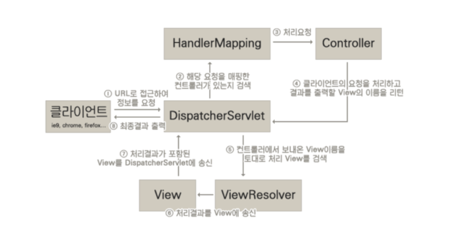

스프링 프레임워크로 웹 애플리케이션을 개발하는 일반적인 방법은 스프링 웹 모듈에 포함되는 `서블릿 스택(Servlet Stack)`을 사용하는 것입니다. 4년차 자바 개발자를 바라보는 시점에서 기초 부터 탄탄히 메꾸는 공부를 진행하려합니다. 그래서 스프링 프레임워크로 서블릿 기반의 웹 애플리케이션을 작성하는 것을 살펴보면서 잠만보가 놓치고 있는 부분을 찾아봅시다.

먼저, 스프링에서 제공하는 웹 스택 중 하나는 `서블릿(Servlet)`입니다. 그러면 서블릿이란 무엇일까요?... 🙄 음... 솔직히 모르겠어요 톰캣으로 구동할 수 있다는 것은 어렴풋이 기억 나는데 말이죠 ㅎㅎ.

오히려 저보다 국비지원을 통해 자바 웹을 공부하는 비전공자분들이나 신입 개발자들이 잘 알것 같습니다. 그래서 찾아봅니다. 구글님 서블릿이 뭐야? 스택오버플로우에 있는 [What is Java Servlet?](https://stackoverflow.com/questions/7213541/what-is-java-servlet) 이라는 질문에 대한 답변을 보면 서블릿에 대해서 다음과 같이 설명합니다.

> A servlet is simply a class which responds to a particular type of network request - most commonly an HTTP request. Basically servlets are usually used to implement web applications
> Servlets run in a servlet container which handles the networking side (e.g. parsing an HTTP request, connection handling etc). One of the best-known open source servlet containers is Tomcat.

아 그러니까 서블릿(Servlet)은 웹 요청을 처리할 수 있는 자바 클래스이고 톰캣과 같은 서블릿 컨테이너에서 동작하는 거구나. 그래서 서블릿 스택에서는 `Servlet API`를 통해 웹 애플리케이션을 작성할 수 있게 관련 클래스를 제공하는것이었네요 😀

실제로 스프링 부트에서 서블릿 스택에 대한 자동 구성 클래스들을 찾아보면 DispatcherServletAutoConfiguration라는 클래스에서 `dispatcherServlet`이라는 이름의 디스패처 서블릿을 등록하는 코드를 확인할 수 있습니다.

```java
public class DispatcherServlet extends FrameworkServlet {}
```

> DispatcherServlet은 javax.servlet.Servlet 인터페이스 구현체입니다.

스프링의 서블릿 스택은 이 DispatcherServlet이 빈으로 등록되는 것부터 시작됩니다. 스프링 부트의 @SpringBootApplication 어노테이션은 @EnableAutoConfiguration을 포함하고 있는데 WebMvcAutoConfiguration은 웹 애플리케이션 유형이 서블릿이거나 DispatcherServletAutoConfiguration이 수행되고 난 후에 동작합니다.

그러면 이렇게 생각할 수 있죠 `dispatcherServlet` 이름으로 등록되는 DispatcherServlet이 중요한 역할을 하겟구나? 도대체 무슨 역할을 하는 걸까요? 찾아봅시다.

DispatcherServlet 클래스의 주석을 살펴보면 친절하게도 다음과 같은 내용을 확인할 수 있습니다.

> Central dispatcher for HTTP request handlers/controllers, e.g. for web UI controllers or HTTP-based remote service exporters. Dispatches to registered handlers for processing a web request, providing convenient mapping and exception handling facilities.

웹 요청을 처리할 수 있는 핸들러를 찾아 위임해주며 예외 처리 기능을 제공한다고 합니다. 인터넷에 디스패처 서블릿에 대하여 검색하면 다음의 이미지를 찾아볼 수 있습니다. 꽤 설명이 깔끔하게 되있는 것 같습니다.



디스패처 서블릿은 웹 요청을 처리할 수 있는 서블릿(위 이미지에서 컨트롤러)를 찾아서 처리를 위임하고 결과를 받아 클라이언트로 결과를 응답합니다.

DispatcherServletAutoConfiguration이 수행되기전에 포함되는 자동 구성 클래스가 하나 더 있습니다. 바로 ServletWebServerFactoryAutoConfiguration 클래스입니다. 뭐야 그럼 DispatcherServlet 보다 더 중요한게 있단 말이야?!

네 그래요 사실 자바의 서블릿은 자체적으로 동작하지 않습니다. 이 글 초반에 톰캣을 언급했었습니다. 바로 톰캣으로 서블릿이 동작하는 환경을 구성할 수 있습니다. 그런데 왜 ServletWebServerFactory 이라는 클래스 이름을 지었을까요? 톰캣은 서블릿을 구동할 수 있는 서블릿 컨테이너 중 하나이기 때문입니다. 실제로 ServletWebServerFactoryAutoConfiguration에서는 Tomcat, Jetty, Undertow을 서블릿 컨테이너로 사용할 수 있도록 하고 있습니다.

```java
@Import({ ServletWebServerFactoryAutoConfiguration.BeanPostProcessorsRegistrar.class,
		ServletWebServerFactoryConfiguration.EmbeddedTomcat.class,
		ServletWebServerFactoryConfiguration.EmbeddedJetty.class,
		ServletWebServerFactoryConfiguration.EmbeddedUndertow.class })
public class ServletWebServerFactoryAutoConfiguration {}
```

스프링 부트에서는 클래스패스에 존재하는 서블릿 컨테이너에 따라 해당 서블릿 컨테이너를 빈으로 등록합니다. 이렇게 스프링 부트에서는 톰캣과 같은 서블릿 컨테이너를 직접 설치하고 구동하지 않더라도 구동할 수 있게 임베디드 서블릿 컨테이너 의존성을 활용합니다.

> 임베디드 서블릿 컨테이너가 동작하기 위해서 반드시 스프링 부트를 사용해야하는 것은 아니에요. 

여기까지 살펴본 내용을 토대로 다음과 같이 정리할 수 있습니다.

1. 스프링 웹 서블릿 스택은 자바 서블릿 기반의 웹 애플리케이션을 지원한다.
2. 웹 요청을 처리하는 것은 서블릿이며 중앙의 디스패처 서블릿이 웹 요청을 받아 다른 서블릿에 처리를 위임한다.
3. 서블릿을 자체적으로 동작하지 않고 서블릿 컨테이너가 필요하다.

서블릿 컨테이너와 디스패처 서블릿은 만들었는데 그렇다면 디스패처 서블릿이 처리를 위임할 핸들러 또는 컨트롤러는 어떻게 만드는 걸까요?... 

웹 요청 처리를 담당할 컨트롤러는 RequestMappingHandlerMapping 클래스에서 찾아서 등록합니다. `isHandler(Class<?> beanType)` 함수에서 @Controller와 @RequestMapping을 가지고 있는 빈을 찾습니다.

```java
@Override
protected boolean isHandler(Class<?> beanType) {
    return (AnnotatedElementUtils.hasAnnotation(beanType, Controller.class) ||
            AnnotatedElementUtils.hasAnnotation(beanType, RequestMapping.class));
}
```

이렇게 등록된 HandlerMapping은 디스패처 서블릿이 내부적으로 가지고 있게 됩니다. 

```java
public class DispatcherServlet extends FrameworkServlet {
    @Nullable
	private List<HandlerMapping> handlerMappings;

    @Nullable
	private List<HandlerAdapter> handlerAdapters;
}
```

그리고 디스패처 서블릿은 이외에도 여러가지 [특별한 유형의 빈](https://docs.spring.io/spring-framework/docs/current/reference/html/web.html#mvc-servlet-special-bean-types)들을 가집니다.

여기까지해서 스프링 웹 서블릿 스택에서 서블릿 기반의 웹 애플리케이션이 어떻게 만들어지는지 과정을 살펴보았습니다. 이외에도 웹 서블릿 스택에서는 위 링크에서 확인할 수 있는 특별한 유형의 빈들을 통해 여러가지 기능을 적용할 수 있도록 지원하고 있습니다.

스프링 웹 서블릿 스택 2탄에서는 디스패처 서블릿이 웹 요청에 대한 응답을 어떤 형식으로 제공할 지 결정하는데 사용하는 `뷰 리졸버(ViewResolver)`와 웹 요청을 처리하는 과정에서 발생한 오류를 어떻게 해결하는지 결정하는 `HandlerExceptionResolver` 그리고 멀티파트 업로드를 지원하기 위한 `멀티파트 리졸버(MultipartResolver)` 등에 대해서 공부해봅시다.