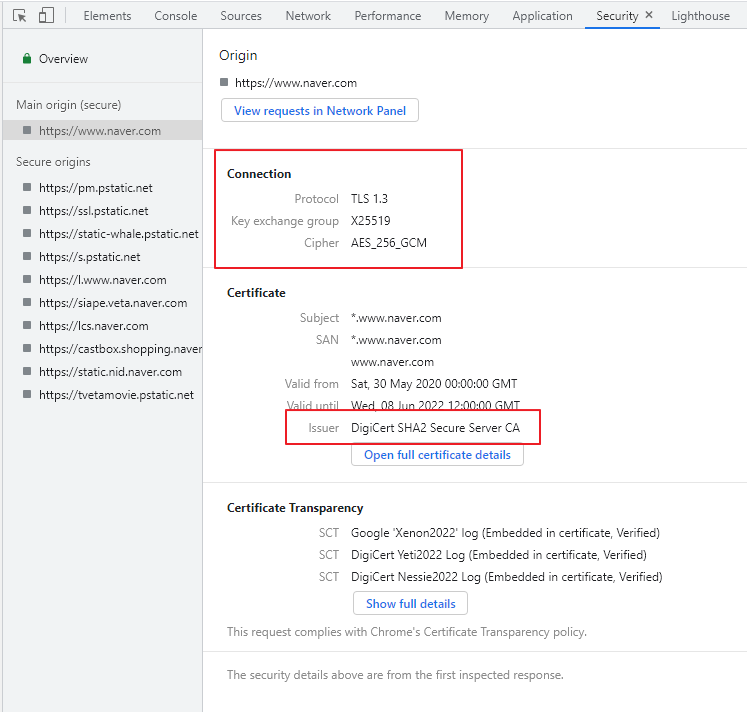
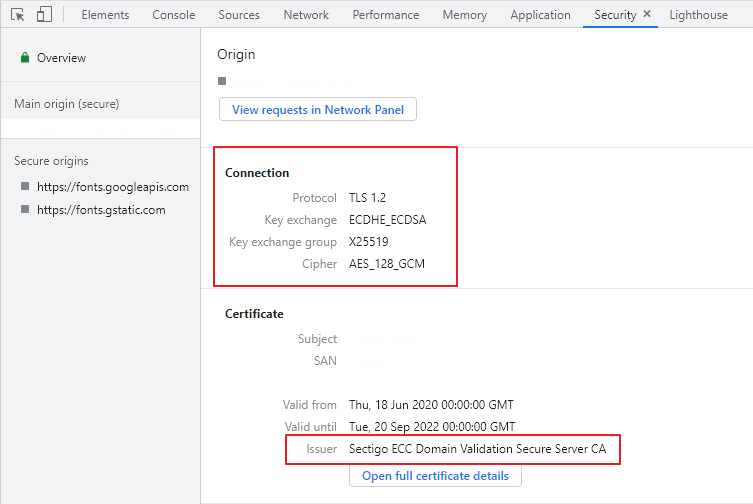
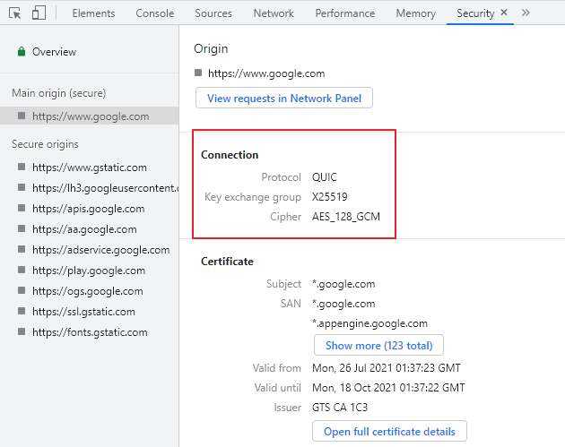
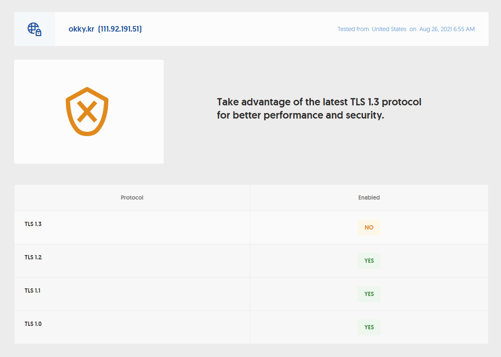
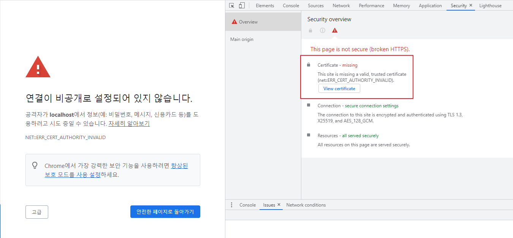
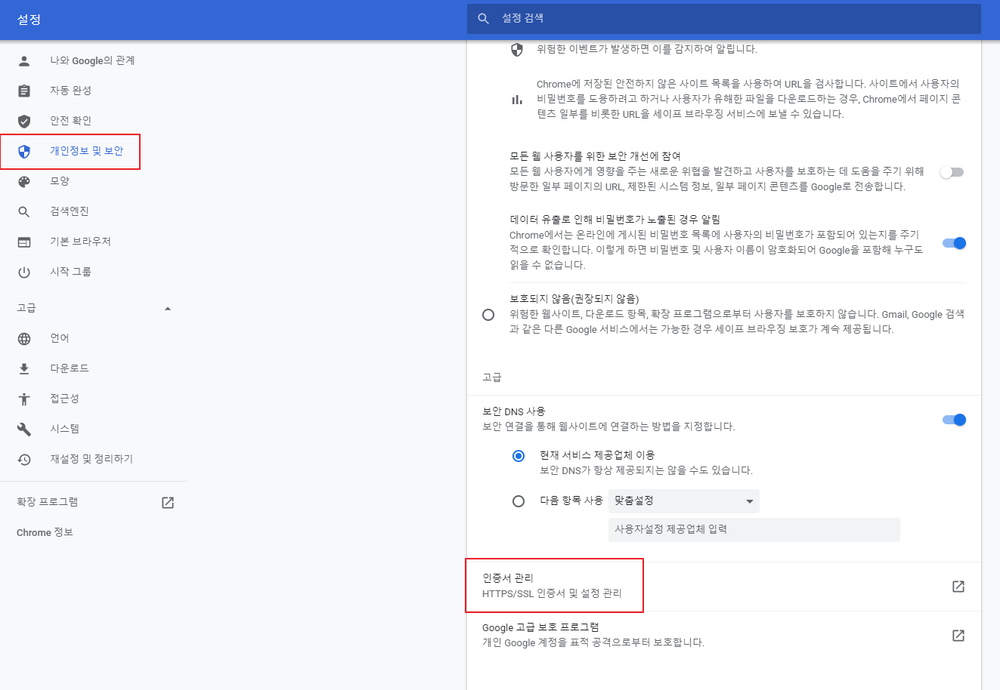
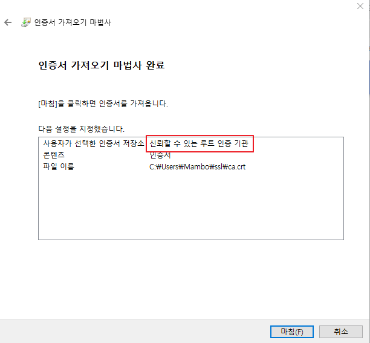
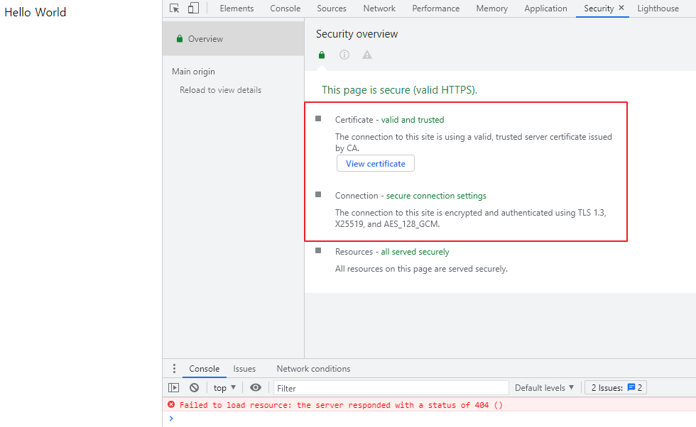
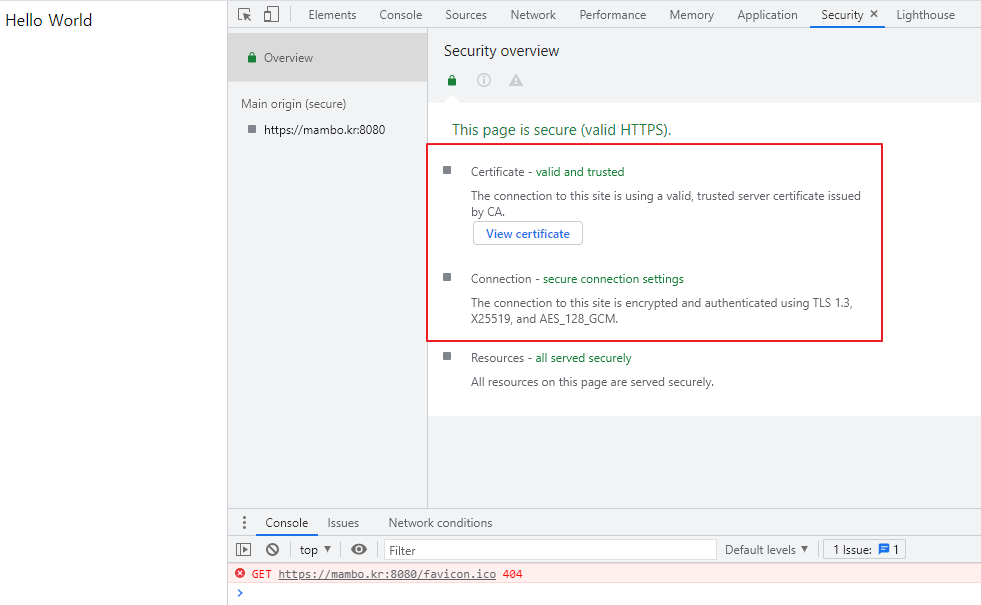
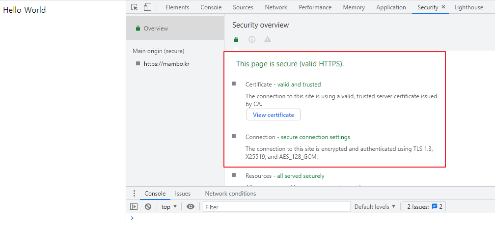

안녕하세요 Mambo 입니다.

오늘은 웹사이트 접속 시 필수적으로 사용되는 HTTPS 그리고 SSL 인증서에 대해 이야기하려합니다. 회사에서 운영중인 웹 서비스를 HTTPS로 배포되고있으나 정작 SSL에 대한 부분은 머리속에서 복잡하게 얽혀 제대로 정리되지않은 상태입니다. 이 글을 작성하면서 얽혀있는 부분을 하나씩 풀어나가면서 SSL에 대한 개념을 확립해보고자 합니다.

## HTTPS
일반 사용자들이 웹 사이트에 접속할 때는 HTTPS에 대해서 신경쓰지 않습니다. 하지만, 애플리케이션을 개발하고 운영하는 웹 개발자들에게 HTTPS는 아주 중요한 표준 보안 기술입니다. 구글 크롬과 같은 모던 브라우저에서는 HTTPS 프로토콜 적용을 강력하게 권장하고 있으며 SSL이 적용되지 않은 웹 사이트에 대해서는 신뢰할 수 없는 사이트로 안내합니다. HTTPS이 적용되는 애플리케이션은 웹 요청 간 통신에 전달되는 데이터가 암호화되어 사용자의 민감한 정보가 위변조되는 것을 최대한 방지할 수 있습니다.

HTTP라는 전송 프로토콜과 함께 데이터를 암복호화하기 위한 보안 프로토콜을 사용하기 때문에 추가적인 오버헤드가 발생하는 부분은 어쩔 수 없이 감안해야하는 부분입니다. 최근 컴퓨터들의 CPU의 성능이 좋아짐에 따라 암복호화에 걸리는 시간은 미미하며 네트워크 기술이 좋아지면서 레이턴시도 줄어들어 HTTPS 프로토콜을 사용한다고해서 사용자의 요청과 응답하기까지의 시간이 큰 차이를 보이지는 않습니다.

### TLS 핸드쉐이크


HTTPS는 웹 요청에 대한 신뢰성 여부를 확인하거나 통신 데이터를 암복호화하기 위한 방식을 교환하기 위해 **TLS 핸드쉐이크 과정**을 수행합니다. TLS 핸드쉐이크 과정에는 애플리케이션 서버에 등록된 SSL 인증서를 제공받거나 클라이언트에서 사용할 수 있는 암호화 방식 중에서 애플리케이션 서버에서 지원하는 방식을 선택하여 응답하는 과정이 포함되어있습니다.

다음은 크롬 브라우저에서 제공하는 보안 탭을 통해 TLS 핸드쉐이크 과정에 의해 결정된 사항을 확인하는 화면입니다.

|네이버 웹사이트|회사 웹 서비스|
---|---
|||
 
네이버 웹 사이트는 **DigiCert**라는 인증기관에서 발행한 SSL 인증서를 제공하였고 **TLS 1.3** 버전과 함께 **[X25519](https://en.wikipedia.org/wiki/Curve25519)** 방식으로 키를 교환하고 **AES_256_GCM**으로 암호화하며 회사에서 운영중인 웹 서비스는 네이버와 다르게 **TLS 1.2**, **ECDHE_ECDSA**, **AES_128_GCM**을 사용합니다. 이렇게 결정된 사항들이 어떠한 역할을 하는지 아직 다루지 않았기 때문에 일단 넘어가도록 하겠습니다.

여러분들도 HTTPS 프로토콜을 사용하기 위해 결정된 사항들에는 관심이 없으셨을테니 운영중인 웹 서비스가 있다면 직접 확인해보시는 걸 추천드립니다.

### TLS 버전
TLS 버전에 따라 TLS 핸드쉐이크 과정을 수행하는 방식이 달라지게 됩니다. 당연히 TLS 1.3이 TLS 1.2보다 더 효율적인 방식이며 브라우저는 서버에서 지원하는 TLS 버전에 따라 가장 높은 버전으로 TLS 핸드쉐이크를 수행하게 됩니다. 네이버 웹 사이트는 TLS 1.3까지 지원하는 반면에 회사 웹 서비스는 TLS 1.2까지 지원하도록 되어있다고 보시면 됩니다.

혹시 QUIC 이라는 프로토콜에 대해서 들어보신 적 있으신가요? 
구글 웹 사이트에 대해서 TLS 핸드쉐이크 과정에 의해 결정된 사항을 확인해보면 다음과 같이 프로토콜 부분이 TLS가 아닌 QUIC인 것을 확인할 수 있습니다.



구글에서 사용하는 QUIC는 HTTP/3를 사용하기 위한 전송 프로토콜입니다. 구글 뿐만 아니라 CDN 서버에서 라이브러리를 받을 때 프로토콜을 살펴보시면 **h3-29**도 확인하실 수 있을 겁니다. QUIC은 HTTP와는 다른 전송 프로토콜로써 TCP가 아닌 UDP를 사용하여 더 적은 오버헤드를 가지며 컨텐츠를 제공할 수 있는 장점이 있습니다. SSL은 보안 프로토콜이므로 HTTP에서만 사용되어지는게 아님을 보여주는 예이기도 합니다.

아무튼 다시 TLS 버전에 대해 알아보기 위해서 개발자 커뮤니티 중 하나인 OKKY 사이트에 대해서 [Check TLS Version](https://gf.dev/tls-test)을 수행해본 결과를 확인해보시죠.



TLS 1.3을 제외한 나머지 버전을 지원하는 것으로 리포트 되었네요. TLS 1.2 또는 TLS 1.3을 지원하지 않는게 아니라면 문제될 사항은 없습니다.

### 암호화 스위트
암호화 스위트(Cipher Suite)는 **키 교환**, **전자 서명**, **암호화** 그리고 **데이터 무결성**에 대한 알고리즘을 조합한 암호화 방식을 지칭합니다. 앞서 TLS 핸드쉐이크 과정에서 결정된 사항 중 ECDHE_ECDSA 그리고 AES_128_GCM이 암호화 스위트라고 할 수 있습니다.

```sh
# [프로토콜]_[키 교환 알고리즘]_[전자 서명 알고리즘]_WITH_[암호화 알고리즘]_[데이터 무결성]
TLS_ECDHE_ECDSA_WITH_AES_128_GCM_SHA256
```

암호화 스위트는 위와 같은 구조를 가지도록 조합된 문자열으로 표현하기 때문에 아래와 같이 다시 나열해보도록 할게요.

- TLS : 프로토콜
- ECDHE : 타원 곡선 디피 헬만 키 교환
- ECDSA : 타원 곡선 디지털 서명
- AES_128_GCM : 128 비트 블록 갈루와/카운트 모드의 AES 암호화
- SHA256 : 256비트 해시 알고리즘

보안 전문가가 아니라면 ECDHE-ECDSA가 어떤 원리도 동작하는지까지는 알 필요는 없으며 어떻게 키 교환을 하고 어떤 방식으로 서명하며 어떻게 암호화하는지만 구분할 수 있으면 됩니다. 만약, 이 글을 보고계시는분들이 비전공자라면 통신 보안에 대한 개념을 제대로 배우진 않았을 테니 추가적으로 찾아보시는 걸 추천합니다. 물론, 이해하기 힘든 내용이니 계속 붙잡고 계시진 마시구요.

## SSL 인증서
TLS 핸드쉐이크 과정에서 서버로부터 받아오는 SSL 인증서는 브라우저(클라이언트)가 해당 사이트를 신뢰할 수 있는지를 판단할 수 있는 가장 중요한 사항입니다. 브라우저에서는 자체적으로 **신뢰할 수 있는 인증 기관(CA)** 에 대한 공개키를 관리하거나 운영체제에 등록된 루트 인증 기관에 대한 정보를 활용해서 서버에서 제공하는 SSL 인증서가 신뢰할 수 있는 기관으로부터 발급된 것인지 확인하는 과정을 거치게 됩니다.

일반적으로 서버에서 제공받은 SSL 인증서는 루트 인증 기관(CA)에서 인증하는 **중간 인증 기관(ICA)** 으로부터 발급받은 인증서이며 이를 **체인 인증서**라고 합니다. [Sectigo](https://sectigo.com/)와 [DigiCert](https://www.digicert.com/kr/) 그리고 [GlobalSign](https://www.globalsign.com/en)은 많이 사용되어지는 신뢰할 수 있는 루트 인증 기관입니다. 

### 자체 서명 인증서
자체 서명 인증서는 신뢰할 수 있는 인증 기관으로부터 발급받는 것이 아니라 자체적으로 만드는 인증서를 말합니다. 보유중인 도메인이 있다면 [Let's Encrypt](https://letsencrypt.org/)을 통해 무료로 SSL 인증서를 발급받을 수 있을테지만 저는 보유중인 도메인이 없으므로 OpenSSL 또는 자바의 Keystore 도구를 사용해서 자체 서명한 SSL 인증서를 만들어보도록 하겠습니다.

이 글에서는 상위 인증 기관으로부터 발급받는 체인 인증서처럼 자체 서명한 CA 인증서를 만들고 이를 토대로 서명된 자체 서명 인증서를 발급합니다.

#### 자체 서명 CA 인증서 발급
먼저, 내 로컬 호스트에서는 신뢰할 수 있다고 보장할 수 있는 CA 인증서를 발급하겠습니다. 인증서는 [다양한 형식]((https://www.sslcert.co.kr/guides/kb/54))으로 구성되는데 OpenSSL 도구를 사용하여 인증서를 만드는 경우 PEM 형식을 가지게 됩니다. 만약, 여러분이 인증 기관으로부터 발급받는 인증서 형식이 다르더라도 다른 형식의 인증서로 변환할 수 있으니 걱정하지 않으셔도 됩니다. 이 글에서도 PEM 형식의 인증서를 스프링 애플리케이션에서 사용하기 위해 KeyStore 형식의 인증서로 변환하는 방법을 다룹니다.

OpenSSL으로 자체 서명 CA 인증서를 만들기 위해서는 개인키와 인증서 서명 요청(CSR)을 생성해야합니다. 이때, 일반적으로 RSA 기반으로 개인키를 만들기도 하지만 회사에서 사용중인 인증서와 동일한 방식의 ECC 인증서를 발급하기 위해서 **ECDSA 기반의 개인키**를 만들겠습니다. 일반 SSL 인증서와 비교해서 **ECC 알고리즘이 적용된 SSL 인증서**가 더 안전하다기보다는 암복호화에 대한 오버헤드가 적으므로 트래픽이 많은 서비스에서는 더 높은 효율을 보여줄 수 있기 때문에 사용합니다.

```ps Windows Terminal
# ECDSA 기반의 개인키 생성
PS openssl ecparam -out ca.key -name prime256v1 -genkey

# 인증서 서명 요청(CSR) 생성
PS openssl req -new -sha256 -subj /C=KO/ST=None/L=None/O=None/CN=CA -key ca.key -out ca.csr
```

개인키를 만들때 사용한 prime256v1는 타원 곡선형 서명 방식을 지칭하는 이름입니다. 개인키와 인증서 서명 요청 파일이 생성되었다면 이를 토대로 **자체 서명 CA 인증서**를 발급합니다.

```ps Windows Terminal
PS openssl x509 -req -sha256 -days 1095 -in ca.csr -signkey ca.key -out ca.crt
Signature ok
subject=C = KO, ST = None, L = None, O = None, CN = CA
Getting Private key
```

만들어진 자체 서명 CA 인증서는 3년(1095일)까지 유효하게 됩니다.

#### 자체 서명 인증서 발급
이제 자체 서명 인증서를 발급해보도록 하겠습니다. 자체 서명 CA 인증서를 만들때와 동일하게 개인키와 인증서 서명 요청 파일을 준비합니다.

```ps Windows Terminal
PS openssl ecparam -out server.key -name prime256v1 -genkey
PS openssl req -new -sha256 -subj /C=KO/ST=None/L=None/O=None/CN=localhost -key server.key -out server.csr
```

자체 서명 인증서를 만들때는 CA 옵션을 적용해서 인증서가 CA 인증서에 의해 서명되도록 해야합니다. 자체 서명 인증서를 만들기에 앞서 주체 이름 대신에 사용할 수 있는 SAN을 설정하기 위한 파일을 만듭니다.

```ext san.ext
authorityKeyIdentifier=keyid,issuer
subjectAltName = @alt_names

[alt_names]
IP.1 = 127.0.0.1
DNS.1 = localhost
DNS.2 = mambo.kr
```

인증 기관에서 발급하는 SSL 인증서는 유효 기간을 1년으로 설정하므로 398일 동안 유효하도록 만듭니다.

```ps Windows Terminal
# 서버 인증서 발급
PS openssl x509 -req -sha256 -days 398 -in server.csr -CA ca.crt -CAkey ca.key -CAcreateserial -out server.crt -extfile san.ext

# 서버 인증서 조회
PS openssl x509 -in server.crt -text -noout
Certificate:
    Data:
        Version: 3 (0x2)
        Serial Number:
            66:ab:bb:ed:19:f3:c7:37:9d:d6:5d:29:da:03:7d:b9:4f:53:7c:b7
        Signature Algorithm: ecdsa-with-SHA256
        Issuer: C = KO, ST = None, L = None, O = None, CN = CA
        Validity
            Not Before: Aug 27 11:27:54 2021 GMT
            Not After : Sep 29 11:27:54 2022 GMT
        Subject: C = KO, ST = None, L = None, O = None, CN = localhost
        Subject Public Key Info:
            Public Key Algorithm: id-ecPublicKey
                Public-Key: (256 bit)
                pub:
                    04:74:06:a3:39:91:2e:4b:cc:45:40:e8:b0:f8:a3:
                    96:69:91:66:ef:d3:b3:93:8d:e5:09:78:aa:a5:af:
                    67:9d:47:13:78:54:7e:d9:02:ba:e4:ca:aa:d4:9f:
                    8b:f3:be:d7:40:1e:f5:c4:8d:7a:23:5b:09:c3:57:
                    75:38:7e:4d:e6
                ASN1 OID: prime256v1
                NIST CURVE: P-256
        X509v3 extensions:
            X509v3 Authority Key Identifier:
                DirName:/C=KO/ST=None/L=None/O=None/CN=CA
                serial:5D:98:7B:BF:10:35:6B:9C:11:97:2C:AC:21:E3:28:C2:FF:AF:2D:3D

            X509v3 Subject Alternative Name:
                IP Address:127.0.0.1, DNS:localhost, DNS:mambo.kr
    Signature Algorithm: ecdsa-with-SHA256
         30:46:02:21:00:ce:5d:3a:68:e9:04:dc:a9:fd:e6:14:de:bb:
         11:5c:5a:a1:bf:b4:f9:1a:61:08:cd:da:47:d1:b4:68:80:81:
         d1:02:21:00:e7:a1:b4:cb:06:6d:ad:80:d3:89:09:c1:1e:ca:
         6e:c7:2e:14:fd:99:d9:df:44:14:cb:47:39:df:ea:5e:e0:1e
```

인증서 정보를 확인하는 명령어를 실행하여 CA 인증서로 서명되고 SAN이 제대로 설정되어있는 것을 확인하면 자체 서명 인증서 발급이 완료됩니다.

## 서버 인증서
서비스를 HTTPS로 운영하기 위해서는 SSL 인증서를 **애플리케이션 서버에 직접 등록**하거나 분산 웹 애플리케이션의 경우 **Nginx와 같은 L7 로드밸런서에 SSL 인증서를 등록**하고 애플리케이션으로 전달되도록 구성합니다. 먼저, 간단하게 스프링 부트 애플리케이션을 만들어 SSL 인증서를 적용하고 HTTPS를 활성화해보도록 하겠습니다.

### JKS 형식의 인증서로 변환
스프링 부트 애플리케이션에서 HTTPS를 활성화하기 위해서는 KeyStore 형식의 SSL 인증서를 사용해야합니다. PEM 형식의 인증서를 KeyStore 형식의 인증서로 변환하기 위해서는 OpenSSL을 사용해서 PEM 형식의 인증서를 PKCS12 형식의 인증서로 변환하고 자바의 Keystore를 사용해서 PKCS12 형식의 인증서를 KeyStore 형식의 인증서로 변환하는 과정을 거치면 됩니다.

#### PEM 인증서를 PFX 인증서로
먼저, OpenSSL을 사용해서 PEM 형식의 인증서를 PFX 형식의 인증서로 변환합니다.

```ps Windows Terminal
PS openssl pkcs12 -export -inkey server.key -in server.crt -out server.pfx
Enter Export Password: [비밀번호 입력:passwd]
Verifying - Enter Export Password: [비밀번호 입력:passwd]
```

#### PFX 인증서를 JKS 인증서로
변환된 PFX 형식의 인증서를 자바의 Keytool을 사용하여 KeyStore 형식의 인증서로 변환합니다.

```ps Windows Terminal
PS keytool -importkeystore -srckeystore server.pfx -srcstoretype pkcs12 -destkeystore server.jks -deststoretype pkcs12
키 저장소 server.pfx을(를) server.jks(으)로 임포트하는 중...
대상 키 저장소 비밀번호 입력: [비밀번호 입력:passwd]
새 비밀번호 다시 입력: [비밀번호 입력:passwd]
소스 키 저장소 비밀번호 입력: [PFX 비밀번호 입력:passwd]
1 별칭에 대한 항목이 성공적으로 임포트되었습니다.
임포트 명령 완료: 성공적으로 임포트된 항목은 1개, 실패하거나 취소된 항목은 0개입니다.
```

이렇게 해서 PEM 형식의 SSL 인증서가 **KeyStore 형식의 SSL 인증서**로 변환되었습니다.

### 스프링 부트 애플리케이션
스프링 부트 애플리케이션을 만든 후 HTTPS로 실행하기 위한 프로퍼티를 설정하고 애플리케이션을 구동합니다.

```properties application.properties
server.port=8080
server.ssl.enabled=true
server.ssl.protocol=TLS
server.ssl.enabled-protocols=TLSv1.2,TLSv1.3
server.ssl.key-store=classpath:cert/server.jks
server.ssl.key-store-password=passwd
server.ssl.key-store-type=pkcs12
```



자체 서명 인증서를 사용하기 때문에 브라우저에서는 발급자인 CA에 대한 정보가 없기 때문에 신뢰할 수 없는 사이트로 안내합니다. 자체 서명 CA 인증서를 브라우저가 확인할 수 있도록 등록하겠습니다.



**설정 > 개인정보 및 보안 > 보안 > 인증서 관리**로 들어가서 자체 서명된 CA 인증서를 루트 인증 기관으로 등록합니다.



다시 접속해보면 루트 인증 기관 목록에 등록된 자체 서명한 CA 인증서를 통해 자체 서명 인증서를 신뢰할 수 있다고 판단하게 됩니다.

|127.0.0.1|mambo.kr|
---|---
|||

SAN으로 지정한 127.0.0.1과 mambo.kr에 대해서도 신뢰되는 것으로 처리되었습니다.

### PEM 형식의 인증서로 변환
인증 대행 기관에서 JKS 인증서로 제공했거나 Keytool을 사용해서 인증서를 만들었다면 PEM 형식의 인증서로 변환해야할 수 있습니다. 예를 들어, Nginx는 PEM 형식의 인증서를 사용합니다. KeyStore 형식의 인증서를 PEM 형식의 인증서로 변환하는 것은 Keytool을 사용해서 PFX 형식의 인증서로 변환하고 OpenSSL을 사용해서 PEM 형식의 인증서로 변환하면 됩니다.

```ps Windows Terminal
# JKS 형식의 인증서를 PFX 형식의 인증서로 변환
PS keytool -importkeystore -srckeystore server.jks -destkeystore server.pfx -deststoretype pkcs12
키 저장소 server.jks을(를) server.pfx(으)로 임포트하는 중...
대상 키 저장소 비밀번호 입력: [비밀번호 입력:passwd]
새 비밀번호 다시 입력: [비밀번호 입력:passwd]
소스 키 저장소 비밀번호 입력: [JKS 비밀번호 입력:passwd]
1 별칭에 대한 항목이 성공적으로 임포트되었습니다.
임포트 명령 완료: 성공적으로 임포트된 항목은 1개, 실패하거나 취소된 항목은 0개입니다.

# PFX 형식의 인증서에서 PEM 형식의 인증서로 변환
PS openssl pkcs12 -in server.pfx -out server.crt -clcerts -nokeys
Enter Import Password: [PFX 비밀번호 입력:passwd]

# PFX 형식의 인증서에서 개인키 추출
PS openssl pkcs12 -in server.pfx -out server.key -nocerts
Enter Import Password: [PFX 비밀번호 입력:passwd]
Enter PEM pass phrase: [비밀번호 입력:passwd]
Verifying - Enter PEM pass phrase: [비밀번호 입력:passwd]
```

### Nginx
뭔가 조금 아쉬우니 이번에는 Nginx에 SSL 인증서를 등록하고 HTTP로 동작하는 애플리케이션 서버에 프록시되도록 구성해보겠습니다. 먼저, 앞선 스프링 부트 애플리케이션을 실행가능한 JAR 파일로 패키징하여 준비합니다.

```sh Windows Terminal
gradle bootJar
> Task :compileJava UP-TO-DATE
> Task :processResources UP-TO-DATE
> Task :classes UP-TO-DATE
> Task :bootJarMainClassName
> Task :bootJar
# build/libs/demo-0.0.1-SNAPSHOT.jar
```

그리고 다음의 도커 컴포즈 문서와 함께 패키징된 애플리케이션과 서버 인증서 그리고 개인키 파일을 하나의 폴더에 구성합니다.

```yaml docker-compose.yaml
version: '3.8'
services: 
  nginx:
    image: nginx
    ports: 
      - 80:80
      - 443:443
    volumes:
      - ./nginx.conf:/etc/nginx/nginx.conf
      - ./server.crt:/etc/nginx/server.crt
      - ./server.key:/etc/nginx/server.key
  app:
    image: adoptopenjdk/openjdk11
    command: 'java -jar /etc/app.jar'
    volumes:
      - ./demo-0.0.1-SNAPSHOT.jar:/etc/app.jar

```

도커 컴포즈가 참조하는 Nginx 설정 파일에 443 포트에 SSL을 활성화하고 SSL 인증서를 지정합니다.

```conf nginx.conf
worker_processes auto;

events {
    worker_connections  1024;
}

http {
    access_log      /var/log/nginx/access.log;
    error_log       /var/log/nginx/error.log;

    include         /etc/nginx/mime.types;

    server {
        listen              443 ssl;
        server_name         localhost 127.0.0.1 mambo.kr;
        ssl_certificate     /etc/nginx/server.crt;
        ssl_certificate_key /etc/nginx/server.key;
        ssl_protocols       TLSv1.2 TLSv1.3;
        ssl_ciphers         HIGH:!aNULL:!MD5;

        location / {
            proxy_pass         http://app:8080;
            proxy_redirect     off;
            proxy_set_header   Host $host;
            proxy_set_header   X-Real-IP $remote_addr;
            proxy_set_header   X-Forwarded-For $proxy_add_x_forwarded_for;
        }
    }

    keepalive_timeout  60;
    include /etc/nginx/conf.d/*.conf;
}
```

도커 컴포즈로 Nginx와 함께 애플리케이션을 실행합니다.

```ps Windows Terminal
docker-compose up -d
```

정상적으로 실행되었다면 Nginx을 경유하여 애플리케이션 서버로 접근할 수 있고 다음 처럼 TLS 핸드쉐이크 과정이 수행되었음을 확인할 수 있습니다.



인프라 구조상 SSL 인증서를 어디에 등록하고 TLS 핸드쉐이킹 과정을 수행하는지도 중요한 부분입니다. 운영중인 웹 서비스를 분산 애플리케이션으로 로드밸런싱을 수행하고 있다면 로드밸런싱을 수행하는 Nginx 또는 NLB에서 TLS 핸드쉐이킹을 수행할 수 있도록 SSL 인증서를 등록하는 것이 좋습니다. 

이상으로 SSL 인증서에 대한 학습을 마칩니다. 감사합니다.

## 참고
- [X509 인증서 생성 및 서명](https://docs.aws.amazon.com/ko_kr/elasticbeanstalk/latest/dg/configuring-https-ssl.html)
- [Converting a Java Keystore Into PEM Format](https://www.baeldung.com/java-keystore-convert-to-pem-format)
- [Convert .pem to .crt and .key](https://stackoverflow.com/questions/13732826/convert-pem-to-crt-and-key)
- [Convert Certificate Format SSL 인증서 변환 가이드](https://www.sslcert.co.kr/guides/SSL-Certificate-Convert-Format)
- [localhost를 위한 인증서](https://letsencrypt.org/ko/docs/certificates-for-localhost/)
