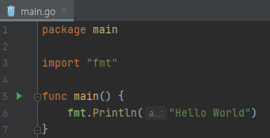

지난 글에서 Go 바이너리 배포판을 설치했으므로 Go 언어를 학습하러 가도록 하겠습니다. Go 언어에 대해서 배울 수 있는 사이트는 다음과 같습니다.

- [Tutorials | golang.org](https://golang.org/doc/tutorial/)
- [쉽고 빠른 Go 시작하기 | 노마드 코더](https://nomadcoders.co/go-for-beginners)
- [30 Go | 프로그래머스](https://programmers.co.kr/learn/courses/13)
- [예제로 배우는 Go 프로그래밍](http://golang.site/)

## Learning Go
맨 처음에는 golang.org 에서 제공하는 [튜토리얼](https://golang.org/doc/tutorial/getting-started)로 시작해보죠.

### 안녕 고랭?
튜토리얼에 따라 "Hello World"를 출력하는 코드를 작성하고 `go` 명령어로 코드를 실행해봅니다. 먼저, GoLand에서 새 프로젝트를 GOPATH/src 폴더 하위에 생성합니다.


빈 프로젝트 폴더에 New Go File로 `main.go` 파일을 생성하고 코드를 작성합니다.

```go main.go
package learning

import "fmt"

func main() {
    fmt.Println("Hello World")
}
```

코드를 작성했으니 튜토리얼 순서에 따라 코드를 실행해야겠죠?

```sh Windows Terminal
C:\Users\Mambo\go\src\learning>go run main.go
go run: cannot run non-main package
```

이상하게도 main.go를 실행할 수 없습니다. 오류 메시지는 메인 패키지를 실행할 수 없다는데요. 튜토리얼의 코드를 살펴보면 package 키워드 다음이 main 입니다. 튜토리얼 문서를 살펴보면 다음의 문장을 찾을 수 있습니다.

> A main function executes by default when you run the main package.

결국 메인 함수를 실행하기 위해서는 패키지를 main으로 선언해야한다는 것입니다. 다시 패키지명을 learning이 아닌 main으로 바꿔보죠.



> 패키지가 leaning일 때는 main 함수가 회색이었는데 밝은 색으로 변하고 Run Application이 생겼습니다.
> 이제 main 함수를 실행 가능하다라는 GoLand에서 알려주는 거겠죠?

```sh Windows Terminal
C:\Users\Mambo\go\src\learning>go run main.go
Hello World
```

찾아보니 Go 언어 스펙 문서에 [프로그램 실행](https://golang.org/ref/spec#Program_execution) 조건이 있습니다. 이 조건으로 인해 튜토리얼에서도 main 패키지와 main 함수를 작성해서 실행한 것입니다.

> 애플리케이션을 실행하기 위해서는 main 패키지와 main 함수 선언이 필요하다는 것을 배웠습니다.

### Import packages
자바에서 import 키워드로 특정 패키지의 클래스를 추가하는 것처럼 Go 언어는 import로 라이브러리로 지칭되는 패키지를 우리가 선언한 패키지에 추가할 수 있습니다. 앞서 작성했던 main.go 파일에서 import 키워드로 `fmt` 패키지를 추가하여 Hello World라는 문자열을 콘솔에 출력했습니다.

Go 언어는 자바와는 다르게 애플리케이션을 개발할 때 필요한 기능을 제공하는 [표준 라이브러리](https://golang.org/pkg/)들을 패키지로 제공합니다. 예를 들어, **database/sql/driver**는 데이터베이스 연결을 위한 인터페이스를 제공하고 **net/http**는 웹 애플리케이션을 작성하고 실행할 수 있는 구현체를 제공합니다.

> 필요한 기능이 표준 라이브러리에 없는 경우 개발자들이 구현해서 깃허브 리파지토리에 공유된 패키지를 다운받을 수 있어요.

외부 라이브러리인 rsc.io/quote 패키지를 다운받고 함수에서 사용해봅니다.
```sh Windows Terminal
C:\Users\Mambo\go\src\learning>go get -u rsc.io/quote
go: downloading rsc.io/quote v1.5.2
```

그리고 패키지에 포함된 함수를 사용하도록 코드를 변경한 뒤 실행합니다.

```go main.go
package main

import "fmt"
import "rsc.io/quote"

func main() {
    fmt.Println(quote.Go())
}
```

> rsc.io/quote 패키지와 Go 함수가 빨간색으로 표시됩니다.

```sh Windows Terminal
C:\Users\Mambo\go\src\learning>go run main.go
main.go:4:8: cannot find module providing package rsc.io/quote: working directory is not part of a module
```

작업 폴더에서 모듈 부분을 찾을 수 없다고 합니다. 모듈에 대해서 찾아봐야겠습니다.

### Go Modules
튜토리얼 문서 상에는 의존성을 추적하기 위해서 신규 [모듈(Module)](https://golang.org/doc/tutorial/getting-started#code)을 초기화 하는 과정이 있습니다. 

> 그래서 모듈이 뭔데...

Go 블로그에 [Using Go Modules](https://blog.golang.org/using-go-modules)이라는 글이 있으니 읽어봅시다. ... 영어에 거부감이 있으니 [번역본](https://johngrib.github.io/wiki/golang-mod/)을 참고하죠.

> 번역본이 없었다면 파파고나 구글 번역으로 사용 했...

1. 모듈은 Go의 의존성 관리 도구이다.
2. 모듈은 프로젝트 루트 경로에 위치하는 go.mod 파일에 정의 된 패키지 모음이다.
3. go.mod 파일에 의존성이 정의되며 함께 버전도 명시된다.
4. 작업 폴더가 $GOPATH/src 외부이면서 go.mod 파일이 있다면 모듈 기능이 활성화된다.
5. Go 1.13 부터 모듈 모드가 기본값으로 설정된다.

4번은 모듈을 사용하면 프로젝트 폴더를 GOPATH 외부에 둘 수 있다는 말이고 5번 항목에 의해 현재 1.15.8 버전을 사용중이므로 모듈 모드가 기본값입니다.

```sh Windows Terminal
C:\Users\Mambo\go\src\learning>go version
go version go1.15.8 windows/amd64
```

> 다시 작성중입니다.

감사합니다.