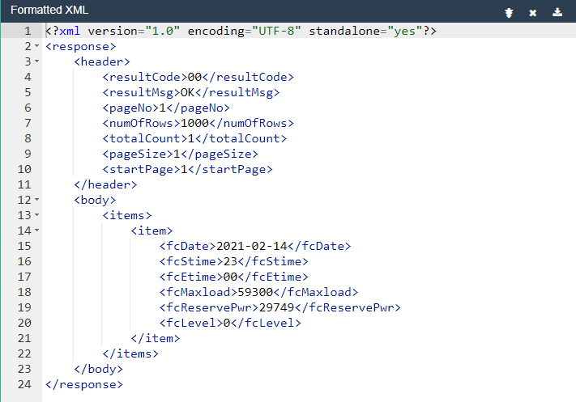
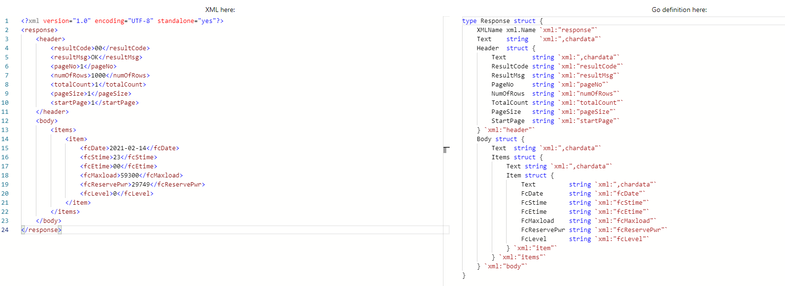
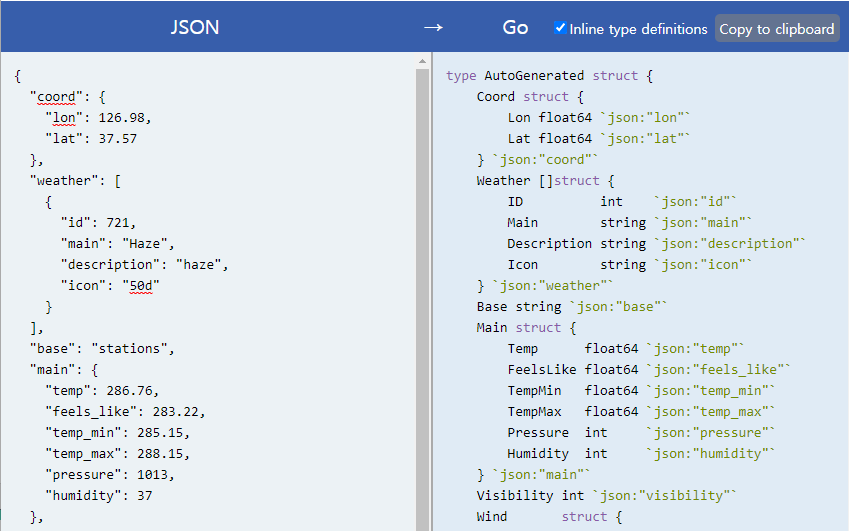

자바 개발자가 Go를 배우는 이야기 2탄에서는 Go 프로젝트 구조와 간단한 웹 애플리케이션을 작성해보았습니다. 이제부터는 실제로 토이 프로젝트에 적용될 기능을 위해 추가해야되는 라이브러리들을 검색하고 몇가지 테스트 코드를 작성해볼 예정입니다.

2021년에 만들어볼 토이 프로젝트는 에너지 관련으로 포함해야하는 기능은 다음과 같습니다.

- 국내 전력 수급 현황 및 수급 예보 정보 모니터링
- 특정 지역에 대한 시간별 날씨 모니터링
- 스마트 미터 전력량 데이터 시뮬레이터
- 일자별 전력량 데이터를 CSV 포맷으로 다운로드
- MQTT 퍼블리싱 에이전트

## Packages
위에서 언급한 기능과 관련된 라이브러리들을 검색해보죠.

### 국내 전력 수급 현황 및 수급 예보 정보 모니터링

[공공데이터포털](https://www.data.go.kr)에는 한국전력거래소에서 제공하는 [전력수급예보조회](https://www.data.go.kr/data/15051436/openapi.do)와 [현재전력수급현황조회](https://www.data.go.kr/data/15056640/openapi.do) API가 있습니다. 이 API들의 응답 데이터 형식을 보면 XML이며 Go로 작성된 웹 애플리케이션에서 OpenAPI를 사용할 수 있는 HTTP 클라이언트와 XML 데이터를 파싱할 수 있는 라이브러리가 필요합니다.

Go로 작성된 HTTP 클라이언트 라이브러리와 XML 파싱 라이브러리를 찾아보면 다음과 같습니다.

- [resty](https://github.com/go-resty/resty)
- [encoding/xml](https://golang.org/pkg/encoding/xml/)

`resty`로 공공데이터포털 API를 호출하는 테스트 함수와 API 응답 결과(XML 데이터)를 Go 스트럭처(Struct)로 변환하는 과정을 테스트해야합니다.

먼저, 테스트 코드는 `/test` 폴더에 생성하므로 이 폴더 아래에 **data_go/data_go_test.go** 파일을 생성합니다.

```go /test/data_go/data_go_test.go
package data_go

import (
	"fmt"
	"github.com/go-resty/resty/v2"
	"os"
	"testing"
)

func TestApiToken(t *testing.T) {
	var dataGoApiToken = os.Getenv("PLUGIN_DATA_GO_API_TOKEN")
	if len(dataGoApiToken) == 0 {
		t.Error("API 토큰 정보가 없습니다.")
		return
	}

	var dataGoEndpoint = "https://openapi.kpx.or.kr/openapi/forecast1dMaxBaseDate/getForecast1dMaxBaseDate"
	var apiUrl = dataGoEndpoint + "?ServiceKey=" + dataGoApiToken

	fmt.Printf("apiUrl: %s\n", apiUrl)

	client := resty.New()

	resp, err := client.R().EnableTrace().Get(apiUrl)
	if err != nil {
		t.Error("REST Client 오류")
		return
	}

	fmt.Printf("%s\n", resp)
}
```

GoLand와 같은 IDE로 테스트를 실행하는 경우 환경 변수에 값을 설정할 수 있습니다.


만약, PLUGIN_DATA_GO_API_TOKEN 환경변수가 존재하지 않는 경우 다음과 같은 오류를 표시하고 테스트 케이스는 중단되죠.

```ps
API server listening at: [::]:23307
=== RUN   TestApiToken
    data_go_test.go:14: API 토큰 정보가 없습니다.
--- FAIL: TestApiToken (0.00s)

FAIL

Debugger finished with exit code 0
```

공공데이터포털 API 호출이 정상적으로 수행되었다면 다음과 같이 통과된 내용을 볼 수 있습니다.

```ps
=== RUN   TestApiToken
apiUrl: https://openapi.kpx.or.kr/openapi/forecast1dMaxBaseDate/getForecast1dMaxBaseDate?ServiceKey=BOlhjPxOGUanamCqkOUCCP7QqmQh%2B%2FxuyFGZemgQTBTBb%2FQntgjS6TKcNW7l%2Bu4rEc%2ByqUlvNKI04a0p%2FM%2BNfQ%3D%3D
<?xml version="1.0" encoding="UTF-8" standalone="yes"?><response><header><resultCode>00</resultCode><resultMsg>OK</resultMsg><pageNo>1</pageNo><numOfRows>1000</numOfRows><totalCount>1</totalCount><pageSize>1</pageSize><startPage>1</startPage></header><body><items><item><fcDate>2021-02-14</fcDate><fcStime>23</fcStime><fcEtime>00</fcEtime><fcMaxload>59300</fcMaxload><fcReservePwr>29749</fcReservePwr><fcLevel>0</fcLevel></item></items></body></response>
--- PASS: TestApiToken (0.24s)
PASS
```

API 응답 결과인 XML 형식의 문자열을 복사해서 [XML Parser](https://jsonformatter.org/xml-parser)로 이쁘게 포맷팅해서 보겠습니다.



위 결과에 따르면 2021년 2월 14일 23시부터 00시까지 전력 수급 예보가 있을 예정입니다. 이제 두번째 테스트 함수인 XML 형식의 문자열을 Go의 Struct로 변환하는 테스트를 수행해야합니다.

[XML to Go struct](https://www.onlinetool.io/xmltogo/)를 통해 변환된 Go Struct 형태를 확인할 수 있습니다.



이 변환 도구는 XML 형태를 그대로 Go Struct로 변환하므로 실제 데이터 구조와 맞지 않을 수 있습니다. 실제로 items 안에 item 항목은 반복되어 item는 배열이 되어야합니다. 그러나 변환된 item는 단일 항목입니다.

따라서 실제로는 다음과 같이 Struct가 되어야합니다.

```go
type DataGoResponse struct {
	XMLName xml.Name `xml:"response"`
	Header  struct {
		ResultCode string `xml:"resultCode"`
		ResultMsg  string `xml:"resultMsg"`
		PageNo     string `xml:"pageNo"`
		NumOfRows  string `xml:"numOfRows"`
		TotalCount string `xml:"totalCount"`
		PageSize   string `xml:"pageSize"`
		StartPage  string `xml:"startPage"`
	} `xml:"header"`
	Body struct {
		Items struct {
			Item []struct {
				FcDate       string `xml:"fcDate"`
				FcStime      string `xml:"fcStime"`
				FcEtime      string `xml:"fcEtime"`
				FcMaxload    string `xml:"fcMaxload"`
				FcReservePwr string `xml:"fcReservePwr"`
				FcLevel      string `xml:"fcLevel"`
			} `xml:"item"`
		} `xml:"items"`
	} `xml:"body"`
}
```

Go에서 구조체(Struct)는 어떠한 필드들의 집합으로 구성합니다. 일반적인 객체지향 언어(자바)가 가지는 클래스, 객체, 상속에 대한 개념이 존재하지 않습니다.

[Go 구조체(Struct) | 예제로 배우는 Go 프로그래밍](http://golang.site/go/article/16-Go-%EA%B5%AC%EC%A1%B0%EC%B2%B4-struct)

자바처럼 제네릭(Generic)에 대한 개념이 아직까지는 없기 때문에 구조체 내 필드를 제네릭으로 표현할 수 없습니다. 2021년 8월에 Go에 [제네릭](https://blog.golang.org/generics-next-step)을 추가한다는 내용은 있습니다.

어찌됐든 공공데이터포털의 오픈 API마다 응답결과에 대한 구조체를 별도로 만들어야합니다.

- Sukub5mMaxDatetime
- Forecast1dMaxBaseDate

`/pkg` 폴더에 **model** 폴더를 만들어 공공데이터 포털 API 응답 결과에 대한 구조체를 만들겠습니다. 

```go /pkg/model/data_go/response.go
package data_go

import "encoding/xml"

type Forecast1dMaxBaseDate struct {
	FcDate       string `xml:"fcDate"`
	FcStime      string `xml:"fcStime"`
	FcEtime      string `xml:"fcEtime"`
	FcMaxload    string `xml:"fcMaxload"`
	FcReservePwr string `xml:"fcReservePwr"`
	FcLevel      string `xml:"fcLevel"`
}

type Forecast1dMaxBaseDateResponse struct {
	XMLName xml.Name `xml:"response"`
	Header  struct {
		ResultCode string `xml:"resultCode"`
		ResultMsg  string `xml:"resultMsg"`
		PageNo     string `xml:"pageNo"`
		NumOfRows  string `xml:"numOfRows"`
		TotalCount string `xml:"totalCount"`
		PageSize   string `xml:"pageSize"`
		StartPage  string `xml:"startPage"`
	} `xml:"header"`
	Body struct {
		Items struct {
			Item []Forecast1dMaxBaseDate `xml:"item"`
		} `xml:"items"`
	} `xml:"body"`
}

type Sukub5mMaxDatetime struct {
	BaseDatetime    string `xml:"baseDatetime"`
	SuppAbility     string `xml:"suppAbility"`
	CurrPwrTot      string `xml:"currPwrTot"`
	ForecastLoad    string `xml:"forecastLoad"`
	SuppReservePwr  string `xml:"suppReservePwr"`
	SuppReserveRate string `xml:"suppReserveRate"`
	OperReservePwr  string `xml:"operReservePwr"`
	OperReserveRate string `xml:"operReserveRate"`
}

type Sukub5mMaxDatetimeResponse struct {
	XMLName xml.Name `xml:"response"`
	Header  struct {
		ResultCode string `xml:"resultCode"`
		ResultMsg  string `xml:"resultMsg"`
		PageNo     string `xml:"pageNo"`
		NumOfRows  string `xml:"numOfRows"`
		TotalCount string `xml:"totalCount"`
		PageSize   string `xml:"pageSize"`
		StartPage  string `xml:"startPage"`
	} `xml:"header"`
	Body struct {
		Items struct {
			Item []Sukub5mMaxDatetime `xml:"item"`
		} `xml:"items"`
	} `xml:"body"`
}
```

그리고 data_go_test.go 파일로 돌아와서 XML 문자열을 파싱하여 구조체로 변환되는지 테스트 코드를 작성합니다.

```go /test/data_go/data_go_test.go
package data_go

import (
	"encoding/xml"
	"fmt"
	"github.com/go-resty/resty/v2"
	"github.com/kdevkr/toy2021/pkg/model/data_go"
	"os"
	"testing"
)

func TestForecast1dMaxBaseDate(t *testing.T) {
	var dataGoApiToken = os.Getenv("PLUGIN_DATA_GO_API_TOKEN")
	if len(dataGoApiToken) == 0 {
		t.Error("API 토큰 정보가 없습니다.")
		return
	}

	var dataGoEndpoint = "https://openapi.kpx.or.kr/openapi/forecast1dMaxBaseDate/getForecast1dMaxBaseDate"
	var apiUrl = dataGoEndpoint + "?ServiceKey=" + dataGoApiToken

	client := resty.New()

	resp, err := client.R().EnableTrace().Get(apiUrl)
	if err != nil {
		t.Error("REST Client 오류")
		return
	}

	var dataGoResp data_go.Forecast1dMaxBaseDateResponse
	err = xml.Unmarshal(resp.Body(), &dataGoResp)
	if err != nil {
		t.Error("XML Unmarshal 과정에서 오류가 발생했습니다.")
		return
	}

	fmt.Printf("%+v\n", dataGoResp.Body.Items)
}
```

Forecast1dMaxBaseDate 구조체에 대한 테스트 코드를 작성하였으며 테스트를 수행하여 구조체의 필드와 값이 표시되는지 확인합니다.

```ps
=== RUN   TestForecast1dMaxBaseDate
{Item:[{FcDate:2021-02-14 FcStime:23 FcEtime:00 FcMaxload:59300 FcReservePwr:29749 FcLevel:0}]}
--- PASS: TestForecast1dMaxBaseDate (0.16s)
```

테스트 수행은 완료되었지만 테스트 코드상 API 엔드포인트 값은 추후 애플리케이션을 개발할 때에도 동일하게 사용되므로 상수로 만들겠습니다.

```go /pkg/model/data_go/endpoint.go
package data_go

const Forecast1dMaxBaseDateEndpoint = "https://openapi.kpx.or.kr/openapi/forecast1dMaxBaseDate/getForecast1dMaxBaseDate"
const Sukub5mMaxDatetimeEndpoint = "https://openapi.kpx.or.kr/openapi/sukub5mMaxDatetime/getSukub5mMaxDatetime"
```

테스트에 대한 자세한 검증은 수행하지 않았지만 하나의 기능에 대한 테스트 수행이 완료되었습니다. 이렇게 테스트 코드를 작성하면서 알게되는 정보는 다음과 같습니다.

1. 테스트 코드 파일은 *_test.go*로 되어야한다.
2. 테스트 함수는 *TestXxx*로 작성되어야하며 *testing.T*를 함수 인자로 받는다.
3. 패키지 폴더에 작성한 코드를 테스트 코드에서 사용할 수 있다.
4. 동일한 패키지로 선언하면 코드 파일을 분리해도 된다.

### 특정 지역에 대한 시간별 날씨 모니터링
특정 지역(위, 경도)에 대한 시간별 날씨 정보는 [Open Weather API](https://openweathermap.org/)를 활용할 예정이며 HTTP 클라이언트 라이브러리인 resty를 활용해서 날씨 데이터를 응답받은 뒤 JSON 형식의 문자열을 구조체로 변환하는 과정을 테스트합니다.

- [encoding/json](https://golang.org/pkg/encoding/json)

서울 지역에 대한 위도, 경도로 응답받은 데이터(JSON)는 다음과 같습니다.
```json
{
  "coord": {
    "lon": 126.98,
    "lat": 37.57
  },
  "weather": [
    {
      "id": 721,
      "main": "Haze",
      "description": "haze",
      "icon": "50d"
    }
  ],
  "base": "stations",
  "main": {
    "temp": 286.76,
    "feels_like": 283.22,
    "temp_min": 285.15,
    "temp_max": 288.15,
    "pressure": 1013,
    "humidity": 37
  },
  "visibility": 5000,
  "wind": {
    "speed": 2.06,
    "deg": 300
  },
  "clouds": {
    "all": 90
  },
  "dt": 1613285102,
  "sys": {
    "type": 1,
    "id": 8105,
    "country": "KR",
    "sunrise": 1613254989,
    "sunset": 1613293776
  },
  "timezone": 32400,
  "id": 1835848,
  "name": "Seoul",
  "cod": 200
}
```

JSON 문자열을 Go Struct로 변환할 때는 [JSON-to-go](https://mholt.github.io/json-to-go/)를 활용할 수 있습니다.



먼저 Open Weather API 응답에 대한 구조체를 만듭니다.

```go /pkg/model/open_weather/response.go
package open_weather

type Coord struct {
	Lon float64 `json:"lon"`
	Lat float64 `json:"lat"`
}

type Weather struct {
	ID          int    `json:"id"`
	Main        string `json:"main"`
	Description string `json:"description"`
	Icon        string `json:"icon"`
}

type Main struct {
	Temp      float64 `json:"temp"`
	FeelsLike float64 `json:"feels_like"`
	TempMin   float64 `json:"temp_min"`
	TempMax   float64 `json:"temp_max"`
	Pressure  int     `json:"pressure"`
	Humidity  int     `json:"humidity"`
}

type Wind struct {
	Speed float64 `json:"speed"`
	Deg   int     `json:"deg"`
}

type Sys struct {
	Type    int    `json:"type"`
	ID      int    `json:"id"`
	Country string `json:"country"`
	Sunrise int    `json:"sunrise"`
	Sunset  int    `json:"sunset"`
}

type CurrentWeatherResponse struct {
	Coord      Coord     `json:"coord"`
	Weather    []Weather `json:"weather"`
	Base       string    `json:"base"`
	Main       Main      `json:"main"`
	Visibility int       `json:"visibility"`
	Wind       Wind      `json:"wind"`
	Clouds     struct {
		All int `json:"all"`
	} `json:"clouds"`
	Dt       int    `json:"dt"`
	Sys      Sys    `json:"sys"`
	Timezone int    `json:"timezone"`
	ID       int    `json:"id"`
	Name     string `json:"name"`
	Cod      int    `json:"cod"`
}
```

Open Weather API에 대한 테스트 코드를 만들어서 응답받은 JSON 형식의 문자열을 구조체로 변환합니다.

```go /test/open_weather/open_weather_test.go
package open_weather

import (
    "encoding/json"
    "fmt"
    "github.com/go-resty/resty/v2"
    "github.com/kdevkr/toy2021/pkg/model/open_weather"
    "net/http"
    "os"
    "testing"
)

func TestCurrentWeather(t *testing.T) {
    var openWeatherApiToken = os.Getenv("PLUGIN_OPEN_WEATHER_API_TOKEN")
    if len(openWeatherApiToken) == 0 {
        t.Error("API 토큰 정보가 없습니다.")
        return
    }

    lon, lat := 126.9778, 37.5683

    var openWeatherEndpoint = open_weather.CurrentWeatherEndpoint
    var apiUrl = openWeatherEndpoint + "?appid=" + openWeatherApiToken

    apiUrl += "&lon=" + fmt.Sprintf("%f", lon)
    apiUrl += "&lat=" + fmt.Sprintf("%f", lat)

    client := resty.New()

    resp, err := client.R().EnableTrace().Get(apiUrl)
    if err != nil {
        t.Error("REST Client 오류")
        return
    }

    if http.StatusOK != resp.StatusCode() {
        t.Errorf("API 오류, %s", resp.String())
        return
    }

    var openWeatherResp open_weather.CurrentWeatherResponse

    err = json.Unmarshal(resp.Body(), &openWeatherResp)
    if err != nil {
        t.Error("JSON Unmarshal 과정에서 오류가 발생했습니다.")
        return
    }

    fmt.Printf("%+v\n", openWeatherResp)
}
```

테스트 수행이 완료되면 다음과 같이 JSON 문자열이 구조체로 변환되어 출력됩니다.

```ps
=== RUN   TestCurrentWeather
{Coord:{Lon:126.98 Lat:37.57} Weather:[{ID:721 Main:Haze Description:haze Icon:50d}] Base:stations Main:{Temp:286.79 FeelsLike:283.25 TempMin:285.15 TempMax:288.15 Pressure:1013 Humidity:37} Visibility:5000 Wind:{Speed:2.06 Deg:300} Clouds:{All:90} Dt:1613286741 Sys:{Type:1 ID:8105 Country:KR Sunrise:1613254989 Sunset:1613293776} Timezone:32400 ID:1835848 Name:Seoul Cod:200}
--- PASS: TestCurrentWeather (0.22s)
```

> JSON 형식의 문자열도 표준 패키지인 encoding/json으로 처리할 수 있네요

### 스마트 미터 전력량 데이터 시뮬레이터
스마트 미터의 전력량을 예측하여 계산할지 시스템 정보 중 메모리 사용량을 측정해서 저장할지는 현재 시점에서 정하지는 않았으나 예측 또는 측정은 반복적인 행위일 것입니다. Go 애플리케이션에서 주기적인 작업을 수행하기 위해 자바에서 사용되는 쿼츠 스케줄러와 같은 라이브러리가 필요해보입니다.

- [cron](https://github.com/robfig/cron)
- [goCron](https://github.com/jasonlvhit/gocron)

`robfig/cron` 패키지를 사용하면 간단하게 크론 표현식으로 함수를 주기적으로 실행할 수 있습니다.

```go /test/schedule/schedule_test.go
package schedule

import (
    "fmt"
    "github.com/robfig/cron"
    "testing"
    "time"
)

func TestCron(t *testing.T) {
    c := cron.New()
    err := c.AddFunc("0/5 * * * * *", func() {
        fmt.Println(time.Now())
    })
    if err != nil {
        t.Error("")
    }
    c.Start()

    time.Sleep(time.Minute)
}
```

### 일자별 전력량 데이터를 CSV 포맷으로 다운로드
데이터베이스에 저장된 전력량 데이터를 가져와서 CSV 포맷으로 다운로드할 수 있는 기능입니다. 이를 위해 구조체 정보를 CSV 포맷의 문자열로 변환하는 작업을 테스트해야합니다.

- [encoding/csv](https://golang.org/pkg/encoding/csv/)
- [gocsv](https://github.com/gocarina/gocsv)

Go 표준 패키지인 encoding/csv을 사용하는 것도 나쁘지 않아보입니다만 gocsv를 이용하면 CSV 파일을 읽어서 Go 구조체로 변환할 수 있습니다.

샘플 데이터가 없으므로 kaggle에 공유된 [Smart Meter Energy(kW) Demand Forecasting](https://www.kaggle.com/asimzahid/smart-meter-energykw-demand-forecasting) 정보를 활용하겠습니다.

```go /test/export_csv/export_csv.go
import (
    "fmt"
    "github.com/gocarina/gocsv"
    "os"
    "strconv"
    "testing"
)

type SmartMeterForecast struct {
    Serial string `csv:"serial"`
    KWh float32 `csv:"kWh"`
    KW float32 `csv:"kW"`
    KVARh float32 `csv:"kVARh"`
    KVAR float32 `csv:"kVAR"`
    Timestamp string `csv:"Time_stamp"`
}

func TestCSVToStruct(t *testing.T) {
    csvFile, err := os.OpenFile("./3098000032-Mar18-Mar19.csv", os.O_RDONLY, os.ModePerm)
    if err != nil {
        t.Error("파일을 열수 없음")
        return
    }
    defer csvFile.Close()

    var smartMeterForecasts []*SmartMeterForecast
    err = gocsv.UnmarshalFile(csvFile, &smartMeterForecasts)
    if err != nil {
        t.Error("CSV Unmarshal 과정에서 오류가 발생했습니다.")
        return
    }

    for _, row := range smartMeterForecasts {
        fmt.Printf("%+v\n", *row)
    }
}
```

CSV 파일을 읽는 것은 테스트 완료하였고 이제 구조체에 저장된 데이터를 CSV 파일로 저장할 수 있어야합니다.


```go /test/export_csv/export_csv_test.go
func TestSaveCSVFile(t *testing.T) {
    csvFile, err := os.OpenFile("./3098000032-Mar18-Mar19.csv", os.O_RDONLY, os.ModePerm)
    if err != nil {
        t.Error("파일을 열수 없음")
        return
    }
    defer csvFile.Close()

    var smartMeterForecasts []*SmartMeterForecast
    err = gocsv.UnmarshalFile(csvFile, &smartMeterForecasts)
    if err != nil {
        t.Error("CSV Unmarshal 과정에서 오류가 발생했습니다.")
        return
    }

    exportCsvFile, err := os.OpenFile("./test.csv", os.O_RDWR|os.O_CREATE, os.ModePerm)
    err = gocsv.Marshal(&smartMeterForecasts, exportCsvFile)

    if err != nil {
        t.Error("CSV 파일을 저장하는 과정에서 오류가 발생했습니다.")
        return
    }
}
```

export_csv_text.go와 같은 경로에 test.csv 파일이 생성되는 것을 확인할 수 있습니다. 그런데 작성된 테스트 함수 로직 중에서 새로운 문법이 보입니다.

```go
var smartMeterForecasts []*SmartMeterForecast
err = gocsv.UnmarshalFile(csvFile, &smartMeterForecasts)
```

구조체 앞에 &를 붙이는 것은 구조체에 대한 포인터 변수를 생성하는 것이라고 합니다. 

> 학부 시절 C언어 과목을 수강할 때 포인터 부분으로 인해 큰 좌절감을 느끼고 그 이후로는 C언어를 거부하고 있습니다. 다행스러운 부분은 Go는 C언어와 다르게 포인터 연산을 지원하지 않는다는 부분입니다.
> C언어에 이어 Go를 거부할 뻔....


### MQTT 퍼블리싱 에이전트
연결된 MQTT 브로커 서버를 통해 현재 전력량 데이터를 전송할 수 있는 에이전트 기능으로 MQTT 클라이언트 라이브러리를 사용해야 합니다.

- [Eclipse Paho MQTT Go client](https://github.com/eclipse/paho.mqtt.golang)

이 기능에 대한 테스트 코드 작성은 MQTT 브로커 서버인 [Mosquitto](https://mosquitto.org/)를 로컬 환경에 설치한 뒤 진행합니다.

웹 애플리케이션에서 제공하는 기능에 대한 패키지를 찾아보고 테스트 코드를 작성해보았으니 자바 개발자가 Go를 배우는 이야기 3탄을 마치겠습니다.
감사합니다.