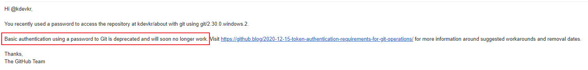
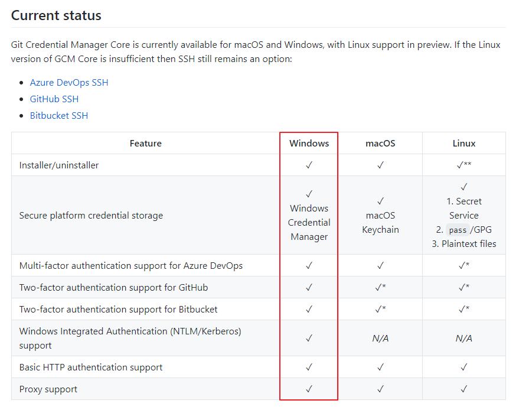
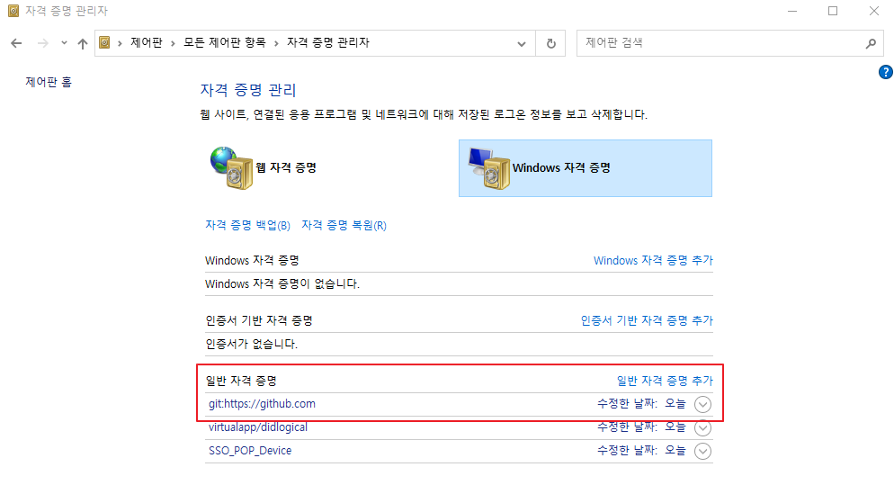
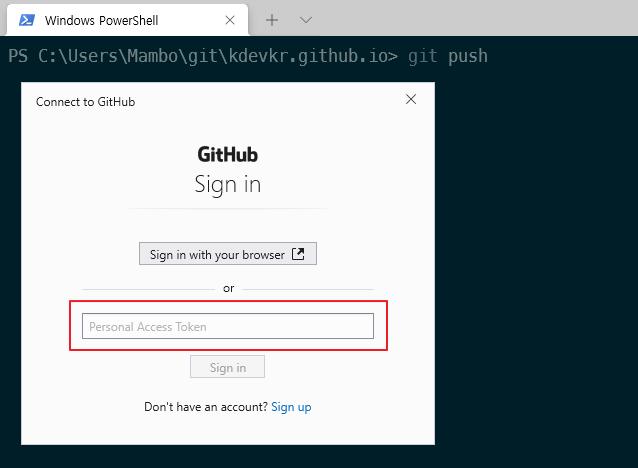
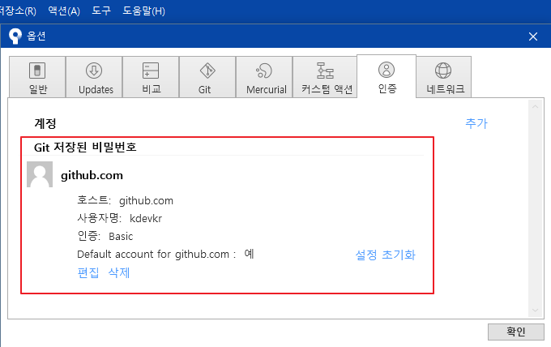

안녕하세요 Mambo 입니다.

오늘은 변경된 사항을 깃허브 저장소에 반영시키기 위하여 깃 명령어를 수행할 때 사용되는 인증 방식을 비밀번호가 아닌 액세스 토큰으로 변경하는 것에 대해서 공유하려합니다. 



2020년 12월 15일에 깃허브에서는 [Token authentication requirements for Git operations](https://github.blog/2020-12-15-token-authentication-requirements-for-git-operations/)을 통해 2021년 8월 13일에 더이상 비밀번호 인증 방식으로 Git 작업을 수행할 수 없다고 알려주었으며 비밀번호를 사용하는 개발자들에게 지속적으로 Deprecation Notice 메일을 발송해왔습니다.

저는 이 문제에 대하여 당장은 변경하지않아도 무방하다고 생각하여 무시하였지만 이제는 비밀번호를 사용하여 인증할 수 없게되어 우리는 비밀번호가 아닌 깃허브에서 발급받은 토큰을 사용하도록 변경해야합니다.

## Git Credential Helper
깃에서 사용하는 크레덴셜을 어떻게 저장했는지 기억나지 않으므로 찾아보니 깃 크레덴셜 헬퍼를 사용한다고 합니다. 그리고 윈도우에서 사용하는 크레덴셜 헬퍼는 [Git Credential Manager for Windows](https://github.com/Microsoft/Git-Credential-Manager-for-Windows)에서 [Git Credential Manager Core](https://github.com/microsoft/Git-Credential-Manager-Core)되어 크로스 플랫폼으로 통합된 것 같습니다.



위 스크린샷에서 확인할 수 있듯이 윈도우에서 크레덴셜 저장소는 **자격 증명 관리자**를 사용한다고 합니다. 제어판에서 자격 증명 관리자를 열어보면 일반 자격 증명 항목에 Github 관련 자격 증명이 있는 것을 확인할 수 있을겁니다.



비밀번호가 저장되어있는 Github 자격 증명을 선택해서 삭제하시면 됩니다. 

### Manager Core
윈도우에 설치된 Git 버전이 2.29 이상이라면 깃 크레덴셜 헬퍼를 초기화하고 Manager Core로 지정하는게 좋다고 생각되므로 다음과 같이 명령어를 수행합니다.

```ps Windows Terminal
git --version
git version 2.32.0.windows.2

git config --unset credential.helper
git config --global credential.helper manager-core
git config --global credential.helper
manager-core
```

> 이미 깃 크레덴셜 헬퍼가 manager-core로 지정되어있다면 스킵하세요.

### Token Credential 
이제 리파지토리 폴더에서 깃허브를 대상으로 깃 명령어를 수행하면 깃허브 주소에 대한 자격 증명이 존재하지 않으므로 다음과 같이 크레덴셜을 요구하는 팝업창이 뜨게 됩니다.



깃허브에서 발급받은 토큰을 입력하면 자격 증명 관리자에 깃허브 주소에 대한 자격 증명이 등록되고 성공적으로 깃 명령어를 수행되는 것을 확인할 수 있을겁니다.

### SourceTree Authentication
만약, 소스트리를 사용하고 계시다면 설정 > 옵션 > 인증에서 정상적으로 자격 증명을 확인할 수 있는 지 확인해보셔야합니다.



이상으로 Github의 Git 작업에 대한 토큰 인증 요구 사항을 마치겠습니다.

감사합니다.