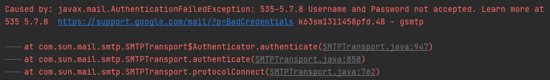
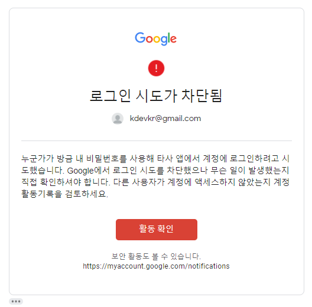
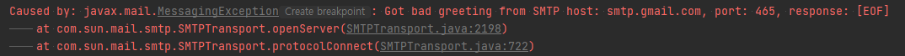

통신 프로토콜 이해하기 시리즈는 컴퓨터 또는 디바이스 간 통신에 사용되는 다양한 프로토콜을 이해하는 시간을 가집니다. 실무에서 다양한 프로젝트를 진행하다보면 통신에 사용되는 프로토콜이 다양하다는 것을 느낄 수 있습니다. 이번 통신 프로토콜 이해하기 시리즈에서 살펴볼 통신 프로토콜은 `SMTP`입니다.

## SMTP
SMTP(Simple Mail Transfer Protocol)은 메일 서버간 이메일 송수신에 사용되는 네트워크 프로토콜로 기본적으로 25번 포트를 할당하도록 되어있습니다. 대부분의 메일 서버는 보안 전송을 위해 `SMTPS` 프로토콜을 사용합니다. 이때 SSL은 465 포트, TLS 또는 STARTTLS는 587 포트를 할당합니다. 

### 메일 서버별 SMTP 프로토콜 설정
국내외 잘 알려진 메일 서버에 대한 SMTP 설정을 살펴봅시다.  

#### Gmail
- SMTP 주소: smtp.gmail.com
- SSL 포트: 465
- TLS/STARTTLS 포트: 587
- Auth: 예

#### Daum
- SMTP 주소: smtp.daum.net
- SSL 포트: 465

#### Naver
- SMTP 주소: smtp.naver.com
- SSL 포트: 465
- TLS 포트: 587

> 보통 SSL은 465 포트를 TLS는 587 포트를 설정하는 것을 기억하세요.

### 구글 SMTP 메일 서버로 이메일 발송
다양한 메일 서버 또는 [James](https://james.apache.org/index.html)를 통해 자체 메일 서버를 구축할 수 있으나 구글 이메일 계정을 통해 메일 발송을 위해 구글 SMTP 메일 서버를 사용할 수 있습니다. 스프링 부트 애플리케이션에서 SMTP 설정을 하고 이메일을 발송해보도록 하죠.

먼저 SMTP 메일 서버로 인증할 때 우리가 사용하는 `이메일 계정`과 `비밀번호`를 사용해야합니다. 그런데 구글은 여러분의 이메일 계정을 지키기 위해서 구글이 정해놓은 표준을 지키지 않는 접근은 이메일 계정에 대한 인증 시도를 `차단`합니다. 이 부분을 언급하는 이유는 여러분이 SMTP 메일 서버를 사용하기 위해서 이메일 계정과 비밀번호로 접근하였지만 구글에서는 이를 허용하지 않기 때문입니다.



그리고 구글에서 여러분의 이메일 계정에 대한 접근이 차단되었다는 메일을 발송합니다.



#### 보안 수준이 낮은 앱의 액세스
따라서, 여러분의 구글 이메일 계정으로 구글 SMTP 메일 서버에 인증을 허용하기 위해서 구글 이메일 계정에 대한 [보안 수준이 낮은 앱의 액세스](https://www.google.com/settings/security/lesssecureapps)를 활성화해야합니다.


보안 수준이 낮은 앱의 액세스를 활성화하면 중요 보안 사항으로 보안 수준이 낮은 앱에 대한 액세스가 허용됨에 대한 활동 확인 메일이 발송됩니다. 이제 여러분의 이메일 계정으로 구글 SMTP 메일 서버에 대한 인증을 수행할 수 있습니다.

#### 스프링 이메일 프로퍼티 설정
위 구글 SMTP 설정 정보에 따라 `SSL`을 보안으로 적용하기 위하여 465 포트를 사용하도록 프로퍼티를 작성합니다.

```yaml application.yml
spring:
  mail:
    protocol: smtp
    host: smtp.gmail.com
    port: 465
    username: kdevkr@gmail.com
    password:
    default-encoding: UTF-8
    test-connection: true
    properties:
      mail.smtp.auth: true
      mail.smtp.ssl.enable: true
#      mail.smtp.starttls.enable: true
```

그리고 간단한 이메일 발송을 위한 테스트 함수를 작성합니다. 

```java
@Autowired
private JavaMailSender javaMailSender;

@DisplayName("구글 SMTP 메일서버로 이메일 발송 테스트")
@Test
void testSendMail() {
    SimpleMailMessage mimeMessage = new SimpleMailMessage();
    mimeMessage.setFrom("no-reply@gmail.com");
    mimeMessage.setTo("kdevkr@gmail.com");
    mimeMessage.setSubject("Hi");
    mimeMessage.setText("\uD83D\uDC4B");

    Assertions.assertDoesNotThrow(() -> {
        try {
            javaMailSender.send(mimeMessage);
            Thread.currentThread().join(Duration.ofSeconds(10).toMillis());
        } catch (Exception e) {
            e.printStackTrace();
            throw e;
        }
    });
}
```

> 이메일을 발송하도록 현재 스레드를 10초간 기다리게 했어요.

이제 구글 SMTP 메일 서버가 여러분이 요청한 메일을 전송하여 다음과 같이 정상적으로 수신되는 것을 확인할 수 있습니다.


그렇다면, SMTP 설정을 잘못한다면 어떤 오류가 발생할 지 살펴보겠습니다. 먼저, TLS로 보안을 설정하기 위하여 STARTTLS를 활성화하는데 465 포트를 사용해보겠습니다.

```yaml application.yml
spring:
  mail:
    properties:
      mail.smtp.auth: true
#      mail.smtp.ssl.enable: true
      mail.smtp.starttls.enable: true
```



그러면 다시 587 포트로 변경하고 테스트를 수행하면 이메일이 수신됩니다.


테스트를 종합적으로 정리해보면 SMTP 메일 서버를 사용하기 위해서는 여러분이 사용하려는 메일 서버가 `SSL` 또는 `TLS/STARTTLS`을 지원하는지 확인하고 보안 프로토콜에 따라 465 또는 587 포트를 설정하면 됩니다.

## 참고
- [SMTP | 정보통신기술용어해설](http://www.ktword.co.kr/abbr_view.php?m_temp1=196)
- [Which SMTP Port Should I Use? | Mailgun](https://www.mailgun.com/blog/which-smtp-port-understanding-ports-25-465-587/)
- [이메일 클라이언트의 SMTP와 기타 설정 변경 | Gmail](https://support.google.com/mail/answer/7126229?hl=ko)