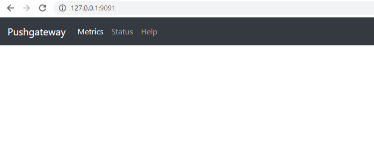
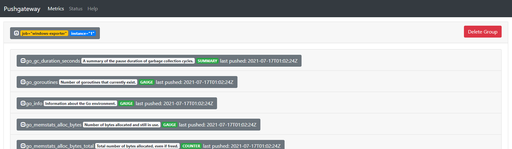
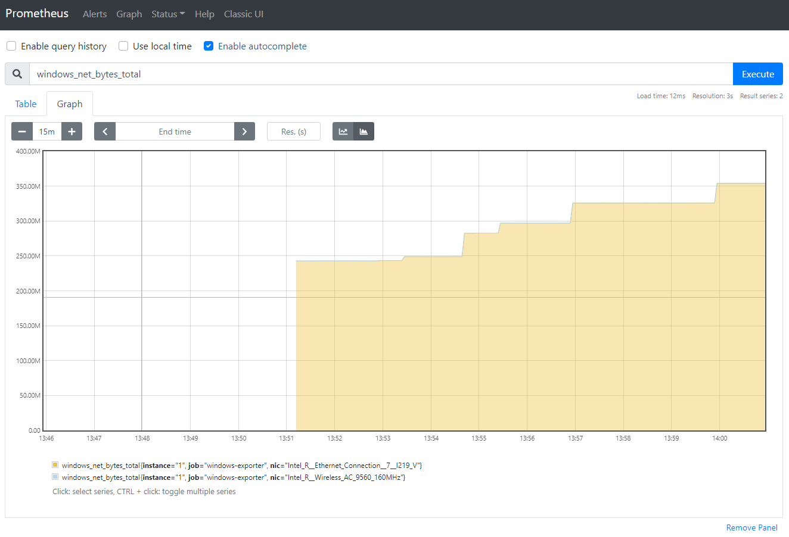
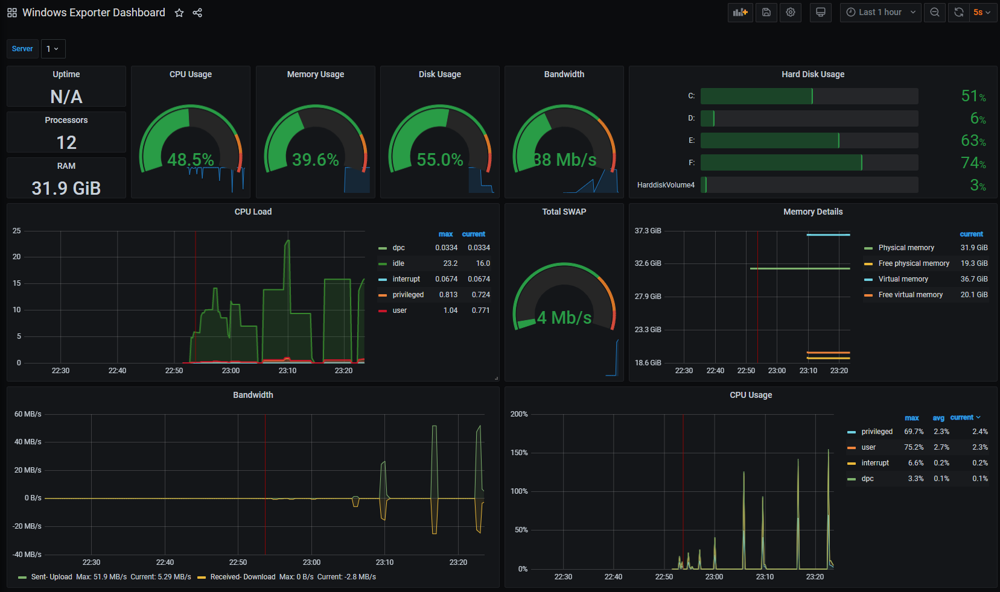

안녕하세요 Mambo 입니다. 오늘은 Promethues의 Pushgateway를 왜 사용해야하는지에 대해서 알아보려고 합니다.

프로메테우스(Promethues)는 기본적으로 매트릭 지표를 제공하는 서버에게 주기적으로 요청하여 매트릭을 수집하도록 되어있습니다. 그래서 매트릭을 수집하기 위해서는 프로메테우스가 수집해야할 설정 파일에 매트릭 수집을 위한 주소를 입력해야합니다. 하지만 모든 인스턴스가 외부 인터넷망을 통해 접근할 수 있는 공인 IP를 할당하지는 않습니다. 또한, 클라우드를 통해 애플리케이션을 운영하는 경우에도 외부로 나가는 트래픽은 허용하지만 외부에서 내부로 들어오는 트래픽은 특정 IP 대역에서만 접근할 수 있도록 보안 규칙을 설정하기도 합니다.

사설망에 있는 인스턴스는 내부 아이피만 할당되어있고 외부 인터넷망과의 통신은 별도의 장비를 통해 수행합니다. 이 경우 인스턴스에는 공인 IP가 할당되어있지 않기 때문에 프로메테우스에 주소를 입력할 수 없는 상황이 됩니다. 그래서 Polling 방식이 아닌 프로메테우스에 매트릭을 Push 할 수 있도록 해야합니다. 매트릭을 푸시할 수 있도록 지원하는게 바로 `Pushgateway` 입니다.

## Pushgateway
프로메테우스에서 제공하는 [Pushgateway](https://github.com/prometheus/pushgateway)는 매트릭을 푸시할 수 있도록 지원하며 푸시된 매트릭을 프로메테우스에서 가져갈 수 있도록 중개자 역할을 수행합니다. 따라서, Pushgateway에 푸시된 매트릭을 프로메테우스에서 가져갈 수 있습니다.

### How to install Pushgateway
Pushgateway는 운영체제별 바이너리 파일을 받아 설치할 수 있습니다. 저는 운영체제에 상관없이 실행하기 위하여 바이너리 파일이 아닌 도커를 사용하여 Pushgateway를 실행하도록 하겠습니다.

```yaml pushgateway/docker-compose.yml
version: '3'
services:
    pushgateway:
        container_name: pushgateway
        image: prom/pushgateway:latest
        restart: always
        ports:
            - 9091:9091
```

#### (Optinal) Listening Port
Pushgatway는 기본적으로 9091 포트를 할당합니다. 
만약, 9091 포트가 이미 사용중이라면 `web.listen-address` 플래그를 설정해야합니다.

#### (Optional) Enable Persistence Mode
기본적으로 Pushgateway는 푸시된 매트릭을 저장하지 않습니다. 
만약, Pushgateway가 예기치 못하게 중단되더라도 푸시된 매트릭을 유지하고 싶다면 `persistence.file` 플래그로 푸시된 매트릭을 저장할 파일을 지정해야합니다.

#### (Optional) TLS and basic authentication
Pushgateway는 TLS 및 기본 인증을 지원합니다. 이를 설정하기 위해서는 `web.config.file` 플래그에 [Web Configuration](https://github.com/prometheus/exporter-toolkit/blob/master/docs/web-configuration.md) 파일을 지정하세요.

### Run Pushgateway

```cmd Windows Terminal
docker-compose up -d
```

도커 컴포즈 명령어로 Pushgateway를 실행하고 브라우저를 통해 127.0.0.1:9091로 접근할 수 있습니다.




### How to push metrics
Pushgateway로 매트릭을 푸시하는 것은 HTTP로 수행할 수 있습니다. 다음의 HTTP 요청 예시를 살펴보시죠.

```sh Terminal
echo "some_metric 3.14" | curl --data-binary @- http://127.0.0.1:9091/metrics/job/some_job
```

`curl`과 같은 HTTP 요청 도구로 매트릭을 쉽게 푸시할 수 있으며 윈도우 환경에서는 [curl](https://curl.se/windows/)을 다운로드하여 설치하거나 Powershell의 Invoke-WebRequest 명령어로 HTTP 요청을 수행할 수도 있습니다.

```cmd 명령 프롬프트
powershell -Command "Invoke-WebRequest -Uri http://127.0.0.1:9091/metrics/job/some_job -Method POST -Body \"some_metric 3.14`n\""
```

### Push Examples
앞서 HTTP 요청을 통해 매트릭을 푸시할 수 있음을 확인했으므로 node_exporter 또는 windows_exporter와 같은 OS 매트릭을 제공하는 Promethues Exporter에서 매트릭을 받아서 Pushgateway에 매트릭을 보내보도록 하겠습니다.

다음처럼 curl를 사용하여 매트릭을 쉽게 Pushgateway로 보낼 수 있습니다.

```cmd Windows Terminal
curl -s http://localhost:9100/metrics | curl --data-binary @- http://127.0.0.1:9091/metrics/job/node-exporter/instance/1
curl -s http://127.0.0.1:9182/metrics | curl --data-binary @- http://127.0.0.1:9091/metrics/job/windows-exporter/instance/1
```

#### Node Exporter
[prometheus/node_exporter](https://github.com/prometheus/node_exporter)는 리눅스 커널을 사용하는 OS에 대한 매트릭을 제공합니다. 바이너리 뿐만 아니라 도커 이미지를 제공하므로 컨테이너로 실행할 수 있습니다.

```yaml docker-compose.yml
version: '3'
services:
  node-exporter:
    image: quay.io/prometheus/node-exporter:latest
    container_name: node-exporter
    command:
      - '--path.rootfs=/host'
    network_mode: host
    pid: host
    restart: unless-stopped
    volumes:
      - '/:/host:ro,rslave'
```

#### Windows Exporter
[prometheus-community/windows_exporter](https://github.com/prometheus-community/windows_exporter)는 윈도우 머신에 대한 매트릭을 제공합니다. windows_exporter는 파일을 다운로드 받아서 설치하거나 실행해야합니다.

```cmd Windows Terminal
.\windows_exporter-0.16.0-386.exe --collectors.enabled "cpu,net,cs"
```

명령어가 정상적으로 수행되었다면 Pushgateway에서 다음과 같이 Exporter로 부터 받은 매트릭이 보내졌음을 확인할 수 있습니다.


### Pushgateway with TTL
Pushgateway는 푸시된 매트릭을 지우지 않습니다. 따라서, 매트릭이 다시 푸시되지 않는다면 Pushgateway는 이전에 푸시된 매트릭을 현재 매트릭 정보로 제공합니다. 

몇몇 사용자들이 일정시간이 지나면 매트릭을 지우는 옵션을 적용해달라고 요청하였지만 Pushgateway 개발팀은 적용하지 않는게 맞다고 판단하였습니다.

> A while ago, we decided to not implement a “timeout” or TTL for pushed metrics because almost all proposed use cases turned out to be anti-patterns we strongly discourage.

만약, 푸시된 매트릭이 일정시간 이후에 지워져야한다면 푸시된 매트릭을 지우도록 DELETE API를 호출하는 배치 작업을 만들어야합니다. 배치를 만들고 싶지 않고 최신 버전을 사용하지 않아도 괜찮다면 Pushgateway를 포크하여 TimeToLive 옵션을 추가한 [pushgateway-ttl](https://github.com/dinumathai/pushgateway)을 사용하시는 것을 추천합니다.

```yaml docker-compose.yml
version: '3'
services:
    pushgateway-ttl:
        container_name: pushgateway-ttl
        image: dmathai/prom-pushgateway-ttl:latest
        restart: always
        ports:
            - 9091:9091
        command:
            - '--metric.timetolive=60s'
```

### Promethues Scrap Configs
우리는 사설망의 인스턴스에서 Pushgateway로 매트릭을 푸시할 수 있음을 확인하였습니다. 이제는 Pushgateway에 푸시된 매트릭을 프로메테우스에서 가져갈 수 있도록 설정해야합니다. [Configure the Pushgateway as a target to scrape](https://github.com/prometheus/pushgateway#configure-the-pushgateway-as-a-target-to-scrape)

```yaml promethues.yml
scrape_configs:
  - job_name: 'pushgateway'
    honor_labels: true
    static_configs:
      - targets: ['pushgateway:9091']
```

> `honor_labels` 항목이 true로 설정되어야한다는 점에 주의하시기 바랍니다.

프로메테우스가 Pushgateway로부터 매트릭을 수집하였다면 다음과 같이 매트릭을 확인할 수 있습니다.



### Grafana Dashboard

위 화면에서 확인한 windows_net_bytes_total 매트릭은 windows_expoter로 수집된 매트릭으로 이를 그라파나로 시각화하기 위해 [Windows Exporter Dashboardby girb90](https://grafana.com/grafana/dashboards/14694)를 추가하면 다음과 같이 확인할 수 있습니다.



이로써 Pushgateway를 활용해 사설망에 위치한 인스턴스에 대한 모니터링을 수행할 수 있음을 알게되었습니다. 감사합니다.

