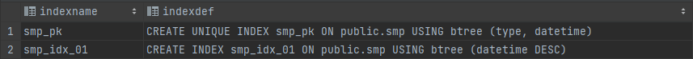
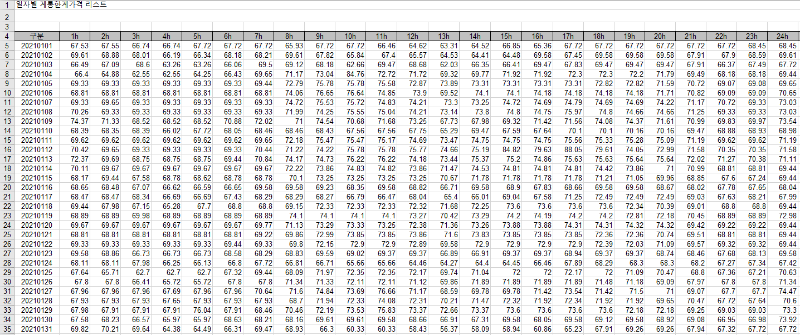
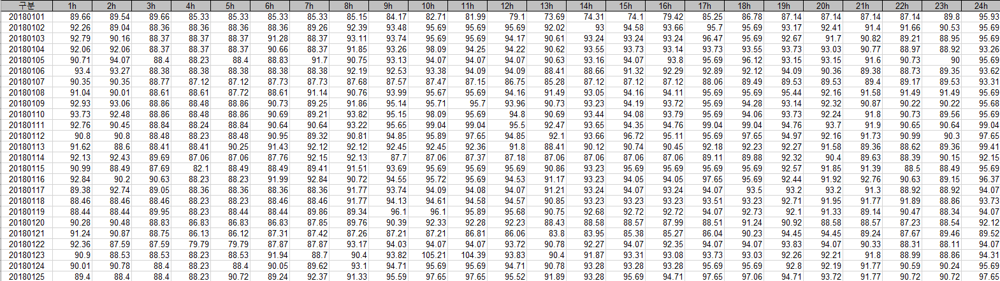
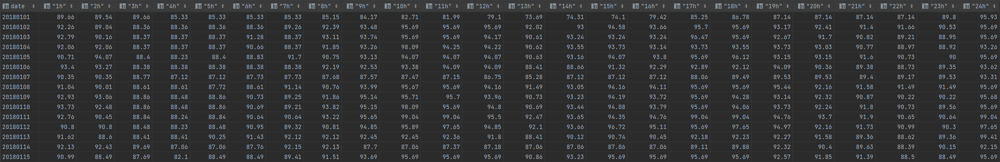

안녕하세요 Mambo 입니다. 오늘은 현재 다니고 있는 회사에서 주로 사용하는 관계형 데이터베이스인 PostgreSQL에 대해서 다루어보려고 합니다. 회사에서 DB 관련 부분을 주로 담당하고 있지는 않지만 애플리케이션에 문제가 있을 때 DB 영역에서 문제가 있을 경우 원인을 좀 더 상세하게 파악하여 공유한다면 해당 담당자가 좀 더 쉽고 빠르게 해결할 수 있을 것 입니다.

본 글에서는 PostgreSQL가 무엇인지에 대해 다루지 않습니다. 
PostgreSQL에 대해서는 네이버 D2의 [한눈에 살펴보는 PostgreSQL](https://d2.naver.com/helloworld/227936)을 참고하시면 좋다고 생각합니다.

## 학습을 위한 준비  
PostgreSQL은 윈도우 또는 맥과 같은 [OS별 설치파일](https://www.postgresql.org/download/)을 제공합니다만, 도커에서 PostgreSQL에 대한 이미지를 공식적으로 지원하기 때문에 학습을 위한 PostgreSQL을 쉽게 컨테이너로 실행하려고 합니다.

> 사실 PostgreSQL을 설치하는 방법을 다루지 않는 이유는 회사에서 AWS의 [Aurora](https://aws.amazon.com/ko/rds/aurora)를 통해 PostgreSQL 기반의 데이터베이스 클러스터를 구성해서 사용하고 있어 직접 설치하는 방법을 숙지할 필요는 없는 상황이기 때문입니다.

- [PostgreSQL Docker Official Image](https://hub.docker.com/_/postgres)
- [PostgreSQL 11 Documentation](https://www.postgresql.org/docs/11)
- [DataGrip](https://www.jetbrains.com/ko-kr/datagrip/)


### 도커 컴포즈
저는 도커 컨테이너를 실행하기 위해서 [도커 컴포즈](https://docs.docker.com/compose/) 문서를 작성하는 편입니다. 도커 컴포즈를 활용하면 도커 컨테이너 환경을 쉽게 파악할 수 있으므로 직접 명령어로 실행하는 분들이라면 도커 컴포즈를 활용해보시면 좋겠습니다.

```yaml docker-compose.yml
version: '3'
services:
  postgres:
    container_name: postgres
    image: postgres:11
    ports:
      - 5432:5432
    environment:
      POSTGRES_USER: postgres
      POSTGRES_PASSWORD: postgres
    volumes:
      - postgres_volume:/var/lib/postgresql/data
volumes:
  postgres_volume:
```

도커 컴포즈 문서가 준비되었으면 컴포즈 명령어를 통해 PostgreSQL 컨테이너를 실행합시다.

```sh Terminal
docker compose up -d
```

### DataGrip로 PostgreSQL 연결
성공적으로 PostgreSQL가 도커 컨테이너로 실행되었다면 [DataGrip](https://www.jetbrains.com/ko-kr/datagrip/)을 통해 연결합니다. 
만약, 라이센스가 없으신 분들이라면 [DBeaver](https://dbeaver.io/) 또는 [SQLTools for Visual Studio Code](https://marketplace.visualstudio.com/items?itemName=mtxr.sqltools) 등을 이용하실 수도 있습니다.


## PostgreSQL 학습
PostgreSQL에 대해서 학습하기 위한 환경은 갖추어졌습니다. 오늘의 학습 목표는 [KPX(전력거래소)에서 제공하는 SMP(계통한계가격)](https://www.kpx.or.kr/www/contents.do?key=225)을 저장할 수 있는 데이터베이스를 구성하고 저장된 SMP 데이터를 전력거래소에서 제공하는 형태처럼 조회해보는 것입니다.

### 사용자 및 데이터베이스 생성
PostgreSQL에 슈퍼유저인 `postgres`가 존재하지만 슈퍼유저로 데이터베이스를 사용하지 않습니다. 일반 사용자를 생성하고 데이터베이스에 대한 권한을 가지도록 해야합니다. 일반 사용자를 생성하기 위해서는 로그인 권한을 가지는 `롤(Role)`을 만들어야 합니다. PostgreSQL은 `CREATE USER` 이라는 SQL 명령어(Command)를 제공하므로 이를 사용하여 일반 사용자를 생성할 수 있습니다.

```pgsql 사용자 생성을 위한 CREATE USER 예시
CREATE USER mambo WITH ENCRYPTED PASSWORD 'mambo' CONNECTION LIMIT 100;
```

> PostgreSQL의 [CREATE USER](https://www.postgresql.org/docs/11/sql-createuser.html) 구문은 CREATE ROLE 구문에 LOGIN 권한이 부여된 별칭 명령어입니다.

```pgsql [Tip] 사용자 목록을 확인할 수 있는 SQL
SELECT * FROM pg_user;
SELECT * FROM pg_shadow;
```

mambo라는 사용자를 만들었고 이제 이 사용자가 접근할 수 있는 데이터베이스를 만드려고 합니다. 데이터베이스를 만드는 SQL 명령어는 `CREATE DATABASE` 입니다. 사실 상 데이터베이스 이름은 아무렇게 설정해도 상관없으므로 mambo_db 라고 만들겠습니다. 

```pgsql 데이터베이스 생성을 위한 CREATE DATABASE 예시
CREATE DATABASE mambo_db OWNER mambo;
```

이렇게 만들어진 데이터베이스에 대한 정보는 [`pg_database`](https://www.postgresql.org/docs/11/catalog-pg-database.html) 카탈로그에 저장되어 다음의 SQL을 통해 데이터베이스 목록을 확인할 수 있습니다.

```pgsql 데이터베이스 목록을 확인할 수 있는 SQL
SELECT datname AS "Name",
       pg_get_userbyid(datdba) AS "Owner",
       pg_encoding_to_char(encoding) AS "Encoding",
       datctype AS "Collate",
       datacl AS "Access Privileges"
FROM pg_database;
```

쿼리 콘솔에서 위 SQL을 실행하면 현재 연결중인 postgres 데이터베이스 이외에 추가한 `mambo_db`라는 데이터베이스가 있는 것을 확인할 수 있을겁니다.

### SMP 테이블 구성하기
mambo 사용자로 mambo_db 데이터베이스에 연결한 뒤 SMP 저장을 위한 테이블을 구성합니다.

- type: SMP 유형으로 육지(1), 제주(9)
- datetime: 시간대 날짜(UTC)
- value: SMP 값

```pgsql 테이블 생성 SQL
CREATE TABLE IF NOT EXISTS smp (
    type        INTEGER   NOT NULL,
    datetime    TIMESTAMP NOT NULL,
    value       NUMERIC   NOT NULL,
    created_at  TIMESTAMP NOT NULL DEFAULT (now() AT TIME ZONE 'UTC'),
    modified_at TIMESTAMP NOT NULL DEFAULT (now() AT TIME ZONE 'UTC'),
    CONSTRAINT smp_pk PRIMARY KEY (type, datetime)
);
```
> SMP 유형별로 시간대에 대한 값이 유일해야하므로 type과 datetime이 키가 되어야 합니다.
> value는 정밀한 실수 계산을 위해 FLOAT 또는 DOUBLE PRECISION이 아닌 [NUMERIC](https://www.postgresql.org/docs/11/datatype-numeric.html) 유형으로 지정하였습니다.

#### 날짜 검색을 위한 인덱스 추가하기
SMP는 하루, 일주일, 한달 그리고 1년 기간에 대하여 조회할 수 있어야하므로 datetime에 대한 내림차순을 인덱스로 추가합니다.

```pgsql SQL
CREATE INDEX IF NOT EXISTS smp_idx_01 ON smp (datetime DESC);
```

```pgsql [Tip] 인덱스 정보를 조회할 수 있는 SQL
SELECT indexname, indexdef FROM pg_indexes WHERE tablename = 'smp';
```



### SMP 데이터를 추가할 수 있는 함수 만들기
SMP 테이블에 데이터를 추가하기 위하여 [PL/pgSQL](https://www.postgresql.org/docs/11/plpgsql.html) 방식의 함수를 만들도록 하겠습니다. PostgreSQL을 사용할 때 PL/pgSQL을 활용하면 일반적인 SQL이 수행할 수 없는 로직을 만들 수 있습니다.

```pgsql 기본 데이터 추가 함수
CREATE OR REPLACE FUNCTION "smp$upsert"(v_type INTEGER, v_datetime TIMESTAMP, v_value DOUBLE PRECISION)
    RETURNS INTEGER
    LANGUAGE plpgsql
AS
$$
DECLARE
    now    TIMESTAMP := now() at time zone 'UTC';
    result INTEGER   := 0;
BEGIN
    INSERT INTO smp (type, datetime, value)
    VALUES (v_type, v_datetime, v_value)
    ON CONFLICT (type, datetime) DO UPDATE
        SET (value, modified_at) = (v_value, now);
    GET DIAGNOSTICS result = ROW_COUNT;
    RETURN result;
END;
$$;
```

> value는 NUMERIC 유형이지만 함수 단계에서 FLOAT 또는 DOUBLE PRECISION로 사용해도 무방합니다.

`smp$upsert` 함수는 1건의 데이터씩 추가되는 함수이기 때문에 1000건의 데이터를 저장하기 위해서는 함수를 1000번 반복해서 호출해야하는 번거로움과 효율성이 떨어지는 단점이 있습니다. 그래서 우리는 복수의 데이터를 JSON 문자열로 구성하여 JSONB 형식으로 읽어 한번에 추가할 수 있도록 함수를 추가하겠습니다.

```pgsql 복수 데이터 추가 함수
CREATE OR REPLACE FUNCTION "smp$upsert"(v_type INTEGER, v_values JSONB)
    RETURNS INTEGER
    LANGUAGE plpgsql
AS
$$
DECLARE
    now    TIMESTAMP := now() at time zone 'UTC';
    result INTEGER   := 0;
BEGIN
    INSERT INTO smp (type, datetime, value)
    SELECT v_type                                     AS type,
           TO_TIMESTAMP(t.datetime / 1000)::TIMESTAMP AS datetime,
           t.value
    FROM JSONB_TO_RECORDSET(v_values) AS t(datetime BIGINT, value DOUBLE PRECISION)
    ON CONFLICT (type, datetime)
        DO UPDATE SET (value, modified_at) = (excluded.value, now);
    GET DIAGNOSTICS result = ROW_COUNT;
    RETURN result;
END;
$$;
```

> 위 함수에서는 JSONB 형식의 복수 데이터를 [PostgreSQL에서 제공하는 JSON 관련 함수](https://www.postgresql.org/docs/11/functions-json.html)인 jsonb_to_recordset()을 활용하여 쉽게 테이블 형태로 만들어 SELECT INTO로 수행하도록 하였습니다.

물론, 다음과 같이 jsonb_array_elements() 함수를 활용하여 반복해서 INSERT 문을 호출할 수도 있습니다.

```pgsql FOR와 jsonb_array_elements()를 활용한 데이터 추가 함수
CREATE OR REPLACE FUNCTION "smp$upsert_foreach"(v_type INTEGER, v_values JSONB)
    RETURNS INTEGER
    LANGUAGE plpgsql
AS
$$
DECLARE
    _value JSONB;
    now    TIMESTAMP := now() at time zone 'UTC';
    result INTEGER   := 0;
    total_result INTEGER := 0;
BEGIN
    FOR _value IN SELECT jsonb_array_elements(v_values)
    LOOP
        INSERT INTO smp (type, datetime, value)
        VALUES (v_type, TO_TIMESTAMP((_value ->> 'datetime')::BIGINT / 1000), (_value ->> 'value')::DOUBLE PRECISION)
        ON CONFLICT (type, datetime)
        DO UPDATE SET (value, modified_at) = (excluded.value, now);
        GET DIAGNOSTICS result = ROW_COUNT;
        total_result := total_result + result;
    END LOOP;
    RETURN total_result;
END;
$$;
```

복수 데이터가 동일한 형식으로 구성되어있다면 SELECT INTO 방식을 사용하는 `jsonb_to_recordset` 방식이 더 효율적이지만 동일한 형식으로 구성되지 않을 수 있다면 `jsonb_array_elements` 함수를 사용하여 데이터 구성 형태에 따라 값을 가져와서 수행해야 합니다.

> 결국 여러가지 함수를 활용하여 상황에 따라 효율적인 방식을 채택해야겠네요 :)

### JDBC를 통해 데이터 추가 함수 호출하기
다음과 같이 쿼리 콘솔을 통해 직접 함수를 호출하여 테스트해볼 수 있으나 우리의 애플리케이션과 연계해보는 것도 중요합니다.

```pgsql Query Sample
SELECT smp$upsert(9::INTEGER,
                  ('[' ||
                  '{"datetime":1609426800000,"value":75.25},' ||
                  '{"datetime":1609430400000,"value":75.25},' ||
                  '{"datetime":1609434000000,"value":73.91},' ||
                  '{"datetime":1609437600000,"value":73.91},' ||
                  '{"datetime":1609441200000,"value":75.25},' ||
                  '{"datetime":1609444800000,"value":75.25},' ||
                  '{"datetime":1609448400000,"value":75.25},' ||
                  '{"datetime":1609452000000,"value":74.42},' ||
                  '{"datetime":1609455600000,"value":75.12},' ||
                  '{"datetime":1609459200000,"value":75.12},' ||
                  '{"datetime":1609462800000,"value":75.12},' ||
                  '{"datetime":1609466400000,"value":70.78},' ||
                  '{"datetime":1609470000000,"value":63.31},' ||
                  '{"datetime":1609473600000,"value":64.52},' ||
                  '{"datetime":1609477200000,"value":74.61}' ||
                  ']')::JSONB);
```

저는 스프링에서 제공하는 SimpleJdbcCall를 활용하여 PostgreSQL 함수를 호출해보도록 구현하겠습니다.

```java Smp
@Data
public class Smp {
    private Type type;
    private long datetime;
    private double value;

    public enum Type {
        LAND(1),
        JEJU(9);

        int value;
        Type(int value) {
            this.value = value;
        }

        public int getValue() {
            return value;
        }
    }
}
```

함수 호출 형식은 `? = call $functionName($params)`으로 구성되며 우리가 만든 함수와 파라미터 유형이 일치하도록 코드를 작성해야합니다.

```java SmpDAO
@Repository
public class SmpDAO extends DataAccessObject {

    public Integer upsert(Smp.Type type, List<Smp> values) throws JsonProcessingException, SQLException {
        PGobject valuesObj = new PGobject();
        valuesObj.setType("jsonb");
        valuesObj.setValue(objectMapper.writeValueAsString(values));

        SimpleJdbcCall simpleJdbcCall = new SimpleJdbcCall(jdbcTemplate)
                .withSchemaName("public")
                .withFunctionName("smp$upsert")
                .declareParameters(
                        new SqlOutParameter("result", Types.INTEGER),
                        new SqlParameter("v_type", Types.INTEGER),
                        new SqlParameter("v_values", Types.OTHER)
                ).withoutProcedureColumnMetaDataAccess();

        MapSqlParameterSource source = new MapSqlParameterSource()
                .addValue("v_type", type.getValue(), Types.INTEGER)
                .addValue("v_values", values, Types.OTHER);

        return simpleJdbcCall.executeFunction(Integer.class, source);
    }
}
```

> 파라미터 이름은 달라도 상관없으나 코드 로직을 쉽게 이해할 수 있도록 함수와 일치시키는 것이 좋습니다.

이제 SmpDAO를 테스트하기 위한 테스트 케이스를 작성하도록 합니다. 그런데 아직은 SMP 엑셀 파일을 불러와서 데이터를 가져오는 기능은 구현하지 않았으므로 SMP 데이터를 직접 JSON 문자열로 구성하여 호출하도록 해야합니다.

```java SmpDAOTests
@ActiveProfiles("test")
@SpringBootTest
class SmpDAOTests {

    private final Logger log = LoggerFactory.getLogger(getClass());

    @Autowired
    private SmpDAO smpDAO;

    @DisplayName("SMP 추가 테스트")
    @Test
    void testUpsert() {
        Assertions.assertDoesNotThrow(() -> {
            Smp.Type type = Smp.Type.JEJU;
            ObjectMapper objectMapper = new ObjectMapper();
            List<Smp> values = objectMapper.readValue(getSample(), new TypeReference<List<Smp>>() {
            });
            Integer result = smpDAO.upsert(type, values);
            log.info("result: {}", result);
            Assertions.assertTrue(result > 0);
        });
    }

    String getSample() {
        return "[{\"datetime\":1609426800000,\"value\":75.25}]";
    }
}
```

SMP 데이터 조회 함수를 만들기 전에 SMP 테이블에 데이터를 저장해놓기 위하여 전력거래소에서 제공하는 SMP 엑셀 파일을 파싱하여 저장하는 테스트를 먼저 작성하겠습니다.

### SMP 엑셀 파일을 불러와서 SMP 데이터로 변환하기
엑셀 파일을 불러오기 위해 Apache Poi 라이브러리를 활용하겠습니다.

```groovy build.gradle
dependencies {
    implementation 'org.apache.poi:poi:5.0.0'
    implementation 'org.apache.poi:poi-ooxml:5.0.0'
}
```

먼저 전력거래소에서 다운로드 받은 SMP 엑셀 파일의 데이터 구조를 확인합니다.



5행 부터 데이터가 있고 0번째 열은 날짜 그리고 1번째 부터 24번째까지 각 시간대의 SMP 입니다.
이 구조를 토대로 Poi 라이브러리로 읽어들이면 다음과 같습니다.

```java SmpExcelParser
public class SmpExcelParser {
    private SmpExcelParser() {}

    public static List<Smp> parse(InputStream inputStream) throws IOException {
        SimpleDateFormat dateFormat = new SimpleDateFormat("yyyyMMdd");
        List<Smp> smpList = new ArrayList<>();
        try (Workbook workbook = WorkbookFactory.create(inputStream)) {
            Sheet sheet = workbook.getSheetAt(0);

            int rownum = 4;
            int maxRows = sheet.getPhysicalNumberOfRows();

            for (; rownum <= maxRows; rownum++) {
                Row row = sheet.getRow(rownum);
                Cell firstCell = row.getCell(0);
                String firstCellValue = firstCell.getStringCellValue();
                try {
                    Date date = dateFormat.parse(firstCellValue);
                    ZonedDateTime datetime = Instant.ofEpochMilli(date.getTime())
                            .atZone(ZoneId.of("Asia/Seoul"))
                            .withNano(0)
                            .withSecond(0)
                            .withMinute(0)
                            .withHour(0);

                    for (int i = 1; i <= 24; i++) {
                        datetime = datetime.withHour(i - 1);
                        Cell cell = row.getCell(i);
                        CellType cellType = cell.getCellType();
                        double cellValue;
                        if (CellType.NUMERIC.equals(cellType)) {
                            cellValue = cell.getNumericCellValue();
                        } else if (CellType.STRING.equals(cellType)) {
                            cellValue = Double.parseDouble(cell.getStringCellValue());
                        } else {
                            continue;
                        }

                        Smp smp = new Smp();
                        smp.setDatetime(datetime.toInstant().toEpochMilli());
                        smp.setValue(cellValue);
                        smpList.add(smp);
                    }
                } catch (ParseException e) {
                    // ignored
                }
            }
        }
        return smpList;
    }
}
```

이제 엑셀 파일을 불러와서 SMP 데이터를 저장하는 테스트 케이스를 작성합시다.

```java SmpDAOTests
@DisplayName("SMP 엑셀 업로드")
@Test
void testUploadExcel() {
    Assertions.assertDoesNotThrow(() -> {
        ClassPathResource resource = new ClassPathResource("smp_land_2021.xls");
        Assertions.assertNotNull(resource);
        List<Smp> smpList = SmpExcelParser.parse(resource.getInputStream());
        Integer result = smpDAO.upsert(Smp.Type.LAND, smpList);
        log.info("result: {}", result);
        Assertions.assertTrue(result > 0);
    });
}
```

> 테스트 케이스를 수행하니 4104 건의 SMP가 저장되었습니다.

2018년부터 2021년 데이터를 저장하니 약 3만 건의 데이터가 저장되어있습니다. 데이터가 충분히 준비되었으니 SMP 데이터를 원하는 형태로 가져올 수 있도록 조회 쿼리를 만들어보도록 하겠습니다.

### 일자별 SMP 조회 쿼리 만들기
먼저, 일자별로 SMP를 GROUP BY 하기 위한 VIEW를 만들겠습니다.

```pgsql 날짜 및 시간별 SMP VIEW
CREATE OR REPLACE VIEW vw_smp_hour AS
SELECT type,
       datetime,
       to_char(datetime AT TIME ZONE 'utc' AT TIME ZONE 'Asia/Seoul', 'YYYYMMDD') AS date,
       date_part('hour', datetime AT TIME ZONE 'utc' AT TIME ZONE 'Asia/Seoul') + 1 AS hour,
       value
FROM smp
ORDER BY date, hour;
```

VIEW를 만들었기 때문에 일자별 SMP 조회 쿼리를 만들기 쉬어졌습니다.

```pgsql 일자별 SMP 조회
-- Unix Timestamp
SELECT type, date, jsonb_object_agg(EXTRACT(EPOCH FROM datetime) * 1000, value) AS values
FROM vw_smp_hour
GROUP BY type, date;

-- Hour
SELECT type, date, jsonb_object_agg(hour || 'h', value) AS values
FROM vw_smp_hour
GROUP BY type, date;

-- Object
SELECT type, date,
       jsonb_agg(
               jsonb_build_object(
                   'datetime', EXTRACT(EPOCH FROM datetime) * 1000,
                   'hour', hour,
                   'value', value
               )
       ) AS values
FROM vw_smp_hour
GROUP BY type, date;
```

그런데 SMP 엑셀 파일에서처럼 일자별로 시간에 대한 SMP 테이블을 구성할 수 는 없을까요?



위와 같이 행과 열을 바꾸는 것을 Pivot 이라고 하는데요. PostgreSQL에서는 [tablefunc](https://www.postgresql.org/docs/11/tablefunc.html) 모듈의 `crosstab` 함수를 이용하면 가능하다고 합니다.

```
crosstab(text source_sql, text category_sql)
```

crosstab 함수의 category_sql를 만들기 위해 피봇 기준이 될 항목을 만들기 위한 VIEW를 작성하겠습니다.

```pgsql SMP 피봇 기준 항목 VIEW
CREATE OR REPLACE VIEW vw_smp_pivot_columns AS
SELECT DISTINCT type, to_char(datetime AT TIME ZONE 'utc' AT TIME ZONE 'Asia/Seoul', 'YYYYMMDD') AS date, date_part('hour', datetime) + 1 as hour FROM smp;
```

source_sql는 일자, 시간, 값을 가지는 쿼리, category_sql는 피봇 항목이 될 시간에 대한 쿼리를 사용하겠습니다.

```pgsql 
CREATE EXTENSION tablefunc;

SELECT *
FROM crosstab(
    'SELECT date, hour, value FROM vw_smp_hour' || ' WHERE type = ' || 1 || ' ORDER BY date, hour ',
    'SELECT DISTINCT hour FROM vw_smp_pivot_columns ORDER BY hour'
)
AS ct(date varchar,
    "1h" numeric, "2h" numeric, "3h" numeric, "4h" numeric, "5h" numeric, "6h" numeric,
    "7h" numeric, "8h" numeric, "9h" numeric, "10h" numeric, "11h" numeric, "12h" numeric,
    "13h" numeric, "14h" numeric, "15h" numeric, "16h" numeric, "17h" numeric, "18h" numeric,
    "19h" numeric, "20h" numeric, "21h" numeric, "22h" numeric, "23h" numeric, "24h" numeric);
```

crosstab 함수는 SET OF RECORD를 리턴하므로 레코드에 대한 컬럼 및 유형을 지정하여 임시 테이블로 구성해야합니다.
위 작성된 쿼리를 실행하면 다음과 같이 일자 및 시간별 테이블로 변경된 것을 확인할 수 있습니다.



피봇 테이블을 만들어본 것은 처음이라 생소하긴 했지만 어찌되었건 성공했습니다 :)

이상으로 PostgreSQL 학습을 마치도록 하겠습니다. 감사합니다.

