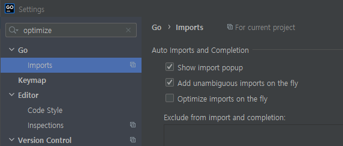
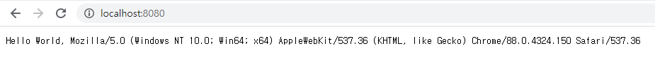

지난 글에서 Go 바이너리 배포판을 설치했으므로 Go 언어를 학습하러 가도록 하겠습니다. Go 언어에 대해서 배울 수 있는 사이트는 다음과 같습니다.

- [Tutorials | golang.org](https://golang.org/doc/tutorial/)
- [쉽고 빠른 Go 시작하기 | 노마드 코더](https://nomadcoders.co/go-for-beginners)
- [30 Go | 프로그래머스](https://programmers.co.kr/learn/courses/13)
- [예제로 배우는 Go 프로그래밍](http://golang.site/)

## Learning Go
맨 처음에는 golang.org 에서 제공하는 [튜토리얼](https://golang.org/doc/tutorial/getting-started)로 시작해보죠.

### 안녕 고랭?
튜토리얼에 따라 "Hello World"를 출력하는 코드를 작성하고 `go` 명령어로 코드를 실행해봅니다. 먼저, GoLand에서 새 프로젝트를 GOPATH/src 폴더 하위에 생성합니다.


빈 프로젝트 폴더에 New Go File로 `main.go` 파일을 생성하고 코드를 작성합니다.

```go main.go
package learning

import "fmt"

func main() {
    fmt.Println("Hello World")
}
```

코드를 작성했으니 튜토리얼 순서에 따라 코드를 실행해야겠죠?

```sh Windows Terminal
C:\Users\Mambo\go\src\learning>go run main.go
go run: cannot run non-main package
```

이상하게도 main.go를 실행할 수 없습니다. 오류 메시지는 메인 패키지를 실행할 수 없다는데요. 튜토리얼의 코드를 살펴보면 package 키워드 다음이 main 입니다. 튜토리얼 문서를 살펴보면 다음의 문장을 찾을 수 있습니다.

> A main function executes by default when you run the main package.

결국 메인 함수를 실행하기 위해서는 패키지를 main으로 선언해야한다는 것입니다. 다시 패키지명을 learning이 아닌 main으로 바꿔보죠.


> 패키지가 leaning일 때는 main 함수가 회색이었는데 밝은 색으로 변하고 Run Application이 생겼습니다.
> 이제 main 함수를 실행 가능하다라는 GoLand에서 알려주는 거겠죠?

```sh Windows Terminal
C:\Users\Mambo\go\src\learning>go run main.go
Hello World
```

찾아보니 Go 언어 스펙 문서에 [프로그램 실행](https://golang.org/ref/spec#Program_execution) 조건이 있습니다. 이 조건으로 인해 튜토리얼에서도 main 패키지와 main 함수를 작성해서 실행한 것입니다.

> 애플리케이션을 실행하기 위해서는 main 패키지와 main 함수 선언이 필요하다는 것을 배웠습니다.

### Import packages
자바에서 import 키워드로 특정 패키지의 클래스를 추가하는 것처럼 Go 언어는 import로 라이브러리로 지칭되는 패키지를 우리가 선언한 패키지에 추가할 수 있습니다. 앞서 작성했던 main.go 파일에서 import 키워드로 `fmt` 패키지를 추가하여 Hello World라는 문자열을 콘솔에 출력했습니다.

Go 언어는 자바와는 다르게 애플리케이션을 개발할 때 필요한 기능을 제공하는 [표준 라이브러리](https://golang.org/pkg/)들을 패키지로 제공합니다. 예를 들어, **database/sql/driver**는 데이터베이스 연결을 위한 인터페이스를 제공하고 **net/http**는 웹 애플리케이션을 작성하고 실행할 수 있는 구현체를 제공합니다.

> 필요한 기능이 표준 라이브러리에 없는 경우 개발자들이 구현해서 깃허브 리파지토리에 공유된 패키지를 다운받을 수 있어요.

외부 라이브러리인 rsc.io/quote 패키지를 다운받고 함수에서 사용해봅니다.
```sh Windows Terminal
C:\Users\Mambo\go\src\learning>go get -u rsc.io/quote
go: downloading rsc.io/quote v1.5.2
```

그리고 패키지에 포함된 함수를 사용하도록 코드를 변경한 뒤 실행합니다.

```go main.go
package main

import "fmt"
import "rsc.io/quote"

func main() {
    fmt.Println(quote.Go())
}
```

> rsc.io/quote 패키지와 Go 함수가 빨간색으로 표시됩니다.

```sh Windows Terminal
C:\Users\Mambo\go\src\learning>go run main.go
main.go:4:8: cannot find module providing package rsc.io/quote: working directory is not part of a module
```

작업 폴더에서 모듈 부분을 찾을 수 없다고 합니다. 모듈에 대해서 찾아봐야겠습니다.

### Go Modules
튜토리얼 문서 상에는 의존성을 추적하기 위해서 신규 [모듈(Module)](https://golang.org/doc/tutorial/getting-started#code)을 초기화 하는 과정이 있습니다. 

> 그래서 모듈이 뭔데...

Go 블로그에 [Using Go Modules](https://blog.golang.org/using-go-modules)이라는 글이 있으니 읽어봅시다. ... 영어에 거부감이 있으니 [번역본](https://johngrib.github.io/wiki/golang-mod/)을 참고하죠.

> 번역본이 없었다면 파파고나 구글 번역으로 사용 했...

1. 모듈은 Go의 의존성 관리 도구이다.
2. 모듈은 프로젝트 루트 경로에 위치하는 go.mod 파일에 정의 된 패키지 모음이다.
3. go.mod 파일에 의존성이 정의되며 함께 버전도 명시된다.
4. 작업 폴더가 $GOPATH/src 외부이면서 go.mod 파일이 있다면 모듈 기능이 활성화된다.
5. Go 1.13 부터 모듈 모드가 기본값으로 설정된다.

4번은 모듈을 사용하면 프로젝트 폴더를 GOPATH 외부에 둘 수 있다는 말이고 5번 항목에 의해 현재 1.15.8 버전을 사용중이므로 모듈 모드가 기본값입니다.

```sh Windows Terminal
C:\Users\Mambo\go\src\learning>go version
go version go1.15.8 windows/amd64
```


## Go Workspaces
Go는 프로젝트별로 작업영역이 나누어지는 NPM과는 달리 GOPATH라는 환경변수에 지정된 경로를 작업 영역으로 인식합니다. 이 작업영역(GOPATH)에는 두개의 폴더를 가지게 됩니다.

- src
- bin

`src` 폴더에는 개발중인 소스 패키지가 위치하며 `bin` 폴더에는 Go로 빌드된 바이너리 파일이 위치합니다. 공식 문서의 작업 영역 예시를 살펴보겠습니다.

```ps
bin/
    hello                          # command executable
    outyet                         # command executable
src/
    github.com/golang/example/
        .git/                      # Git repository metadata
	hello/
	    hello.go               # command source
	outyet/
	    main.go                # command source
	    main_test.go           # test source
	stringutil/
	    reverse.go             # package source
	    reverse_test.go        # test source
    golang.org/x/image/
        .git/                      # Git repository metadata
	bmp/
	    reader.go              # package source
	    writer.go              # package source
    ... (many more repositories and packages omitted) ...
```

Go는 특이하게도 GOPATH 하위의 src 밑에 프로젝트 폴더가 위치합니다. 이 부분은 이해되지 않지만 자바와는 다르게 프로젝트 폴더 경로를 강제하고 있었습니다. 또한, 위 예시에서 **github.com/golang/example/** 부분을 보면 알 수 있는데 프로젝트 폴더명을 깃허브 리파지토리 주소와 같도록 만듭니다.

만약, 프로젝트가 깃허브의 퍼블릭 리파지토리에 공유되었다면 `go get` 명령을 통해 깃허브 저장소에 있는 라이브러리를 가져올 수 있게 됩니다.

예를 들어, 추후 웹 애플리케이션을 작성하기 위한 프레임워크로 [gin](https://github.com/gin-gonic/gin)을 다운받을 수 있습니다.

```ps
go get -u github.com/gin-gonic/gin
go: downloading github.com/gin-gonic/gin v1.6.3
...
```

### Go Project Layout
Go의 표준은 아니지만 [golang-standards/project-layout](https://github.com/golang-standards/project-layout)를 참고해서 Go 개발자들이 선호하는 프로젝트 구조로 시작하겠습니다. 전부 존재할 필요는 없고 애플리케이션을 개발하는 시점에서는 다음의 폴더가 필요할 것 같습니다.

- /cmd
- /pkg
- /vendor
- /web
- /configs
- /test
- /docs

저는 `/test` 폴더에 단위 테스트 코드를 `/pkg`에 기능별 패키지 및 소스코드를 `/cmd`에 웹 애플리케이션 코드를 작성할 예정입니다.

## Get Started

### Disable Optimize imports on the fly using GoLand
Go로 애플리케이션을 작성하기에 앞서 GoLand를 IDE로 사용하여 학습을 하고자한다면 Optimize imports on ther fly 옵션을 비활성화하는게 좋습니다. 이 옵션이 기본으로 활성화되어 있어 특정 코드 라인을 주석했을때 관련된 패키지가 사용되지 않으면 자동으로 지워주는 행위를 수행하게 됩니다.



### Package and Import
Go는 코드를 재사용할 수 있도록 패키지라는 개념을 가지고 있습니다. 자바에서 클래스를 패키지 단위로 묶어 다른 패키지에서 불러와 사용할 수 있는 것처럼 소스코드를 패키지화 해서 다른 소스코드에서 활용할 수 있습니다.

[Get started with Go](https://golang.org/doc/tutorial/getting-started)의 예시를 한번 보겠습니다.

```go /cmd/helloworld/main.go
package main

import "fmt"

func main() {
    fmt.Println("Hello, World!")
}
```

위 소스코드에서 사용된 Go 키워드는  `package`, `import`, `func` 입니다. Go에서 미리 할당한 키워드는 [25가지](https://golang.org/ref/spec#Keywords)입니다.

> main이라는 이름의 패키지와 함수는 특별하게 취급됩니다.

import 키워드로 `fmt`라는 이름의 패키지를 가져왔습니다. fmt는 Go에 포함된 [패키지(표준 라이브러리)](https://golang.org/pkg/) 중 하나입니다. 이렇게 누군가 작성한 코드를 패키지해서 재사용할 수 있게 한 것이 Go의 패키지 구조입니다.

#### Factored imports
import 키워드를 사용할 때는 `factored import` 방식을 권장합니다. 하나의 import 키워드로 다수의 패키지를 가져올 수 있도록 선언할 수 있습니다.

```go
import (
    "fmt"
    "os"
)
```

### Export functions
위 예제 코드에서 fmt 패키지에 작성된 `Println` 함수를 사용했습니다. main.go에 작성한 함수의 이름은 소문자로 시작하는데 fmt 패키지에 있는 함수는 대문자로 시작합니다. Go와 다르게 자바는 접근 제어자(Access Modifier)라고하는 4가지의 키워드를 제공합니다.

- private
- default
- protected
- public

그런데 Go에서 미리 할당한 키워드에는 접근 제어자가 존재하지 않습니다. 그래서 패키지에 작성된 함수 중에서 다른 패키지에서 사용할 수 있는 것은 대문자로 작성하기로 규칙을 만들어냅니다. 그래서 접근제어자보다는 좀 더 간결하게 만들 수 있죠. 패키지에 선언된 함수를 외부에 공개할지 말지만 이름으로 정할 수 있습니다.

Go가 제공하는 테스트 도구로 테스트 코드를 작성하여 실행할 때도 `Test`로 시작하는 함수를 작성합니다. 이는 우리가 만드는 테스트 함수를 외부 패키지에서 호출할 수 있도록 공개하기 위해서 대문자로 시작하는 함수 이름을 사용하고 테스트 함수라고 알려주기 위해 TestXxx 함수명을 가지게 합니다.

## Write Web Application
Hello World를 출력했으니 맨땅의 헤딩으로 웹 애플리케이션을 작성해봅니다. 그런데 [Writing Web Applications](https://golang.org/doc/articles/wiki/)이라는 웹 애플리케이션을 작성해보는 튜토리얼 문서가 있습니다.

해당 문서를 쭉 내리다보면 `net/http` 패키지를 소개하는 부분이 있고 간단한 웹 서버를 작성하는 예시가 있습니다.

우리도 기존 Hello World를 출력하는 애플리케이션을 Hello World를 응답하는 웹 서버로 작성해봅시다.
```go /cmd/helloworld/main.go
package main

import (
    "fmt"
    "log"
    "net/http"
)

func main() {
    port := ":8080"
    http.HandleFunc("/", handler)
    log.Fatal(http.ListenAndServe(port, nil))
}

func handler(w http.ResponseWriter, r *http.Request) {
    fmt.Fprintf(w, "Hello World, %s", r.UserAgent())
}
```

이렇게 작성된 애플리케이션을 **go run** 명령어로 실행합니다. 실행된 애플리케이션은 8080 포트를 수신하게 되고 / 경로에 대한 요청에 대해서 핸들러 함수가 요청을 처리하게 됩니다.

```ps
\cmd\helloworld>go run main.go
```



### Package http
자바에서 웹 애플리케이션을 작성하기 위해서는 [서블릿(Servlet)](https://kdevkr.github.io/spring-web-servlet-stack-01/)을 구현해야하고 이 서블릿을 동작하기 위해서는 Tomcat과 같은 `서블릿 컨테이너` 기술이 필요합니다. 이와 달리 Go의 `net/http` 패키지는 HTTP 클라이언트와 서버 구현체를 제공함으로써 Go로 작성된 웹 애플리케이션이 자체적으로 실행될 수 있습니다.

> 자바와 비교해서 웹 애플리케이션 작성이 간단한 것이 참 좋다고 느껴지는 부분입니다. 
> Java is verbose...

http.ListenAndServeTLS 함수로 TLS 프로토콜을 사용하는 웹 애플리케이션을 작성할 수 있고 http.FileServer 함수로 정적 파일을 배포하는 서버도 작성할 수 있습니다.

### Web Frameworks
http 패키지로 웹 애플리케이션을 작성할 수 있지만 Go 개발자들이 웹 애플리케이션을 쉽게 작성하기 위해 만들어낸 웹 프레임워크 패키지를 추가하여 작성할 수 도 있습니다.

많은 웹 프레임워크 중에서 [`gin`](https://gin-gonic.com/) 또는 [`echo`](https://echo.labstack.com/)를 많이 사용하는 듯 보입니다.

> Gin 보다 Echo가 문서화가 잘 되어 있습니다.

```ps
go get -u github.com/gin-gonic/gin 
```

go get 명령어로 깃허브 리파지토리에 있는 gin 패키지를 가져왔습니다.

net/http 패키지 대신에 gin 패키지에 포함된 함수로 웹 애플리케이션을 작성합니다.

```go
package main

import (
    "fmt"
    "github.com/gin-gonic/gin"
)

func main() {
    port := ":8080"

    r := gin.Default()
    r.GET("/", handler)
    r.Run(port)
}

func handler(c *gin.Context) {
    fmt.Fprintf(c.Writer, "Hello World, %s", c.Request.UserAgent())
}

```

gin.Default() 함수는 기본 미들웨어가 적용된 Engine 인스턴스를 제공합니다. 그래서 웹 요청에 대한 로그도 출력됩니다.

```ps
[GIN-debug] [WARNING] Creating an Engine instance with the Logger and Recovery middleware already attached.

[GIN-debug] [WARNING] Running in "debug" mode. Switch to "release" mode in production.
 - using env:   export GIN_MODE=release
 - using code:  gin.SetMode(gin.ReleaseMode)

[GIN-debug] GET    /                         --> main.handler (3 handlers)
[GIN-debug] Listening and serving HTTP on :8080
[GIN] 2021/02/14 - 13:50:48 | 200 |            0s |             ::1 | GET      "/"
[GIN] 2021/02/14 - 13:50:48 | 404 |            0s |             ::1 | GET      "/favicon.ico"

```

> 스프링과 비교해서도 굉장히 쉽게 작성하고 실행할 수 있습니다. 스프링은 설정하다가 끝날텐데...ㅎㅎ

Go 언어로 웹 애플리케이션을 작성해본 것으로 자바 개발자가 Go를 배우는 이야기 2탄을 마치겠습니다.
감사합니다.