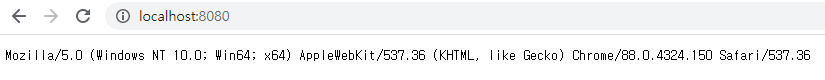

지난 글에서 Go 바이너리 배포판을 설치했으므로 Go 언어를 학습하러 가도록 하겠습니다. Go 언어에 대해서 배울 수 있는 사이트는 다음과 같습니다.

- [Tutorials | golang.org](https://golang.org/doc/tutorial/)
- [쉽고 빠른 Go 시작하기 | 노마드 코더](https://nomadcoders.co/go-for-beginners)
- [30 Go | 프로그래머스](https://programmers.co.kr/learn/courses/13)
- [예제로 배우는 Go 프로그래밍](http://golang.site/)

## Learning Go
맨 처음에는 golang.org 에서 제공하는 [튜토리얼](https://golang.org/doc/tutorial/getting-started)로 시작해보죠.

### 안녕 고랭?
튜토리얼에 따라 "Hello World"를 출력하는 코드를 작성하고 `go` 명령어로 코드를 실행해봅니다. 먼저, GoLand에서 새 프로젝트를 GOPATH/src 폴더 하위에 생성합니다.


빈 프로젝트 폴더에 New Go File로 `main.go` 파일을 생성하고 코드를 작성합니다.

```go main.go
package learning

import "fmt"

func main() {
    fmt.Println("Hello World")
}
```

코드를 작성했으니 튜토리얼 순서에 따라 코드를 실행해야겠죠?

```sh Windows Terminal
C:\Users\Mambo\go\src\learning>go run main.go
go run: cannot run non-main package
```

이상하게도 main.go를 실행할 수 없습니다. 오류 메시지는 메인 패키지를 실행할 수 없다는데요. 튜토리얼의 코드를 살펴보면 package 키워드 다음이 main 입니다. 튜토리얼 문서를 살펴보면 다음의 문장을 찾을 수 있습니다.

> A main function executes by default when you run the main package.

결국 메인 함수를 실행하기 위해서는 패키지를 main으로 선언해야한다는 것입니다. 다시 패키지명을 learning이 아닌 main으로 바꿔보죠.


> 패키지가 leaning일 때는 main 함수가 회색이었는데 밝은 색으로 변하고 Run Application이 생겼습니다.
> 이제 main 함수를 실행 가능하다라는 GoLand에서 알려주는 거겠죠?

```sh Windows Terminal
C:\Users\Mambo\go\src\learning>go run main.go
Hello World
```

찾아보니 Go 언어 스펙 문서에 [프로그램 실행](https://golang.org/ref/spec#Program_execution) 조건이 있습니다. 이 조건으로 인해 튜토리얼에서도 main 패키지와 main 함수를 작성해서 실행한 것입니다.

> 애플리케이션을 실행하기 위해서는 main 패키지와 main 함수 선언이 필요하다는 것을 배웠습니다.

### Import packages
자바에서 import 키워드로 특정 패키지의 클래스를 추가하는 것처럼 Go 언어는 import로 라이브러리로 지칭되는 패키지를 우리가 선언한 패키지에 추가할 수 있습니다. 앞서 작성했던 main.go 파일에서 import 키워드로 `fmt` 패키지를 추가하여 Hello World라는 문자열을 콘솔에 출력했습니다.

Go 언어는 자바와는 다르게 애플리케이션을 개발할 때 필요한 기능을 제공하는 [표준 라이브러리](https://golang.org/pkg/)들을 패키지로 제공합니다. 예를 들어, **database/sql/driver**는 데이터베이스 연결을 위한 인터페이스를 제공하고 **net/http**는 웹 애플리케이션을 작성하고 실행할 수 있는 구현체를 제공합니다.

> 필요한 기능이 표준 라이브러리에 없는 경우 개발자들이 구현해서 깃허브 리파지토리에 공유된 패키지를 다운받을 수 있어요.

외부 라이브러리인 rsc.io/quote 패키지를 로컬 환경에 다운받아서 우리의 main 패키지에서 사용해봅시다. `go get` 명령어를 사용해서 와부 패키지를 다운받읍시다.

```sh Windows Terminal
C:\Users\Mambo\go\src\learning>go get -u rsc.io/quote
code in directory C:\Users\Mambo\go\src\rsc.io\quote\v3 expects import "rsc.io/quote"
```

이렇게 다운받은 라이브러리는 GOPATH의 src 폴더 밑에 존재합니다. 그래서 quote라는 패키지는 $GOPATH/src/rsc.io/quote에 있습니다. 이제 import 키워드로 quote 패키지를 포함시키고 실행해봅시다.

```go main.go
package main

import "fmt"
import "rsc.io/quote"

func main() {
    fmt.Println(quote.Go())
}
```

```sh Windows Terminal
C:\Users\Mambo\go\src\learning>go run main.go
..\rsc.io\quote\quote.go:8:8: code in directory C:\Users\Mambo\go\src\rsc.io\quote\v3 expects import "rsc.io/quote"
..\rsc.io\quote\v3\quote.go:8:8: cannot find package "rsc.io/sampler" in any of:
        C:\Go\src\rsc.io\sampler (from $GOROOT)
        C:\Users\Mambo\go\src\rsc.io\sampler (from $GOPATH)
```

> 튜토리얼과 다르게 오류가 납니다... 다른 부분은 현재 프로젝트 폴더에 고 모듈 파일을 생성하지 않았다는 점이에요.

대부분의 패키지가 고 모듈을 사용하고 있으므로 GOPATH 모드로는 패키지가 내부적으로 사용하는 의존성을 제대로 못가져오는 것 같습니다. 

### Go Modules
제가 튜토리얼을 그대로 따라하지 않았던 것이 문제였습니다. 바로 패키지에서 사용되는 의존성을 관리하기 위한 모듈이라는 파일을 추가하는 것입니다. 그러나 Go 블로그에 [Using Go Modules](https://blog.golang.org/using-go-modules)이라는 글을 참고해보면...

> 어지러우니까 [번역본](https://johngrib.github.io/wiki/golang-mod/)을 참고할래요.

1. 모듈은 Go의 의존성 관리 도구이다.
2. 모듈은 프로젝트 루트 경로에 위치하는 go.mod 파일에 정의 된 패키지 모음이다.
3. go.mod 파일에 의존성이 정의되며 함께 버전도 명시된다.
4. 작업 폴더가 $GOPATH/src 외부이면서 go.mod 파일이 있다면 모듈 기능이 활성화된다.
5. Go 1.13 부터 모듈 모드가 기본값으로 설정된다.

4번은 모듈을 사용하면 프로젝트 폴더를 GOPATH 외부에 둘 수 있다는 말이고 5번 항목에 의해 현재 1.15.8 버전을 사용중이므로 모듈 모드가 기본값입니다.

```sh Windows Terminal
C:\Users\Mambo\go\src\learning>go version
go version go1.15.8 windows/amd64
```

제가 생각한바로는 굳이 모듈 파일을 만들지 않아도 기존의 GOPATH 모드로 동작하겠네 였습니다만 외부에서 가져오는 패키지가 모듈을 사용하고 있으면 모듈 파일로 관련된 의존성을 추적해야하나봅니다. `go mod init` 명령어로 모듈 파일을 만들어보죠.

```sh Windows Terminal
C:\Users\Mambo\go\src\learning>go mod init learning
go: creating new go.mod: module learning
```

그리고 main.go에서 선언한 rsc.io/quote 패키지에 대한 정보를 go.mod 파일과 맞추기 위해 `go mod tidy` 명령어를 수행합니다.

```sh Windows Terminal
C:\Users\Mambo\go\src\learning>go mod tidy -v
go: finding module for package rsc.io/quote
go: downloading rsc.io/quote v1.5.2
go: found rsc.io/quote in rsc.io/quote v1.5.2
```

> 모듈 파일이 없을때와는 달리 rsc.io/quote 패키지에 대해서 특정 버전을 가져오네요.

결국 외부 패키지를 제대로 사용하기 위해서는 GOPATH가 아닌 고 모듈로 의존성 버전까지 추적해야하는 것 같습니다. 그냥 무조건 go.mod 파일을 만드는게 좋겠습니다.

> 이 글을 작성하는 도중 [Go 1.16](https://golang.org/doc/go1.16)이 릴리즈되었는데 고 모듈 모드가 기본적으로 활성화된다고 합니다.

## Write Web App
저의 관심은 Go 언어로 웹 애플리케이션을 작성하는 것입니다. Go 표준 라이브러리인 `net/http`로 웹 서버를 쉽게 작성할 수 있습니다. 그리고 자바 웹 애플리케이션을 만들때 주로 사용되는 스프링 프레임워크처럼 Go 언어로 작성된 웹 프레임워크도 있습니다.

- [gin](https://github.com/gin-gonic/gin)
- [echo](https://github.com/labstack/echo)

http 패키지로 간단하게 웹 서버를 만들어서 실행해본 뒤 `gin` 웹 프레임워크를 패키지로 가져와서 웹 애플리케이션을 작성해봅시다.

### net/http

```Go main.go
package main

import (
    "fmt"
    "log"
    "net/http"
)

func handler(w http.ResponseWriter, r *http.Request) {
    fmt.Fprintf(w, "User Agent: %s\n", r.UserAgent())
}

func main() {
    http.HandleFunc("/", handler)
    log.Fatal(http.ListenAndServe(":8080", nil))
}
```

이제 애플리케이션을 실행하면 콘솔에 아무런 내용도 찍히지는 않지만 localhost:8080 주소로 접근하면 다음과 같이 클라이언트 정보가 표시됩니다.



### gin

이제 웹 애플리케이션을 gin 프레임워크로 작성해보죠.

> 아몰랑. 그냥 웹 프레임워크 씁시다.

```sh Windows Terminal
C:\Users\Mambo\go\src\learning>go get -u github.com/gin-gonic/gin
C:\Users\Mambo\go\src\learning>go mod tidy
```

gin 패키지를 다운받았으니 gin 패키지를 활용하여 웹 애플리케이션을 작성하고 실행합니다.

```go main.go
package main

import (
    "github.com/gin-gonic/gin"
    "log"
)

func handler(c *gin.Context) {
    c.String(200, "%s\n", c.Request.UserAgent())
}

func main() {
    r := gin.Default()
    r.GET("/", handler)
    log.Fatal(r.Run(":8080"))
}
```

```sh Windows Terminal
C:\Users\Mambo\go\src\learning>go run main.go
[GIN-debug] [WARNING] Creating an Engine instance with the Logger and Recovery middleware already attached.

[GIN-debug] [WARNING] Running in "debug" mode. Switch to "release" mode in production.
 - using env:   export GIN_MODE=release
 - using code:  gin.SetMode(gin.ReleaseMode)

[GIN-debug] GET    /                         --> main.handler (3 handlers)
[GIN-debug] Listening and serving HTTP on :8080
```

http와 동일하게 클라이언트 정보가 출력되지만 콘솔에 요청에 대한 로그도 출력됩니다.


```sh Windows Terminal
[GIN] 2021/02/16 - 23:38:00 | 200 |            0s |             ::1 | GET      "/"
```

고 언어로 애플리케이션을 작성하는 법과 함께 gin 이라는 웹 프레임워크로 웹 애플리케이션을 간단하게 작성해서 실행해보았습니다. 이어지는 자바 개발자가 Go를 배우는 이야기 3탄에서는 실제로 토이 프로젝트를 진행해나가면서 좀 더 Go 언어에 빠져보도록 하겠습니다.

감사합니다.