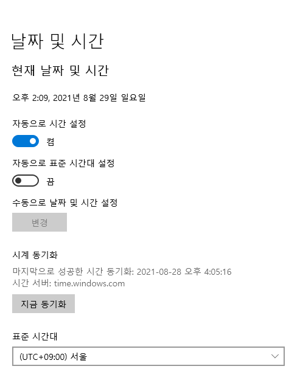
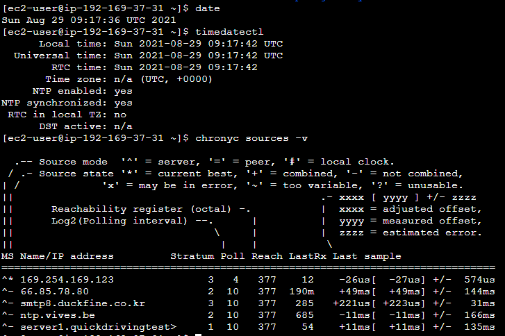

안녕하세요 Mambo 입니다.

오늘은 시간 동기화에 대해서 정리한 내용을 공유합니다. 애플리케이션 서버를 운영할 때 서버 시스템의 시간 동기화는 매우 중요한 부분 중 하나입니다. 잘못된 시간 동기화로 인하여 예약된 작업이 실행되지않거나 서비스에 문제가 발생했을때 원인을 파악하기 위한 로그 시간이 일치하지 않아 오류 해결이 쉽지 않을 수 있습니다. 인터넷에 공유된 시간 동기화 문제로 인한 다양한 이슈에 대해 알아보고 리눅스 시스템에서는 어떻게 시간을 동기화하도록 설정하는지 알아봅니다.

## 시간 동기화
리눅스 뿐만 아니라 윈도우 시스템에서도 주기적으로 시간을 동기화합니다. 

### UTC(세계협정시)
UTC는 세계협정시로 전세계적으로 기준이 되는 시각을 말합니다. 예를 들어, KST(한국 표준시)는 UTC +0 시간대를 기준으로 시차가 9시간 빠르다하여 UTC +9라고 표기합니다. 국내에서만 서비스를 하는 경우에는 편의를 위해 각 시스템들의 시간대를 UTC가 아닌 [KST로 설정하는 경우](https://jojoldu.tistory.com/513)도 있습니다. 하지만, 유튜브와 넷플릭스 같이 다양한 시간대를 가지는 사용자를 위한 서비스를 제공해야하는 경우 사용자가 시간 관련 정보를 확인해야하는 경우에는 UTC 기준 시각으로 데이터를 저장해야합니다. 

애플리케이션 서버에서 시간 정보를 UTC 기준으로 저장하는 이유는 호환성과 유연성입니다. 배달의 민족처럼 국내 사용자를 위한 서비스를 위해 KST 시간으로 저장하는 것은 시간을 파악할 때 편하겠지만 해당 서비스를 다른 시간대를 사용하는 해외 사용자에게 서비스하기에는 확장에 대한 어려움이 있습니다. 그래서 해외 고객을 가질 수 있는 가능성이 있는 지금 회사와 같은 서비스 업체의 경우 모든 시스템의 시간을 UTC로 저장하는 편입니다. 

> AWS EC2의 기본 시간대는 UTC인데 이것을 한국 시간으로 바꾸는 것을 설명하는 블로그 글이 상당히 많다.

### NTP 서버
NTP는 시스템 간 시간 동기화를 위한 네트워크 프로토콜입니다. 윈도우의 기본 NTP 서버는 time.windows.com으로 NTP 서버는 매우 정밀한 시간을 계산해서 시간 동기화를 지원합니다. 아마존 웹 서비스의 [Amazon Time Sync Service](https://aws.amazon.com/ko/blogs/korea/keeping-time-with-amazon-time-sync-service/)도 자체적으로 NTP 서버를 지원하고 있습니다. 

NTP 서버는 패킷 교환이 필요하므로 서버 시스템에 대하여 낮은 레이턴시를 가지는 NTP 서버를 사용하는 것이 좋습니다. 예를 들어, EC2의 경우에는 time.google.com, pool.ntp.org 보다는 자체적으로 제공하는 Amazon Time Sync Service를 사용하는 것이 효율적입니다.

### Chrony
Chrony는 최근에 사용되어지는 NTP 데몬 및 클라이언트입니다. 최근 리눅스 시스템에서는 Chrony를 사용하여 시간 동기화하는 것을 권장하는 편입니다. 

위 **169.254.169.123**라는 아이피는 Amazon Time Sync Service에서 제공하는 NTP 서버 주소입니다. 