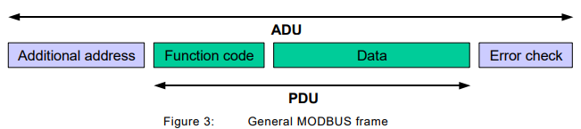
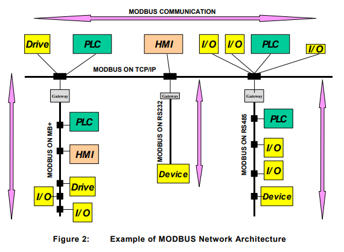

통신 프로토콜 이해하기 시리즈는 컴퓨터 또는 디바이스 간 통신에 사용되는 다양한 프로토콜을 이해하는 시간을 가집니다. 실무에서 다양한 프로젝트를 진행하다보면 통신에 사용되는 프로토콜이 다양하다는 것을 느낄 수 있습니다. 이번 통신 프로토콜 이해하기 시리즈에서 살펴볼 통신 프로토콜은 `모드버스(Modbus)`입니다.

## 모드버스(Modbus)
모드버스 프로토콜은 다양한 산업 제품 간 통신을 위해 사용하는 산업용 프로토콜입니다. 이 프로토콜은 모디콘(Modicon)사에서 1979에 고안한 통신 프로토콜으로 OSI 7 계층 모델 중 애플리케이션 계층에 위치합니다. 초기에는 시리얼 통신(RS-232, RS-485)을 위해 설계되었지만 지금은 TCP/IP 또는 UDP 으로도 구현되어 산업 분야에서 디바이스간 통신을 위해 주로 사용되어 사실 상 [표준](http://www.hellot.net/new_hellot/magazine/magazine_read.html?code=201&sub=002&idx=12273)이라고 해도 무방하다고 합니다. 

저는 전력 수요 관리를 위한 `가상화 발전소(VPP)` 서비스를 개발하고 있어 이더넷으로 연결된 환경에서 PLC 장비와 모드버스 TCP로 통신하여 다양한 데이터를 수집하고 있습니다. 위 그림에서 PLC와 이더넷으로 연결된 애플리케이션을 설치한 뒤 모드버스 TCP로 데이터를 가져오는 프로세스를 수행한다고 보시면 됩니다.

### 모드버스 프레임 구조
모드버스 프로토콜의 패킷 프레임은 일반적으로 다음과 같은 구성을 가집니다. 

- PDU(Protocol Data Unit) : PDU는 통신을 위한 데이터 단위로 1 바이트의 Function Code와 데이터 필드를 구성
- ADU(Application Data Unit) : PDU 이외에 식별 주소와 오류 검출을 위한 CRC 필드를 구성

모드버스 프레임은 통신 방식(RT, ASCII, TCP)에 따라 ADU와 PDU를 구성하는 필드가 달라집니다. 예를 들어, RS-485 기반 시리얼 통신의 PDU는 **256 bytes** - **Server Address(1 byte)** - **CRC(2 bytes)** 로 253 바이트로 구성됩니다.

### 마스터 - 슬레이브
모드버스 프로토콜은 요청/응답을 수행하는 구조로 통신하며 데이터를 요청하는 상위 디바이스를 `마스터(Master)`, 데이터를 제공하는 하위 디바이스를 `슬레이브(Slave)`라고 지칭합니다. 예를 들어, PC 또는 HMI 디바이스는 PLC와 상대적으로 상위 디바이스이므로 마스터가 되며 PLC는 마스터 요청에 의해 데이터를 제공하는 슬레이브가 됩니다.

> 추가적으로 PLC에 연결된 센서 또는 미터 디바이스는 PLC에 대한 슬레이브입니다.

### Function Codes
`Function Code`는 모드버스 프로토콜에서 사용되는 명령어 집합 코드입니다. 마스터는 슬레이브에게 요청할 때 원하는 `메모리 블록(Coil 또는 Register)`에 대하여 어떻게 수행해야하는지를 알려줄 수 있습니다. 

> 코일(Coil) : 비트
> 레지스터(Register) : 워드(16비트)

위 그림에 따라 `Read Discrete Inputs(02)`은 코일 메모리 블록에서 1비트 읽기를 수행합니다. 즉, 0과 1의 값을 가지게 되어 센서가 켜져있는지를 ON/OFF로 확인할 수 있습니다. 그리고 `Read Holding Registers(03)`은 레지스터 메모리 블록에서 16비트 읽기를 수행합니다. 즉, 1워드(2 바이트)에 대한 값으로 0 ~ 65.535을 표현할 수 있습니다.

> 메모리 블록을 연속적으로 읽어서 보다 많은 범위의 수치를 표현할 수 있어요.

## 모드버스 TCP
TCP/IP 기반의 모드버스 TCP 통신은 주로 이더넷 환경으로 연결되는 PC와 PLC 같은 상위 디바이스 간 통신에 사용됩니다. 모드버스 TCP 통신 시 사용되는 포트는 [표준 스펙](https://modbus.org/docs/Modbus_Application_Protocol_V1_1b3.pdf)에 따라 `502` 포트를 통해 연결합니다.

위 그림은 모드버스 네트워크 환경에 대한 예시를 보여주는데 모드버스 TCP와 모드버스 시리얼을 사용하는 디바이스 간 통신을 위해서는 시리얼 패킷을 TCP/IP 패킷으로 변환할 수 있는 게이트웨이가 있어야함을 알 수 있습니다.

### MBAP 헤더
모드버스 TCP 통신 프레임을 구성하는 ADU에는 `MBAP(Modbus Application)` 헤더가 포함됩니다. 

- Transaction Identifier : 요청과 응답을 매칭하기 위한 값으로 마스터가 1씩 증가시킴
- Protocol Identifier : 0x0000으로 고정
- Length : 메시지에 대한 바이트
- Unit Identifier : PLC의 하위 슬레이브에 대한 ID

### 자바 라이브러리
자바 애플리케이션에서 사용할 수 있는 라이브러리는 다음과 같은 것들이 있습니다.

- [EasyModbusTCP](https://sourceforge.net/projects/easymodbustcp-udp-java/)
- [Jamod](https://sourceforge.net/projects/jamod/)
- [modbus](https://github.com/digitalpetri/modbus)

## 모드버스 시리얼(Serial)
RTU 또는 ASCII 기반의 모드버스 시리얼 통신은 [오제이 튜브의 모드버스 프로토콜](https://www.youtube.com/watch?v=jhRcq6bsJ84)에서 잘 설명해주고 있습니다. 

> 저는 시리얼 통신을 수행하지 않기 때문에 자세히 알 필요는 없어요.

### 시리얼 통신 규격
모드버스 시리얼 통신 규격에는 RS-232, RS-422, RS-485가 있으며 다른 규격과 다르게 `RS-485`는 하나의 마스터가 여러개의 슬레이브 디바이스를 하나의 망으로 구성되어 주로 사용된다고 합니다.

> [자동제어김과장 유튜브](https://youtu.be/c0DtQgXIiC4?t=122)에서도 아스키 통신을 해본적은 없다고...

### 전송 방식
모드버스 시리얼 통신은 RTU, ASCII 두 가지의 전송 방식을 사용할 수 있습니다. 아스키보다는 이진 데이터로 보내는 `RTU` 방식이 주로 사용되는 것 같아보입니다.

## 참고
- [모드버스 프로토콜 | 오제이 튜브](https://www.youtube.com/watch?v=jhRcq6bsJ84)
- [모드버스통신에 대한 간단한 설명 | 자동제어김과장](https://www.youtube.com/watch?v=c0DtQgXIiC4)
- [모드버스 | HIVAC](https://hivac.tistory.com/22)
- [Modbus 시작하기 | NI](https://www.ni.com/ko-kr/innovations/white-papers/12/introduction-to-modbus-using-labview.html)